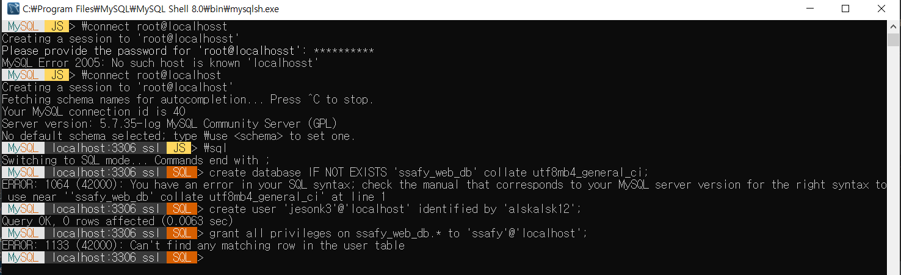
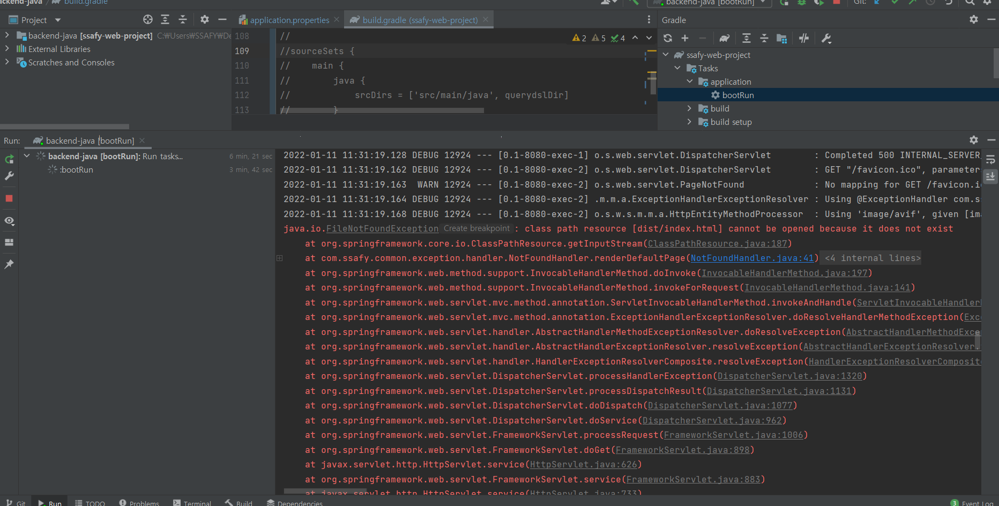

## Error



- mysql의 workbench를 활용하여 ssafy_web_db to를 생성

----



- front 부분의 dist/index.html 파일이 존재하지 않기 때문에 발생한 오류 , 폴더 내부에 dist폴더를 생성하고 프론트 파트에서 해당 파일을 가져오는 방식으로 해결

 ## database 작성 

1. user table
2. conference table
3. user_conference table
4. conference_history
5. conference_category


### MySQl & JPA 연동

- application.properties에 DB정보 추가

```
# MySQL 설정 
spring.datasource.driver-class-name=com.mysql.cj.jdbc.Driver 

# DB Source URL 
spring.datasource.url=jdbc:mysql://<IP>:<Port/<DB>?useSSL=false&useUnicode=true&serverTimezone=Asia/Seoul 

# DB username 
spring.datasource.username=<username> 

# DB password 
spring.datasource.password=<password> 

# true 설정시 JPA 쿼리문 확인 가능 
spring.jpa.show-sql=true 

# DDL(create, alter, drop) 정의시 DB의 고유 기능을 사용할 수 있다. 
spring.jpa.hibernate.ddl-auto=update 

# JPA의 구현체인 Hibernate가 동작하면서 발생한 SQL의 가독성을 높여준다. 
spring.jpa.properties.hibernate.format_sql=true

출처: https://dev-coco.tistory.com/85 [슬기로운 개발생활😃]
```

```
create  :  기존 테이블을 삭제하고 새로 생성 [ DROP + CREATE ]
create-drop  :  CREATE 속성에 추가로 어플리케이션을 종료할 때 생성한 DDL을 제거  [ DROP + CREATE + DROP ]
update  :  DB 테이블과 엔티티 매핑 정보를 비교해서 변경 사항만 수정 [ 테이블이 없을 경우 CREATE ] 
validate  :  DB 테이블과 엔티티 매핑정보를 비교해서 차이가 있으면 경고를 남기고 어플리케이션을 실행하지 않음
none  :  자동 생성 기능을 사용하지 않음
```


-  엔티티 생성 사용 어노테이션 정리

```
@Entity : DB의 테이블을 뜻함 [ Spring Data JPA 에서는 반드시 @Entity 어노테이션을 추가해야 함 ]

@Table : DB 테이블의 이름을 명시 [ 테이블 명과 클래스 명이 동일한 경우 생략 가능 ]

@Getter : Lombok의 Getter를 이용해 Getter 메소드를 생성하고 @Builder 를 이용해서 객체를 생성할 수 있게 처리한다.

@Builder를 이용하기 위해 @AllArgsConstructor 와 @NoArgsConstructor 를 같이 처리해야 컴파일 에러가 발생하지 않음

@Id : Primary Key를 뜻함

@GeneratedValue : Primary Key의 키 생성 전략(Strategy)을 설정하고자 할 때 사용

GenerationType.IDENTITY : MySQL의 AUTO_INCREMENT 방식을 이용

GenerationType.AUTO(default) : JPA 구현체(Hibernate)가 생성 방식을 결정

GenerationType.SEQUENCE : DB의 SEQUENCE를 이용해서 키를 생성. @SequenceGenerator와 같이 사용

GenerationType.TABLE : 키 생성 전용 테이블을 생성해서 키 생성. @TableGenerator와 함께 사용

@Column : DB Column을 명시

@Column과 반대로 테이블에 컬럼으로 생성되지 않는 필드의 경우엔 @Transient 어노테이션을 적용한다.
```


## API 작성

1. 로그인/로그아웃 기능
   1. 404, 401
2. 회원가입 201/ 회원탈퇴 기능 204
3. 프로필
   1. 200
4. 유저정보 검색
   1. 409
5. 유저정보 수정
   1. 200