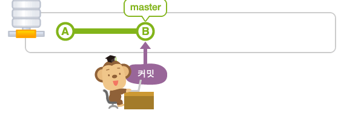

## tomcat을 사용하는 이유

- tomcat 이란?

 'WAS(Web Application Server)'라고 해서 자바코드를 이용해 HTML페이지를 **동적으로 생성**해주는 프로그램, 동적인 데이터를 처리, DB와 연결되어 데이터를 주고 받거나 프로그램으로 데이터 조작이 필요한 경우에 사용

```
WAS
웹서버와 웹 컨테이너의 결합으로 다양한 기능을 컨테이너에 구현하여 다양한 역할을 수행할 수 있는 서버

웹 컨테이너
클라이언트의 요청이 있을 때 내부의 프로그램을 통해 결과를 만들어내고 이것을 다서 클라이언트에 전달해주는 역할을 하는 것
```

- 기본 구조


## 웹 서버와 WAS 서버의 차이점

web container의 유무로 나눌수있다

동적인 데이터를 정적인 테이터로 변환하여 보내줄수 있는 소프트웨어 모듈

WEB의 경우 정적 컨텐츠를 처리하기 때문에 이미지나 단순 HTML파일을 처리하거나 클라이언트의 요청을 WAS에게 보내거나 결과를 클라이언트에 응답하는 역활

WAS의 경우 동적 데이터를 처리하는 서버로 DB와 연결되어 데이터를 주고 받거나 프로그램으로 데이터를 조작

웹 서버만을 이용한다면 사용자가 원하는 요청에 대한 결과값을 모두 미리 만들어 놓고 서비스를 해야 한다.


### git branch

기본 master branch 생성 이후 새로운 branch로 체크아웃 하는 것이 필요



- 새로운 branch(Feature branch)

   기능 추가나 버그 수정과 같은 단위 작업을 위한 브랜치

  

  ```
  git checkout -b feature_branch
  ```

  브랜치 생성 명령어 단, checkout만 사용하여 원하는 브랜치로 이동 가능

- 커밋 가능한 변경 내용 중에 전환된 브랜치에서도 한 차례 변경이 되어 있는 경우

  - stash 를 이용해 일시적으로 변경 내용을 다른 곳에 저장하여 충돌을 피하게 한 뒤 체크아웃 실시


## merge

- 여러 개의 브랜치를 하나로 모을 수 있다

### fast_forward

- master를 예를 들어 해당 브랜치에 변경 사항이 없다 면 바로 병합 가능()


### non fast-forward 

- merge 하고자 하는 브랜치에 여러 변경사항이 적용된 경우
- 생성 브랜치의 변경 사항과 기존 브랜치의 변경사항을 하나로 통합해야한다


- merge 수행 이후 필요 없는 브랜치는 삭제

```
$ git branch -d <branchname>
```

### 병합할 때 충돌 발생 시 해결방법

- 3개의 브랜치를 하나로 병합 시 처음 작업은 fast_forward


```
원숭이도 이해할 수 있는 Git 명령어
add: 변경 사항을 만들어서 인덱스에 등록해보기
<<<<<<< HEAD
commit: 인덱스의 상태를 기록하기
=======
pull: 원격 저장소의 내용을 가져오기
>>>>>>> issue3
```

충돌 시 git에서 충돌 지점을 자동으로 표시해준다 -이후 충돌 지점은 일일이 수정을 해줘야한다

```
원숭이도 이해할 수 있는 Git 명령어
add: 변경 사항을 만들어서 인덱스에 등록해보기
commit: 인덱스의 상태를 기록하기
pull: 원격 저장소의 내용을 가져오기
```

