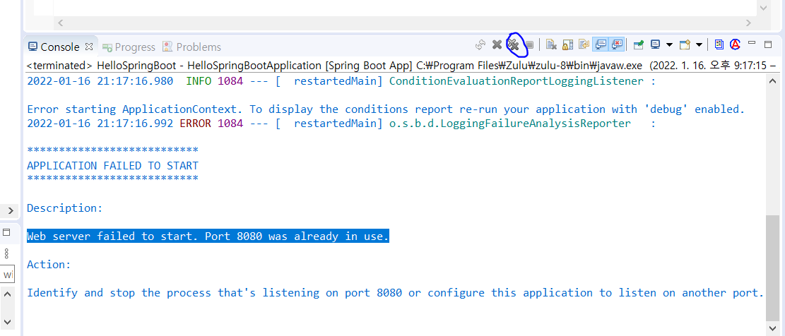

## spring 과 spring boot

- spring 

  많은설정이 필요(library 추가, dependency 설정, 여러가지 구성 및 설정 파일)

  문법의 경우 spring을 따라가므로 spring 공부 필수

- spring boot의 경우

  자주 사용되는 library들이 미리 조합되어 있다

  복잡한 설정을 자동으로 처리

  내장 서버를 포함해서 tomcat과 같은 was를 추가 설치하지 않아도 개발가능

  was에 배포 하지 않고도 실행 할 수 있는 JAR파일로 개발가능

  - spring boot의 경우 작동은 웹 이지만 형태는 어플리케이션
  
- 기본 문법

```
sysout : python의 print명령어랑 동일
model.addAttribute(attributeName, attributeValue)
```


### 주요 파일 구조

src/main/java

```
java source directory 기본 자바 코딩하는 공간
프로젝트명Application.java : application을 시작할 수 있는 main method가 존재하는 스프링 구성 메인 클래스
```

static

```
css, js, img등의 정적 resource directory
```

templates

```
springboot에서 사용가능한 view template 위치
```

application.properties

```
application 및 스프링의 설정 등에서 사용할 여러가지 property를 정의한 파일
```

src/main

```
JSP등의 리소드 directory -원칙적으로 main폴더 하위에 webapp폴더 생성 후 내부에 html파일 위치
```


### property가 무엇이냐?

### JAR 파일이 무엇이며 WAS에 배포해야 실행이 가능한가?

### dependency가 무엇이냐?

### 형태가 application  이라는 의미가 무엇이냐?

### pom.xml은 무슨 역활을 하는가?

- parent : 상속을 의미한다 ctrl + 클릭하면 상위 파일이 실행된다
- 상위로 올라갈수록 버전관리 파일이 나오기때문에 버전 설정시 체크하면 된다

## ERROR 해결

- Web server failed to start. Port 8080 was already in use.

```
사전에 어플동작시 톰캣 서버를 꺼주지 않았기때문에 발생하는 오류이다 이전의 서버를 다 꺼주면 된다
```



-  sts 자동완성 안될 시

```
https://codedragon.tistory.com/8913
```


## spring boot 설정시 패키징을 war 을 쓰는이유

jar의 경우 jsp를 사용할 수 없기 때문

### jsp가 무엇이냐?

### 의존성을 왜 설정해 줘야 하나?

