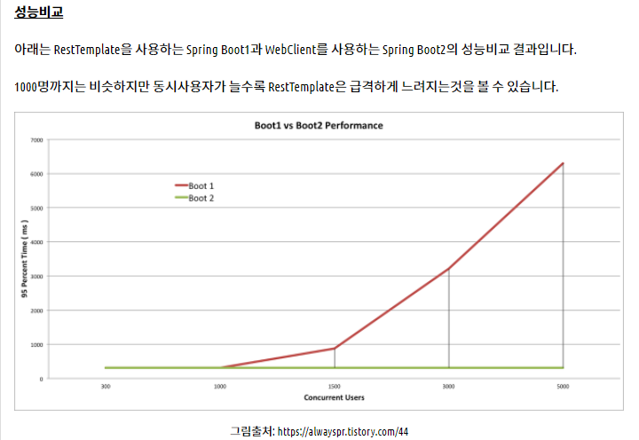

# REST API

> 클라이언트랑 서버간에 데이터를 주고 받는 방식

## 구성

- **자원(RESOURCE)** - URI
- **행위(Verb)** - HTTP METHOD
- **표현(Representations)**

## 특징

#### 1) Uniform (유니폼 인터페이스)

Uniform Interface는 URI로 지정한 리소스에 대한 조작을 통일되고 한정적인 인터페이스로 수행하는 아키텍처 스타일

#### 2) Stateless (무상태성)

REST는 무상태성 성격을 갖습니다. 다시 말해 작업을 위한 상태정보를 따로 저장하고 관리하지 않습니다. 세션 정보나 쿠키정보를 별도로 저장하고 관리하지 않기 때문에 API 서버는 들어오는 요청만을 단순히 처리. 

- 서비스의 자유도가 높아지고 서버에서 불필요한 정보를 관리하지 않음으로써 구현이 단순해집니다.

#### 3) Cacheable (캐시 가능)

REST의 가장 큰 특징 중 하나는 HTTP라는 기존 웹표준을 그대로 사용하기 때문에, 웹에서 사용하는 기존 인프라를 그대로 활용이 가능합니다. 따라서 HTTP가 가진 캐싱 기능이 적용 가능합니다. HTTP 프로토콜 표준에서 사용하는 Last-Modified태그나 E-Tag를 이용하면 캐싱 구현이 가능합니다.

#### 4) Self-descriptiveness (자체 표현 구조)

REST의 또 다른 큰 특징 중 하나는 REST API 메시지만 보고도 이를 쉽게 이해 할 수 있는 자체 표현 구조로 되어 있다는 것입니다.

#### 5) Client - Server 구조

REST 서버는 API 제공, 클라이언트는 사용자 인증이나 컨텍스트(세션, 로그인 정보)등을 직접 관리하는 구조로 각각의 역할이 확실히 구분되기 때문에 클라이언트와 서버에서 개발해야 할 내용이 명확해지고 서로간 의존성이 줄어들게 됩니다.

#### 6) 계층형 구조

REST 서버는 다중 계층으로 구성될 수 있으며 보안, 로드 밸런싱, 암호화 계층을 추가해 구조상의 유연성을 둘 수 있고 PROXY, 게이트웨이 같은 네트워크 기반의 중간매체를 사용할 수 있게 합니다.


## RestTemplate 과 web client

- 공통점
  - 웹으로 API를 호출하기 위해 사용되는 Http Client 모듈
- 차이점
  - 통신방법이 RestTemplate은 Blocking방식이고, WebClient는 Non-Blocking방식
  - why?
    - Non-blocking방식이 필요한 이유는 네트워킹의 병목현상을 줄이고 성능을 향상시키기 위해서

```
Blocking방식은 요청하고 응답 올때까지 기다리는 방식이고, Non-Blocking방식은 요청하고 딴일하다 나중에 응답신호가 오면 결과를 읽어 처리하는 방식

동기방식은 요청자와 제공자사이에 계속 Connection이 맺어져 있어야 하고, 비동기방식은 Connection은 끊어지고 서로간에 이벤트를 통해 통신하는 방식

비동기방식은 요청자와 제공자 사이에 Message Broker라는 또 다른 서비스가 중계해주지만, 동기 방식은 요청자 어플리케이션에 non-blocking처리를 하는 로직이 존재

최근 흔히 사용하는 REST API는 동기 방식이고 보통 Non-Blocking방식으로 통신
Frontend와 backend사이는 거의 대부분 동기+non-blocking 방식으로 구현
```


- RestTemplate
  -  Multi-Thread와 Blocking방식을 사용
- web client
  -  Single Thread와 Non-Blocking방식을 사용
  - 요청자와 제공자 사이의 통신을 좀 더 효율적인 Non-Blocking방식으로 하기 위해서
- 성능비교

