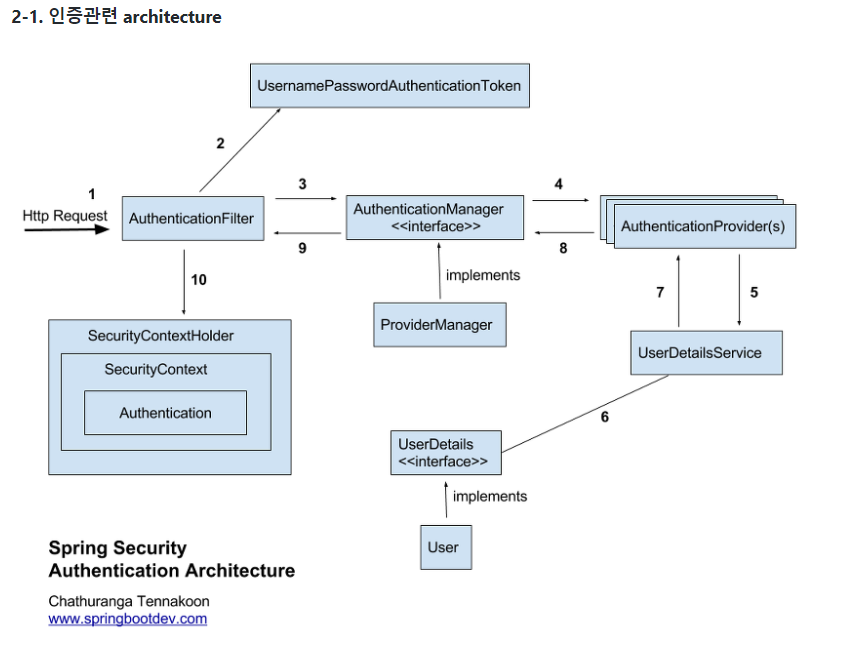
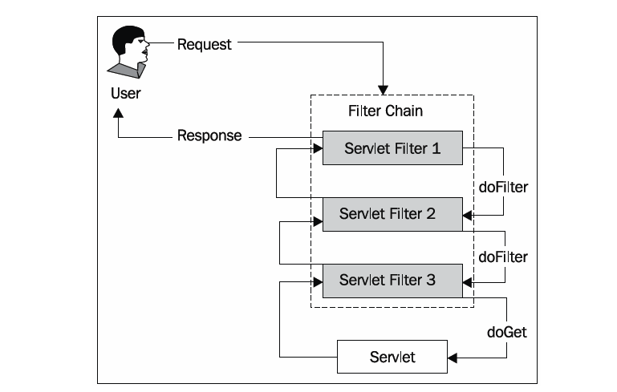

### spring security 

> 참고 사이트 
>
> https://sjh836.tistory.com/165
>
> https://docs.spring.io/spring-security/site/docs/4.2.7.RELEASE/reference/htmlsingle/#getting-started
>
> http://springsource.tistory.com/80
>
> https://okky.kr/article/382738

## 스프링 시큐리티란?

스프링 기반의 어플리케이션의 보안(인증과 권한)을 담당하는 프레임워크

filter 기반으로 동작하기 때문에 spring MVC 와 분리되어 관리 및 동작

### 보안관련 용어

- 접근 주체(Principal)  
  - 보호된 대상에 접근하는 유저
- 인증(Authenticate) 
  -  현재 유저가 누구인지 확인(ex. 로그인)
  - 애플리케이션의 작업을 수행할 수 있는 주체임을 증명

- 인가(Authorize) 
  - 현재 유저가 어떤 서비스, 페이지에 접근할 수 있는 권한이 있는지 검사
- 권한  
  - 인증된 주체가 애플리케이션의 동작을 수행할 수 있도록 허락되있는지를 결정
  - 권한 승인이 필요한 부분으로 접근하려면 인증 과정을 통해 주체가 증명 되어야만 한다
  - 권한 부여에도 두가지 영역이 존재하는데 웹 요청 권한, 메소드 호출 및 도메인 인스턴스에 대한 접근 권한 부여

## spring security 의 구조

#### 세션-쿠키방식으로 인증

1. 유저가 로그인을 시도 (http request)

2. AuthenticationFilter 에서부터 위와같이 user DB까지 타고 들어감

3. DB에 있는 유저라면 UserDetails 로 꺼내서 유저의 session 생성

4. spring security의 인메모리 세션저장소인 SecurityContextHolder 에 저장

5. 유저에게 session ID와 함께 응답을 내려줌

6. 이후 요청에서는 요청쿠키에서 JSESSIONID를 까봐서 검증 후 유효하면 Authentication를 쥐어준다.

1. SecurityContextPersistenceFilter : SecurityContextRepository에서 SecurityContext를 가져오거나 저장하는 역할을 한다. (SecurityContext는 밑에)
2. LogoutFilter : 설정된 로그아웃 URL로 오는 요청을 감시하며, 해당 유저를 로그아웃 처리

3. (UsernamePassword)AuthenticationFilter : (아이디와 비밀번호를 사용하는 form 기반 인증) 설정된 로그인 URL로 오는 요청을 감시하며, 유저 인증 처리

- AuthenticationManager를 통한 인증 실행
- 인증 성공 시, 얻은 Authentication 객체를 SecurityContext에 저장 후 AuthenticationSuccessHandler 실행
- 인증 실패 시, AuthenticationFailureHandler 실행

4. DefaultLoginPageGeneratingFilter : 인증을 위한 로그인폼 URL을 감시한다.

5. BasicAuthenticationFilter : HTTP 기본 인증 헤더를 감시하여 처리한다.

6. RequestCacheAwareFilter : 로그인 성공 후, 원래 요청 정보를 재구성하기 위해 사용된다.

7. SecurityContextHolderAwareRequestFilter : HttpServletRequestWrapper를 상속한 SecurityContextHolderAwareRequestWapper 클래스로 HttpServletRequest 정보를 감싼다. SecurityContextHolderAwareRequestWrapper 클래스는 필터 체인상의 다음 필터들에게 부가정보를 제공한다.

8. AnonymousAuthenticationFilter : 이 필터가 호출되는 시점까지 사용자 정보가 인증되지 않았다면 인증토큰에 사용자가 익명 사용자로 나타난다.

9. SessionManagementFilter : 이 필터는 인증된 사용자와 관련된 모든 세션을 추적한다.

10. ExceptionTranslationFilter : 이 필터는 보호된 요청을 처리하는 중에 발생할 수 있는 예외를 위임하거나 전달하는 역할을 한다.

11. FilterSecurityInterceptor : 이 필터는 AccessDecisionManager 로 권한부여 처리를 위임함으로써 접근 제어 결정을 쉽게해준다.
