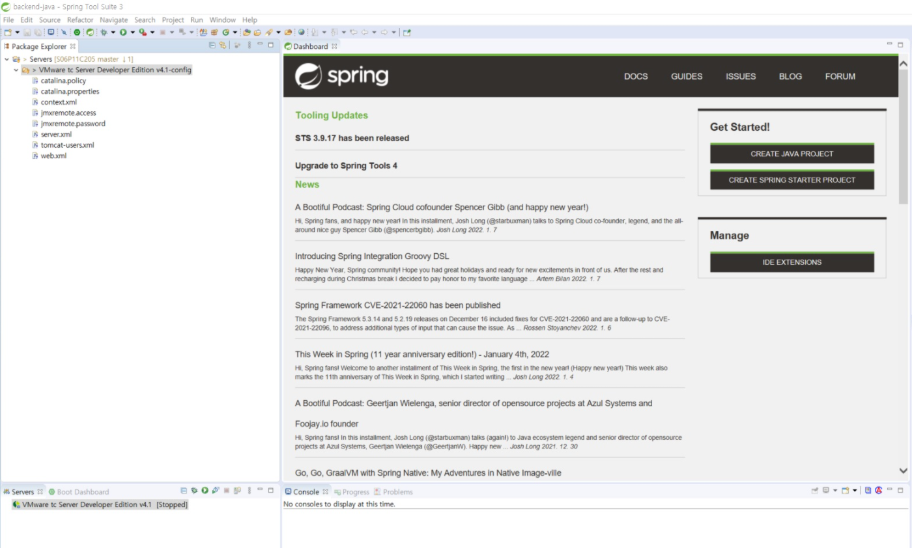
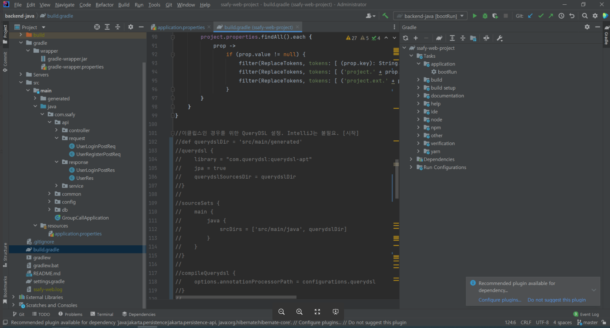
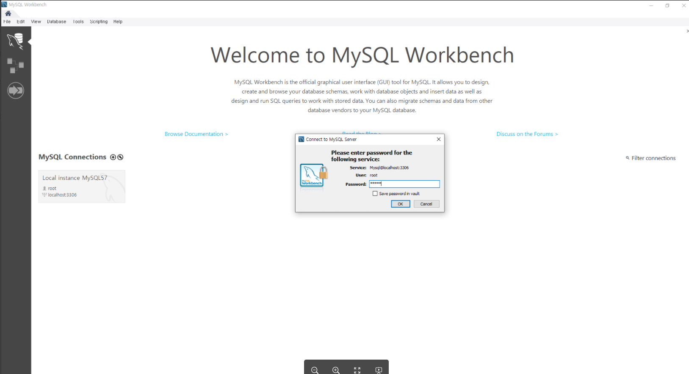
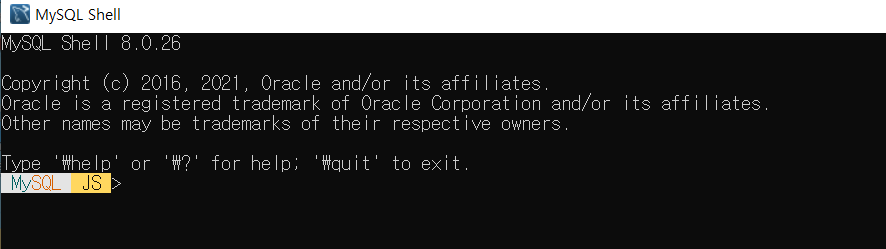
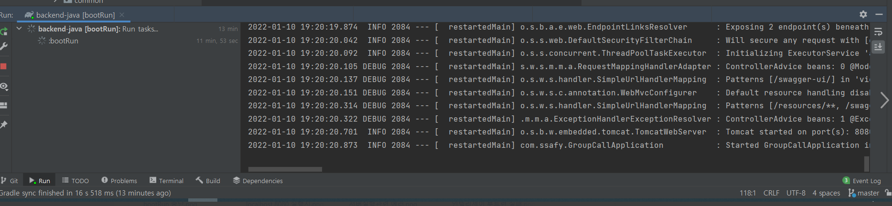
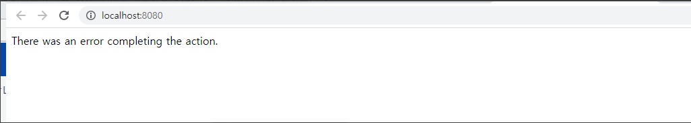
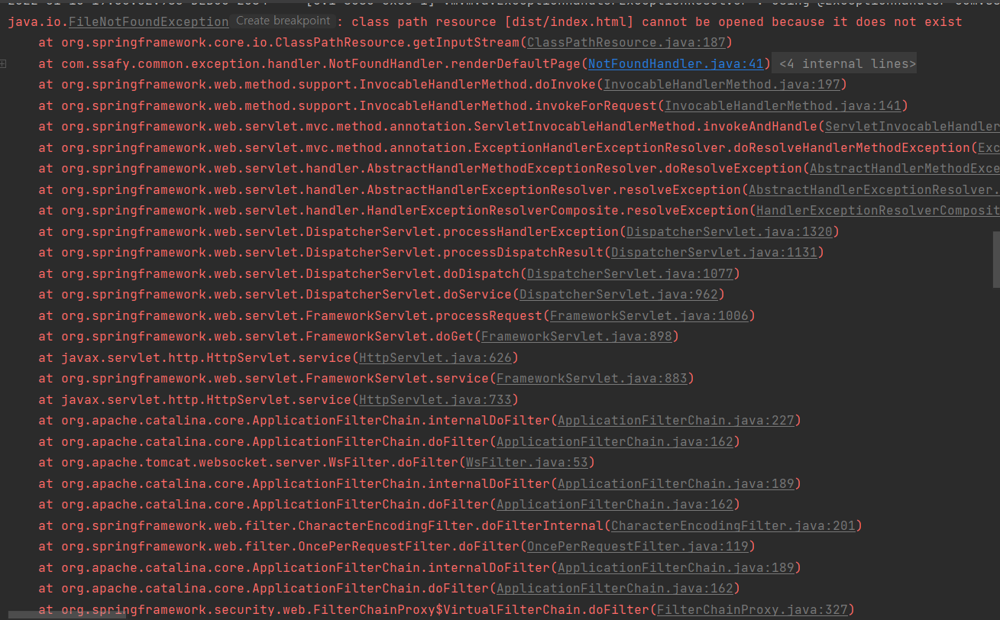
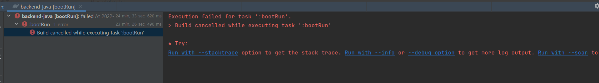
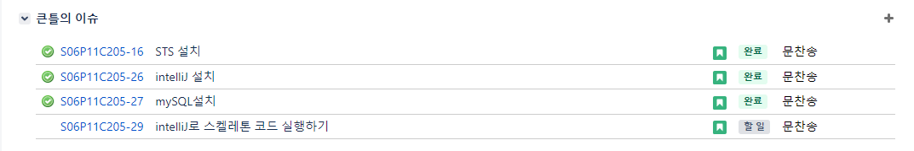

# 220110

### 공통PJT 관련 진행한 내용

##### Jira에 epic / story 등록하기

- Epic : Backend 기본 환경 세팅
  - story1: STS 설치
    - 완료
  - story2: STS로 스켈레톤 코드 실행하기
    - 인텔리제이로 IDE 변경하면서 해당 story는 삭제
  - story3: IntelliJ 설치
    - 완료
  - story4: mySQL 설치
    - 완료
  - sotry5: intelliJ로 스켈레톤 코드 실행하기
    - 미완료

##### STS 설치

- 설치 완료 후 화면
  - 설정 오류 미해결로 인해 해당 IDE 사용은 보류



##### intelliJ 설치

- 설치 완료 후 화면



##### MySQL 설치

 - MySQL Workbench 화면



- MySQL Shell



##### intelliJ로 스켈레톤 코드 실행하기

- bootRun 실패(?)



- localhost:8080 실행시 (에러 발생)





- stop으로 중지시킴



##### 0110 Jira 수행 상태



----

### 아이디어 두가지 더 생각해보기

- 화면을 보고 있는 것을 인식하는 화상회의
  - 30명~50명 단체수업
  - 학생이 수업을 듣는지 안듣는지를 파악
  - 5분이상 화면을 안쳐다보면 경고메시지와 경고음을 host에게
  - 물론 화면에 다른 창을 띄워놓고 하는 것은 막지는 못하겠지만..
    -  적어도 핸드폰을 하거나 화면에서 이탈하거나 졸고 있는 것은 방지할 수 있다

- 음성인식 기록기능 + 자동번역 자막 화상회의
  - 국제적인 화상회의 시
    - 자동번역 기능 제공
    - 음성인식 기록을 통한 기록 파일 제공
    - 녹취 파일 제공을 통한 추가 검증 가능

---

## Java / Spring 공부 (계획)

### Java의 정석 1권 예제 학습

### SpringBoot 관련 학습

- https://imasoftwareengineer.tistory.com/34?category=772561

- https://imasoftwareengineer.tistory.com/35
- https://imasoftwareengineer.tistory.com/37?category=772561

----

### 1일차 학습 후기

```
아침 반미팅 -> 팀 회의 -> 컨설턴트님과의 팀미팅 -> 저녁 종료미팅으로 진행된 본격적인 프로젝트의 첫 날이었습니다.
자기주도 프로젝트때 살짝 경험해보았던 Jira를 실제 프로젝트 업무에 처음으로 활용해보았습니다.
주말 내내 Java 공부를 한다고 했는데, 생각보다 학습해야할 양이 많고 습득이 지연되어서 아직은 문법 숙지도 부족한 상태입니다... Java는 역시 만만한 녀석이 아니었던 것입니다😢 이번 주부터 본격적인 기능 구현에 들어가는 것으로 알고 있어 아침부터 걱정이 많았습니다. 일단 걱정은 제쳐두고 이럴 때일 수록 나는 할 수 있다는 생각으로 마음을 다잡고 분발해야겠습니다.
IDE 설정부터 막히는 부분들이 발생했는데 해결하는데 크게 도움이 안돼서 아쉬운 마음이 들었습니다. 더 공부해서 다른 부분에서라도 꼭 도움이 되도록 노력하겠습니다.
```

