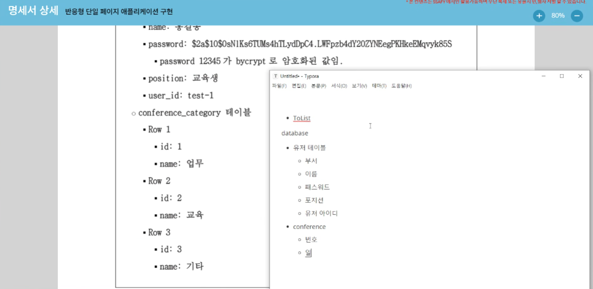

# 220111

### 공통PJT 관련 진행한 내용

#### Jira에 epic/story/task 등록하기

- Epic : 0111 / Backend 환경 설정 및 java/spring 학습

  - sotry1 :  intellij 환경설정 및 스켈레톤 코드 실행

    

    - front-end npm run build 하여 dist 폴더 추가 

    - 폴더명 수정 backend-java => backend

      

    - 스켈레톤 코드 실행 (localhost:8080)

      

  - story2 : 공통PJT 1주차 명세서 파악 회의

    - 명세서 확인

      

      

      

    - 해야할 일 목록 파악

      ```
       ## database 작성 jpa
      
      1. user table
      2. conference table
      3. user_conference table
      4. conference_history
      5. conference_category
      
      ## API 작성
      
      1. 로그인/로그아웃 기능
      2. 404, 401
      3. 회원가입 201/ 회원탈퇴 기능 204
      4. 프로필
         1. 200
      5. 유저정보 검색
         1. 409
      6. 유저정보 수정
         1. 200

  - story3 : backend 스켈레톤 코드 파악(읽어보기)

    - backend > src > main > java > com.ssafy > api

      - controller

        - AuthController

          ```java
          package com.ssafy.api.controller;
          
          import org.springframework.beans.factory.annotation.Autowired;
          import org.springframework.http.ResponseEntity;
          import org.springframework.security.crypto.password.PasswordEncoder;
          import org.springframework.web.bind.annotation.PostMapping;
          import org.springframework.web.bind.annotation.RequestBody;
          import org.springframework.web.bind.annotation.RequestMapping;
          import org.springframework.web.bind.annotation.RestController;
          
          import com.ssafy.api.request.UserLoginPostReq;
          import com.ssafy.api.response.UserLoginPostRes;
          import com.ssafy.api.service.UserService;
          import com.ssafy.common.model.response.BaseResponseBody;
          import com.ssafy.common.util.JwtTokenUtil;
          import com.ssafy.db.entity.User;
          import com.ssafy.db.repository.UserRepositorySupport;
          
          import io.swagger.annotations.Api;
          import io.swagger.annotations.ApiOperation;
          import io.swagger.annotations.ApiParam;
          import io.swagger.annotations.ApiResponses;
          import io.swagger.annotations.ApiResponse;
          
          /**
           * 인증 관련 API 요청 처리를 위한 컨트롤러 정의.
           */
          @Api(value = "인증 API", tags = {"Auth."})
          @RestController
          @RequestMapping("/api/v1/auth")
          public class AuthController {
          	@Autowired
          	UserService userService;
          	
          	@Autowired
          	PasswordEncoder passwordEncoder;
          	
          	@PostMapping("/login")
          	@ApiOperation(value = "로그인", notes = "<strong>아이디와 패스워드</strong>를 통해 로그인 한다.") 
              @ApiResponses({
                  @ApiResponse(code = 200, message = "성공", response = UserLoginPostRes.class),
                  @ApiResponse(code = 401, message = "인증 실패", response = BaseResponseBody.class),
                  @ApiResponse(code = 404, message = "사용자 없음", response = BaseResponseBody.class),
                  @ApiResponse(code = 500, message = "서버 오류", response = BaseResponseBody.class)
              })
          	public ResponseEntity<UserLoginPostRes> login(@RequestBody @ApiParam(value="로그인 정보", required = true) UserLoginPostReq loginInfo) {
          		String userId = loginInfo.getId();
          		String password = loginInfo.getPassword();
          		
          		User user = userService.getUserByUserId(userId);
          		// 로그인 요청한 유저로부터 입력된 패스워드 와 디비에 저장된 유저의 암호화된 패스워드가 같은지 확인.(유효한 패스워드인지 여부 확인)
          		if(passwordEncoder.matches(password, user.getPassword())) {
          			// 유효한 패스워드가 맞는 경우, 로그인 성공으로 응답.(액세스 토큰을 포함하여 응답값 전달)
          			return ResponseEntity.ok(UserLoginPostRes.of(200, "Success", JwtTokenUtil.getToken(userId)));
          		}
          		// 유효하지 않는 패스워드인 경우, 로그인 실패로 응답.
          		return ResponseEntity.status(401).body(UserLoginPostRes.of(401, "Invalid Password", null));
          	}
          }
          ```

        - UserController

          ```java
          package com.ssafy.api.controller;
          
          import org.springframework.beans.factory.annotation.Autowired;
          import org.springframework.http.ResponseEntity;
          import org.springframework.security.core.Authentication;
          import org.springframework.security.crypto.password.PasswordEncoder;
          import org.springframework.web.bind.annotation.GetMapping;
          import org.springframework.web.bind.annotation.PostMapping;
          import org.springframework.web.bind.annotation.RequestBody;
          import org.springframework.web.bind.annotation.RequestMapping;
          import org.springframework.web.bind.annotation.RestController;
          
          import com.ssafy.api.request.UserLoginPostReq;
          import com.ssafy.api.request.UserRegisterPostReq;
          import com.ssafy.api.response.UserLoginPostRes;
          import com.ssafy.api.response.UserRes;
          import com.ssafy.api.service.UserService;
          import com.ssafy.common.auth.SsafyUserDetails;
          import com.ssafy.common.model.response.BaseResponseBody;
          import com.ssafy.common.util.JwtTokenUtil;
          import com.ssafy.db.entity.User;
          import com.ssafy.db.repository.UserRepositorySupport;
          
          import io.swagger.annotations.Api;
          import io.swagger.annotations.ApiOperation;
          import io.swagger.annotations.ApiParam;
          import io.swagger.annotations.ApiResponse;
          import io.swagger.annotations.ApiResponses;
          import springfox.documentation.annotations.ApiIgnore;
          
          /**
           * 유저 관련 API 요청 처리를 위한 컨트롤러 정의.
           */
          @Api(value = "유저 API", tags = {"User"})
          @RestController
          @RequestMapping("/api/v1/users")
          public class UserController {
          	
          	@Autowired
          	UserService userService;
          	
          	@PostMapping()
          	@ApiOperation(value = "회원 가입", notes = "<strong>아이디와 패스워드</strong>를 통해 회원가입 한다.") 
              @ApiResponses({
                  @ApiResponse(code = 200, message = "성공"),
                  @ApiResponse(code = 401, message = "인증 실패"),
                  @ApiResponse(code = 404, message = "사용자 없음"),
                  @ApiResponse(code = 500, message = "서버 오류")
              })
          	public ResponseEntity<? extends BaseResponseBody> register(
          			@RequestBody @ApiParam(value="회원가입 정보", required = true) UserRegisterPostReq registerInfo) {
          		
          		//임의로 리턴된 User 인스턴스. 현재 코드는 회원 가입 성공 여부만 판단하기 때문에 굳이 Insert 된 유저 정보를 응답하지 않음.
          		User user = userService.createUser(registerInfo);
          		
          		return ResponseEntity.status(200).body(BaseResponseBody.of(200, "Success"));
          	}
          	
          	@GetMapping("/me")
          	@ApiOperation(value = "회원 본인 정보 조회", notes = "로그인한 회원 본인의 정보를 응답한다.") 
              @ApiResponses({
                  @ApiResponse(code = 200, message = "성공"),
                  @ApiResponse(code = 401, message = "인증 실패"),
                  @ApiResponse(code = 404, message = "사용자 없음"),
                  @ApiResponse(code = 500, message = "서버 오류")
              })
          	public ResponseEntity<UserRes> getUserInfo(@ApiIgnore Authentication authentication) {
          		/**
          		 * 요청 헤더 액세스 토큰이 포함된 경우에만 실행되는 인증 처리이후, 리턴되는 인증 정보 객체(authentication) 통해서 요청한 유저 식별.
          		 * 액세스 토큰이 없이 요청하는 경우, 403 에러({"error": "Forbidden", "message": "Access Denied"}) 발생.
          		 */
          		SsafyUserDetails userDetails = (SsafyUserDetails)authentication.getDetails();
          		String userId = userDetails.getUsername();
          		User user = userService.getUserByUserId(userId);
          		
          		return ResponseEntity.status(200).body(UserRes.of(user));
          	}
          }
          
          ```

      - request

        - UserLoginPostReq

          ```java
          package com.ssafy.api.request;
          
          import io.swagger.annotations.ApiModel;
          import io.swagger.annotations.ApiModelProperty;
          import lombok.Getter;
          import lombok.Setter;
          
          /**
           * 유저 로그인 API ([POST] /api/v1/auth/login) 요청에 필요한 리퀘스트 바디 정의.
           */
          @Getter
          @Setter
          @ApiModel("UserLoginPostRequest")
          public class UserLoginPostReq {
          	@ApiModelProperty(name="유저 ID", example="ssafy_web")
          	String id;
          	@ApiModelProperty(name="유저 Password", example="your_password")
          	String password;
          }
          
          ```

        - UserRegisterPostReq

          ```java
          package com.ssafy.api.request;
          
          import io.swagger.annotations.ApiModel;
          import io.swagger.annotations.ApiModelProperty;
          import lombok.Getter;
          import lombok.Setter;
          
          /**
           * 유저 회원가입 API ([POST] /api/v1/users) 요청에 필요한 리퀘스트 바디 정의.
           */
          @Getter
          @Setter
          @ApiModel("UserRegisterPostRequest")
          public class UserRegisterPostReq {
          	@ApiModelProperty(name="유저 ID", example="ssafy_web")
          	String id;
          	@ApiModelProperty(name="유저 Password", example="your_password")
          	String password;
          }
          
          ```

      - response

        - UserLoginPostRes

          ```java
          package com.ssafy.api.response;
          
          import com.ssafy.common.model.response.BaseResponseBody;
          
          import io.swagger.annotations.ApiModel;
          import io.swagger.annotations.ApiModelProperty;
          import lombok.Getter;
          import lombok.Setter;
          
          /**
           * 유저 로그인 API ([POST] /api/v1/auth) 요청에 대한 응답값 정의.
           */
          @Getter
          @Setter
          @ApiModel("UserLoginPostResponse")
          public class UserLoginPostRes extends BaseResponseBody{
          	@ApiModelProperty(name="JWT 인증 토큰", example="eyJ0eXAiOiJKV1QiLCJhbGciOiJIUzUxMiJ9.eyJzdWIiOiJ0ZXN...")
          	String accessToken;
          	
          	public static UserLoginPostRes of(Integer statusCode, String message, String accessToken) {
          		UserLoginPostRes res = new UserLoginPostRes();
          		res.setStatusCode(statusCode);
          		res.setMessage(message);
          		res.setAccessToken(accessToken);
          		return res;
          	}
          }
          
          ```

        - UserRes

          ```java
          package com.ssafy.api.response;
          
          import com.ssafy.common.model.response.BaseResponseBody;
          import com.ssafy.db.entity.User;
          
          import io.swagger.annotations.ApiModel;
          import io.swagger.annotations.ApiModelProperty;
          import lombok.Getter;
          import lombok.Setter;
          
          /**
           * 회원 본인 정보 조회 API ([GET] /api/v1/users/me) 요청에 대한 응답값 정의.
           */
          @Getter
          @Setter
          @ApiModel("UserResponse")
          public class UserRes{
          	@ApiModelProperty(name="User ID")
          	String userId;
          	
          	public static UserRes of(User user) {
          		UserRes res = new UserRes();
          		res.setUserId(user.getUserId());
          		return res;
          	}
          }
          ```

      - service

        - UserService

          ```java
          package com.ssafy.api.service;
          
          import com.ssafy.api.request.UserRegisterPostReq;
          import com.ssafy.db.entity.User;
          
          /**
           *	유저 관련 비즈니스 로직 처리를 위한 서비스 인터페이스 정의.
           */
          public interface UserService {
          	User createUser(UserRegisterPostReq userRegisterInfo);
          	User getUserByUserId(String userId);
          }
          ```

        - UserServicelmpl

          ```java
          package com.ssafy.api.service;
          
          import org.springframework.beans.factory.annotation.Autowired;
          import org.springframework.security.crypto.password.PasswordEncoder;
          import org.springframework.stereotype.Service;
          
          import com.ssafy.api.request.UserRegisterPostReq;
          import com.ssafy.db.entity.User;
          import com.ssafy.db.repository.UserRepository;
          import com.ssafy.db.repository.UserRepositorySupport;
          
          /**
           *	유저 관련 비즈니스 로직 처리를 위한 서비스 구현 정의.
           */
          @Service("userService")
          public class UserServiceImpl implements UserService {
          	@Autowired
          	UserRepository userRepository;
          	
          	@Autowired
          	UserRepositorySupport userRepositorySupport;
          	
          	@Autowired
          	PasswordEncoder passwordEncoder;
          	
          	@Override
          	public User createUser(UserRegisterPostReq userRegisterInfo) {
          		User user = new User();
          		user.setUserId(userRegisterInfo.getId());
          		// 보안을 위해서 유저 패스워드 암호화 하여 디비에 저장.
          		user.setPassword(passwordEncoder.encode(userRegisterInfo.getPassword()));
          		return userRepository.save(user);
          	}
          
          	@Override
          	public User getUserByUserId(String userId) {
          		// 디비에 유저 정보 조회 (userId 를 통한 조회).
          		User user = userRepositorySupport.findUserByUserId(userId).get();
          		return user;
          	}
          }
          

  - story4 : java/spring 학습

  - story5 : MySQL / JPA학습

### 아이디어 두가지 구체화하기

```
- 타겟 계층 : 시니어인지, 학생인지, 동호회인지, 전체사용자인지

- 타겟 키워드 : 토론인지, SNS, 음성/얼굴인식 한줄짜리 제목 

- 핵심기능 : 그 컨셉/목적을위한 어떤 필수적인 기능이 있을텐데 그걸 리스트화시켜서 

- 현실성 : 실제로 적용할 수 있을지 가능하다 / 가능하지 않다 (본인이 컷) 에 대한 정확한 조사
```

#### 1.  집중력을 높이는 화상회의

- 타겟 계층 : 학생(수업)
- 타겟 키워드 : 집중력을 높이는 얼굴인식(Face recognition) 화상회의
- 핵심 기능 : 호스트가 수업을 진행중일 때 얼굴이 5분 이상 화면을 바라보지 않거나 졸거나 해서, 핸드폰을 보는 등 딴짓을 하여 화면에 눈코입이 인식(얼굴인식, 추적)되지 않거나 자리비움 상태일 때 호스트와 참가자에게 알림이 가도록 한다.
- 현실성 : 네이버 오픈 API - 클로바 Face Recognition API 사용하면 가능하지 않을지..?

#### 2. 음성인식 + 자동번역 자막 화상회의

- 이미 유사 서비스가 있었음
  - https://www.wemeetnow.net/

#### 3. 영어 회화 학습을 위한 화상회의 커뮤니티

- 타겟 계층 : 영어를 잘하고자 하는 의지를 가진 사람들
- 타겟 키워드: 영어회화 연습 화상 채팅 커뮤니티
- 핵심기능 : 영어 회화 대본 제공 / STT를 통한 유사도 검증 / 회원들간의 영어 회화 연습 화상 채팅 기능을 제공
- 현실성 : 구글 클라우드 STT API 기술 이용
  - https://cloud.google.com/speech-to-text/?hl=ko&utm_source=google&utm_medium=cpc&utm_campaign=japac-KR-all-ko-dr-bkws-all-all-trial-e-dr-1009882&utm_content=text-ad-none-none-DEV_c-CRE_288266945682-ADGP_Hybrid+%7C+BKWS+-+EXA+%7C+Txt+~+AI+%26+ML+~+Speech-to-Text_Speech+-+Recognition+-+en-KWID_43700035804893415-kwd-44602483112&userloc_1009871-network_g&utm_term=KW_google%20speech%20recognition%20api&gclid=Cj0KCQiA8vSOBhCkARIsAGdp6RRaPdOtpnGVFUdbzHuRPOh81mxkD_a3NMImdqpFdFs__F9dD3hIy1AaAtRwEALw_wcB&gclsrc=aw.ds

----

## Java / Spring 공부 (계획)

### Java의 정석 1권 예제 학습

### SpringBoot 관련 학습

- MySQL & JPA 관련
  -  https://dev-coco.tistory.com/85

---

### 2일차 학습 후기

```
기획에 대한 아이디어를 고민하면서 다소 어려움을 느꼈습니다. 생각해 낸 아이디어는 이미 있는 경우도 많았고, 6주 안에 구현하기 위한 기술적인 부분이 어느정도 전제가 되어야 하기 때문에 고민이 많았습니다. 
아직 Java / Spring framework 학습이 많이 더 필요하지만 조금이라도 더 눈에 익히려고 노력했습니다.
```

