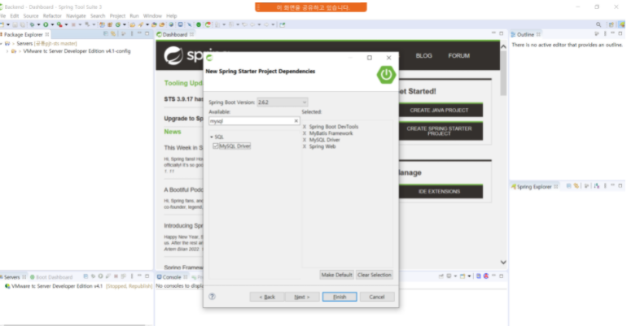
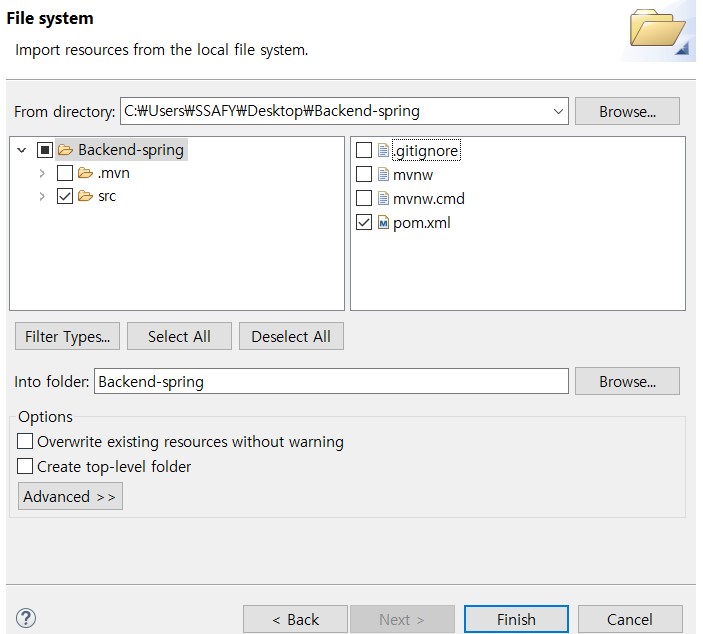
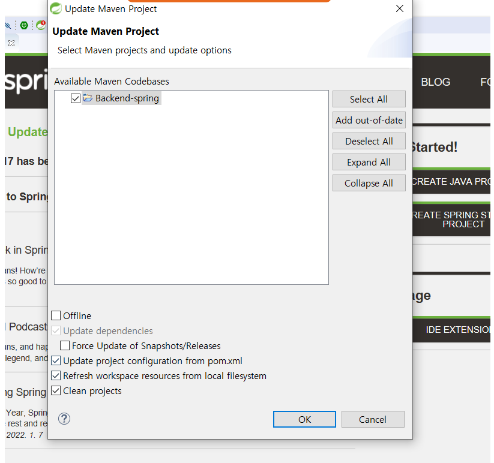
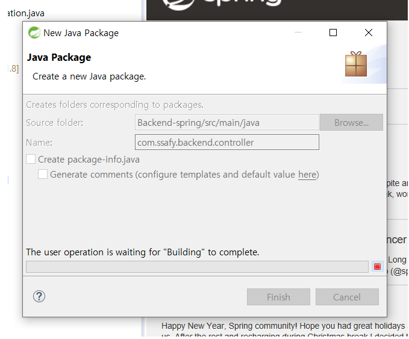
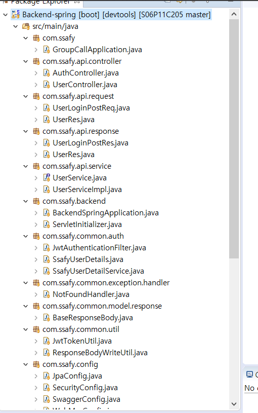
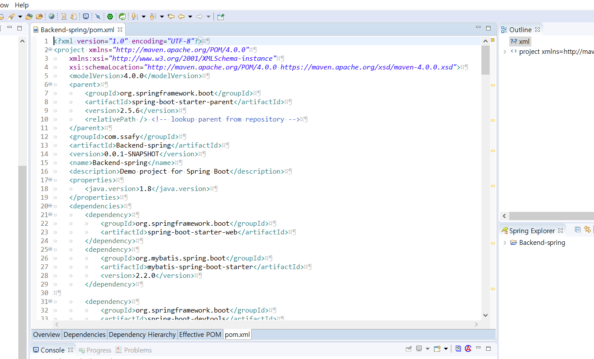
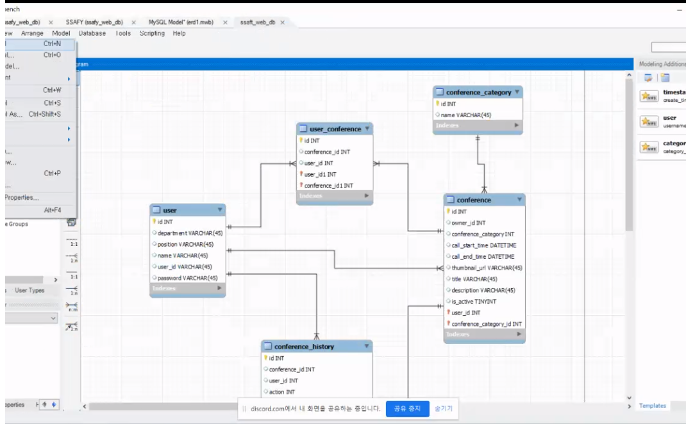

# 220112

### 공통PJT 관련 진행한 내용

- (오전)PJT 주제 아이디어 추가 발표

  ```
  1. 집중력을 높이는 화상회의
  타겟 계층 : 학생(수업)
  타겟 키워드 : 집중력을 높이는 얼굴인식(Face recognition) 화상회의
  핵심 기능 : 호스트가 수업을 진행중일 때 얼굴이 5분 이상 화면을 바라보지 않거나 졸거나 해서, 핸드폰을 보는 등 학습과 무관한 행동을 하여 화면에 눈코입이 인식(얼굴인식, 추적)되지 않거나 자리비움 상태일 때 호스트와 참가자에게 알림이 가도록 한다.
  현실성 : 네이버 오픈 API - 클로바 Face Recognition API
  2. 영어 회화 학습을 위한 화상회의 커뮤니티
  타겟 계층 : 영어를 잘하고자 하는 의지를 가진 사람들
  타겟 키워드: 영어회화 연습 화상 채팅 커뮤니티
  핵심기능 : 영어 회화 대본 제공 / STT를 통한 유사도 검증 / 회원들간의 영어 회화 연습 화상 채팅 기능을 제공
  현실성 : 구글 클라우드 STT API 기술 이용
  https://cloud.google.com/speech-to-text/?hl=ko&utm_source=google&utm_medium=cpc&utm_campaign=japac-KR-all-ko-dr-bkws-all-all-trial-e-dr-1009882&utm_content=text-ad-none-none-DEV_c-CRE_288266945682-ADGP_Hybrid+%7C+BKWS+-+EXA+%7C+Txt+~+AI+%26+ML+~+Speech-to-Text_Speech+-+Recognition+-+en-KWID_43700035804893415-kwd-44602483112&userloc_1009871-network_g&utm_term=KW_google%20speech%20recognition%20api&gclid=Cj0KCQiA8vSOBhCkARIsAGdp6RRaPdOtpnGVFUdbzHuRPOh81mxkD_a3NMImdqpFdFs__F9dD3hIy1AaAtRwEALw_wcB&gclsrc=aw.ds
  ```

- (오전)Backend DB 설정

  ```
  gradle과 maven, jpa 와 myBatis의 차이점 때문에 프로젝트 진행에 어려움이 발생
  현재 스켈레톤 코드는 참조로 두고 새로운 프로젝트를 생성하여 maven과 myBatis을 사용하는 방향으로 논의 진행 중
  ```

- (오전)PJT 주제 아이디어 3개 선정

  ```
  1. 토론 관련 화상회의 2. 캐치마인드 3. 독서모임 관련 화상회의
  -> 독서 모임 관련 화상 회의로 결정 및 추가 회의 진행
  ```

- (오후)프로젝트 수정 진행(기본설정)

  

  

  

  



​	- 새로 작성한 프로젝트에 class 틀만 생성(추가 작성 및 수정/삭제 필요)



​	- pom.xml (maven 관련)

------

- DB 관련 mySQL 기본 ERD 작성 시도
  - https://olidang.tistory.com/95 참조



---

### Spring 강의 목록 정리

```
* 공지사항 Java트랙 다시보기 기준 번호
- 129 / 130
- 131 / 135 / 139 / 143 / 144
- 145
```

----

### 3일차 학습후기

```
독서 관련 화상회의라는 주제로 새로운 아이디어가 결정되었습니다. 팀장님과 팀원분들께서 제시한 아이디어가 뛰어났다고 생각합니다. 아이디어에 따른 실용적인 기능이 많이 제안되었는데, 우선순위를 잘 정리하고 그에 따라 잘 구현될 수 있도록 서포트하고 싶습니다.
```

