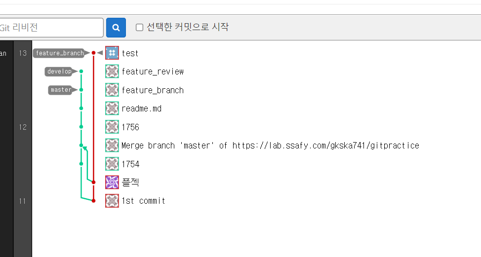

# 220113

### 공통PJT 관련 진행한 내용

- application.properties 설정 조정 및 서버 실행


- MySQL Workbench 쿼리 관련 확인


- 설정 조정 필요

### spring 학습

```
교재 및 강의 참조

강의 다시보기 211018(월)2코딩 Live 강의_Java반_오전_Ioc & Container(1)
( https://edu.ssafy.com/edu/board/free/detail.do?&brdItmSeq=26391 )

교재 Spring-Framework 
(https://edu.ssafy.com/data/upload_files/crossUpload/openLrn/ebook/unzip/A2021081717195337600/index.html )
```


- 실습 진행

- 교재 참조

  - SpringFramework 등장배경

    - EJB를 사용하면 애플리케이션 작성을 쉽게 할 수 있다.

    - Low Level의 트랜잭션이나 상태관리, 멀티 쓰레딩, 리소스 푸링과 같은 복잡한 Low Level의 API 따위를 이해하지 못하더라도 아무 문제 없이 애플리케이션을 개발할 수 있다.

    - EJB.. 현실에서의 반영은 어렵다

      - 코드 수정 후 반영하는 과정 자체가 거창해 기능은 좋지만 스펙으로 인한 개발의 효율성은 떨어짐
      - 어플리케이션을 테스트하기 위해서는 반드시 EJB 서버가 필요하다.

    - 웹사이트가 점점 커지면서 엔터프라이즈급의 서비스가 필요하게 됨

      - 세션빈에서 Transaction 관리가 용이함
      - 로긴, 분산처리, 보안 등

    - 자바진영에서는 EJB가 엔터프라이즈급 서비스로 각광을 받게 됨

      - EJB 스펙에 정의된 인터페이스에 따라 코드를 작성하므로 기존에 작성된 POJO를 변경해야 함
      - 컨테이너에 배포를 해야 테스트가 가능해 개발속도가 저하됨
      - 배우기 어렵고, 설정해야 할 부분이 많음
      - EJB는 RMI를 기반으로 하는 서버이므로 무거운 Container이다.

    - Rod Johnson이 'Expert One-on-One J2EE Development without EJB'라는 저서에서 EJB를 사용하지 않고 엔터프라이즈 어플리케이션을 개발하는 방법을 소개함(스프링의 모태)

      - AOP나 DI같은 새로운 프로그래밍 방법론으로 가능
      - POJO로 전언적인 프로그래밍 모델이 가능해 짐

    - 점차 POJO + 경량프레임워크를 사용하기 시작

    - POJO(Pain Old Java Object)

      - 특정 프레임워크나 기술에 의존적이지 않은 자바 객체

      - 특정 기술에 종속적이지 않기 대문에 생산성, 이식성 향상

      - Plain : component interface를 상속받지 않는 특징

        ​			(특정 framework에 종속되지 않는)

      - Old : EJB 이전의 java class를 의미

    - 경량 프레임워크

      - EJB가 제공하는 서비스를 지원해 줄 수 있는 프레임웤 등장
      - Hibernate, JDO, iBatis(MyBatis), Spring

    - POJO + Framework

      - EJB서버와 같은 거창한 컨테이너가 필요 없다
      - 오픈소스 프레임워크라 사용이 무료
      - 각종 기업용 어플리케이션 개발에 필요한 상당히 많은 라이브러리가 지원
      - 스프링 프레임워크는 모든 플랫폼에서 사용이 가능하다
      - 스프링은 웹 분야 뿐만이 아니라 어플리케이션 등 모든 분야에 적용이 가능한 다양한 라이브러리를 가지고 있다ㅓ

  - Spring Framework?

    - 엔터프라이즈 급 애플리케이션을 만들기 위한 모든 기능을 종합적으로 제공하는 경량화 된 솔루션이다
    - JEE(Java Enterprise Edition)가 제공하는 다수의 기능을 지원하고 있기 때문에, JEE를 대체하는 Framework로 자리잡고 있다.
    - SpringFramework는 JEE가 제공하는 다양한 기능을 제공하는 것 뿐만 아니라, DI(Dependency Injection)나 AOP(Aspect Oriented Programming)와 같은 기능도 지원한다.
    - Spring Framework는 자바로 Enterprise Application을 만들 때 포괄적으로 사용하는 Programming 및 Configuration Model을 제공해 주는 Framework로 Applicatin 수준의 인프라 스트럭쳐를 제공
    - 즉, 개발자가 복잡하고 실수하기 쉬운 Low Level에 신경쓰지 않고 Business Logic 개발에 전념할 수 있도록 해준다.
      - Enterprise System이란 서버에서 동작하며 기업의 업무를 처리해주는 System

----

### Git branch 관련

#### 1. branch에 있는 내용을 받은 후, 각자 feature branch를 생성하여 작업한다.

```bash
$ git branch
$ git checkout -b feature_branch
```

- feature_branch 내에서 작업

#### 2. develop branch로 이동 후 작업 내용을 develop branch에 merge한다

```bash
$ git checkout develop
$ git merge feature_branch
```

#### 3. master branch를 develop branch에 merge/master한다

```bash
$ git checkout master
$ git merge develop
$ git push origin master
```

##### * 실습 진행




---

### 4일차 학습후기

```
백엔드 팀원들에게 양해를 구하여 배려를 받아 부족한 부분인 Spring framework 강의와 강의 자료를 보는 것을 주로 진행했습니다. 다음주부터 PJT에 활용 예정인 git branch도 사용방법을 정리하고 연습용 gitLab에 간단히 실습해보았습니다. 익숙해지기 위해 여러가지 실험과 실습이 필요할 것 같습니다. 오늘은 실질적으로 팀에 도움이 되지 못한 것 같아 개인적인 아쉬움과 미안함이 남는 하루였지만 주말까지 투자하여 더 노력해보려고 합니다.
```

