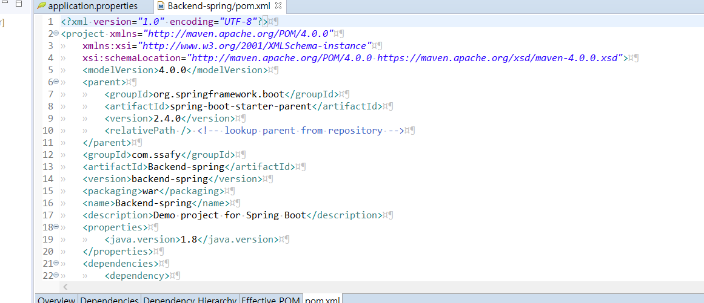
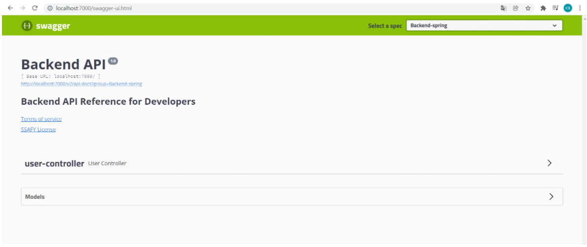
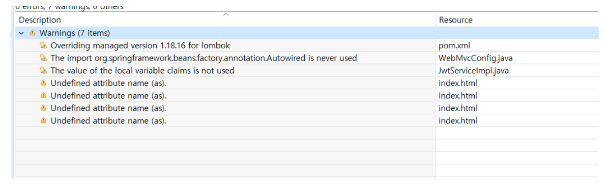
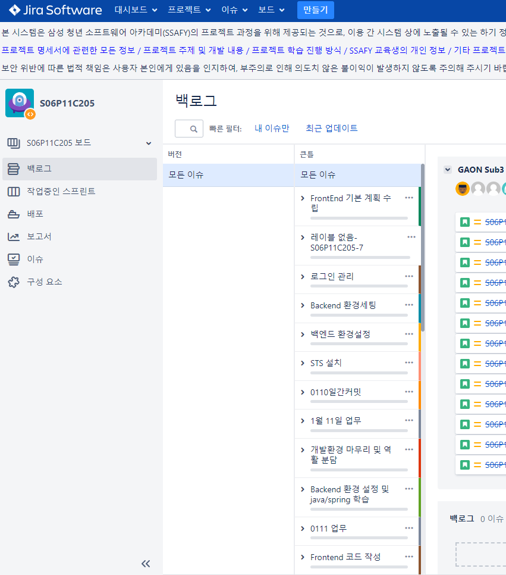
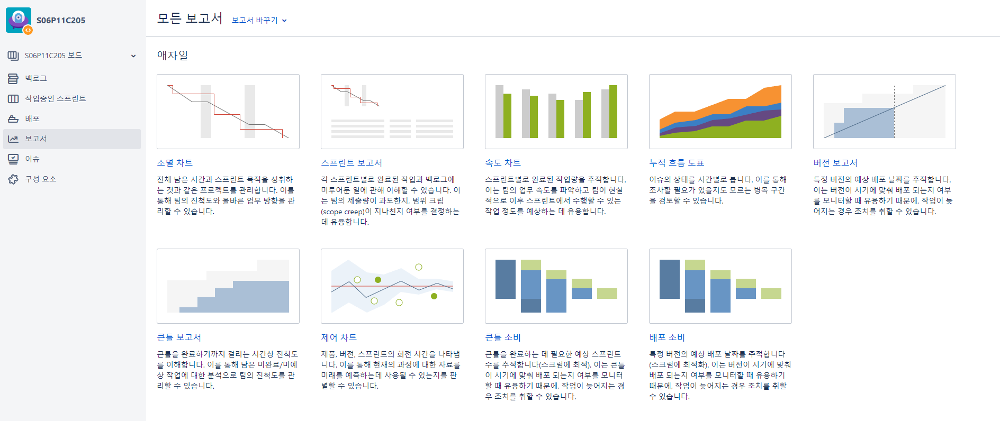
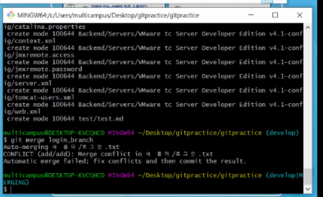

# 220114

### 공통PJT 관련 진행한 내용



- pom.xml
  - version 2.4.0 으로 변경하여 에러 해결

- 
- swagger : 프론트엔드가 활용할 수 있는 백엔드에서 만들어놓은 메소드들 정리하는 페이지



- 서버는 실행되었으나 warning이....

---

## 어색한 개념 / 용어 정리

### Tomcat

```
아파치 소프트웨어 파운데이션(Apache Software Foundation)에서 서버인 자바(Java)를 움직이게 하기 위해 개발한 AP서버.
웹서버에서 서블릿(servlet), JSP, 빈즈와 같은 자바 코드를 이해하기 위해서는 톰캣 같은 자바를 이해하는 엔진이 있어야 한다. 비용이나 성능면에서는 자바 기반 웹서버를 구성할 때 리눅스(Linux), 아파치, 톰캣 조합을 많이 사용한다.

웹프로그램은 순수한 프로그램 언어로만 이루어진 것이 아니라 클라이언트 언어인 HTML이 혼용되었는데, 톰캣은 자바 파일만 해석할 수 있다. HTML과 혼용된 경우 컴파일 과정을 거친다. JSP페이지는 서블릿 형태로 일단 변형되어 완벽한 자바 파일로 변형된 뒤 컴파일된다.

자바 서블릿과 JSP 규격의 '참조용 구현'으로 평가되고 있는 톰캣은, 개발자들의 개방적 협력 작업의 산물로 아파치 웹사이트에서 받을 수 있다. 톰캣을 실행시키기 위해서는 JRE1.1 이상에 부합되는 자바 런타임 환경이 필요하다.
[네이버 지식백과] 톰캣 [Tomcat] (두산백과)
```


### Tomcat 서버 에러 5가지

```
tomcat서버 에러 문제는 무조건 아래 5가지 원인에 기인한다. 

1. web.xml 에러
servlet등록이 잘못되어 있을 때를 말한다. servlet-name, servlet-classm url-pattern을 오타없이 정확히 기입했는지 확인하자.

2. 서블릿 어노테이션
생성한 servlet의 어노테이션에 오타가 있을 경우 서버가 시작되지 않는다. 때문에 어노테이션 부분을 잘못 썼는지 다시 한번 확인해 보자.

3. 포트번호(8080) 충돌
기본설정 포트번호인 8080에 다른 서버가 잡혀 있어서 톰캣서버가 이 포트번호에 접속하려는 경우 충돌이 발생하면 역시 에러가 난다. 톰캣의 conf폴더의 server.xml파일에서 포트번호를 다른 번호로 변경해주자(보통 8090이나 80를 사용한다).

4. 프로젝트 클린 안해서
프로젝트를 주기적으로 클린해주지 않으면 가끔씩 서버가 꼬이는 경우가 있다. 때문에 프로젝트 클린 또한 한 번 실시해주도록 한다.

5. 프로젝트에 서버 업로드 안해서
웹프로젝트에 서버가 업로드 되지 않아서 발생할 경우도 있다(이 때는 프로젝트 파일들의 http관련 클래스에 빨간줄이 그어져 있을 것이다). 해당 프로젝트를 우클릭 한 후 properties => java build path=> libraries => add library => server runtime => tomcat7을 등록한다.

이에 해당하는 원인만 꼼꼼히 살펴주면 반.드.시 문제를 해결할 수 있다. 하나하나씩 정확하게 디버깅하여 에러의 원인을 찾도록 하자.

```


### Maven

```
1. 빌드(Build)
#1 빌드란?
- 소스코드 파일을 컴퓨터에서 실행할 수 있는 독립 소프트웨어 가공물로 변환하는 과정 또는 그에 대한 결과물 이다.
 - 이를 좀더 쉽게 풀어 말하자면 우리가 작성한 소스코드(java), 프로젝트에서 쓰인 각각의 파일 및 자원 등(.xml, .jpg, .jar, .properties)을 JVM이나 톰캣같은 WAS가 인식할 수 있는 구조로 패키징 하는 과정 및 결과물이라고 할 수 있다.

#2 빌드 도구(Build tool)
 - 빌드 도구란 프로젝트 생성, 테스트 빌드, 배포 등의 작업을 위한 전용 프로그램.
 - 빠른기간동안 계속해서 늘어나는 라이브러리 추가, 프로젝트를 진행하며 라이브러리의 버전 동기화의 어려움을 해소하고자 등장.
 - 초기의 java 빌드도구로 Ant를 많이 사용하였으나 최근 많은 빌드도구들이 생겨나 Maven이 많이 쓰였고, 현재는 Gradle이 많이 쓰인다.
(Ant는 스크립트 작성도 많고, 라이브러리 의존관리가 되지 않아 불편함)


2. Maven
#1 정의 및 특징
 - Maven은 자바용 프로젝트 관리도구로 Apache Ant의 대안으로 만들어졌다.
 - Maven은 Ant와 마찬가지로 프로젝트의 전체적인 라이프 사이클을 관리하는 도구 이며, 많은 편리함과 이점이 있어 널리 사용되고 있다.
   (프로젝트의 작성부터 컴파일, 페트스 등 프로젝트 라이프사이클에 포함되는 각 테스트를 지원해준다.)

 - Maven은 필요한 라이브러리를 특정 문서(pom.xml)에 정의해 놓으면 내가 사용할 라이브러리 뿐만 아니라 해당 라이브러리가 작동하는데에 필요한 다른 라이브러리들까지 관리하여 네트워크를 통해서 자동으로 다운받아 준다.
 - Maven은 중앙 저장소를 통한 자동 의존성 관리를 중앙 저장소(아파치재단에서 운영 관리)는 라이브러리를 공유하는 파일 서버라고 볼 수 있고, 메이븐은 자기 회사만의 중앙 저장소를 구축할수도 있다.
 - 간단한 설정을 통한 배포 관리가 가능 하다.
 
 #3 Maven LifeCycle
1) LifeCycle
 - 미리 정해진 빌드순서
 - 메이븐은 프레임워크이기 때문에 동작 방식이 정해져있고, 미리 정의하고 있는 빌드 순서가 있다. 이를 라이프사이클(Lifecycle)이라 한다. 

◎ Default(Build) : 일반적인 빌드 프로세스를 위한 모델이다.
◎ Clean : 빌드 시 생성되었던 파일들을 삭제하는 단계
◎ Validate : 프로젝트가 올바른지 확인하고 필요한 모든 정보를 사용할 수 있는지 확인하는 단계
◎ Compile : 프로젝트의 소스코드를 컴파일 하는 단계
◎ Test : 유닛(단위) 테스트를 수행 하는 단계(테스트 실패시 빌드 실패로 처리, 스킵 가능)
◎ Pacakge : 실제 컴파일된 소스 코드와 리소스들을 jar, war 등등의 파일 등의 배포를 위한 패키지로 만드는 단계
◎ Verify : 통합 테스트 결과에 대한 검사를 실행하여 품질 기준을 충족하는지 확인하는 단계
◎ Install : 패키지를 로컬 저장소에 설치하는 단계
◎ Site : 프로젝트 문서와 사이트 작성, 생성하는 단계
◎ Deploy : 만들어진 package를 원격 저장소에 release 하는 단계

최종 빌드 순서는 compile => test => package 이다. 
① compile : src/main/java 디렉토리 아래의 모든 소스 코드가 컴파일 된다.
② test : src/test/java, src/test/resources 테스트 자원 복사 및 테스트 소스 코드 컴파일 된다. 

     ※ junit : 단위 테스트 프레임워크. 테스트 단계를 거치기 위해 의존 설정을 해준다.
③ packaging : 컴파일과 테스트가 완료 된 후, jar, war 같은 형태로 압축하는 작업.

2) Phase(단계)
Build Lifecycle의 각각의 단계를 Phase라고 한다.
Phase는 의존관계를 가지고 있어 해당 Phase가 수행되려면 이전 단계의 Phase가 모두 수행되어야 한다.
즉, 모든 빌드단계는 이전 단계가 성공적으로 실행되었을 때 실행된다는 것이 Dependency 입니다.

3) Goal
 - 특정 작업, 최소한의 실행 단위(task).
 - 하나의 플러그인에서는 여러 작업을 수행할 수 있도록 지원하며, 플러그인에서 실행할 수 있는 각각의 기능(명령)을 Goal이라고 한다.
(각각의 Phase에 연계된 Goal을 실행하는 과정을 Build라고 한다.)

 - 플러그인의 goal을 실행하는 방법은 다음과 같다.
■ - mvn groupId:artifactId:version:goal(아래와 같이 생략 가능)
■ - mvn plugin:goal


#4 Maven 설정파일
1) settings.xml
- 메이븐 빌드 툴과 관련한 설정파일
- MAVEN_HOME/conf 디렉토리에 위치 (메이븐 설치 시 기본 제공)
- settings.xml의  설정
  
** 메이븐을 빌드할 때 의존 관계에 있는 라이브러리, 플러그인을 중앙 저장소에서 개발자 PC로 다운로드 하는위치(로컬저장소)의 기본 설정 'USER_HOME/.m2/repository' 인데 settings.xml의 에 원하는 로컬 저장소의 경로를 지정, 변경할 수 있다.

2) POM(프로젝트 객체 모델(Project Object Model))
- POM은 pom.xml파일을 말하며 pom.xml은 메이븐을 이용하는 프로젝트의 root에 존재하는 xml 파일이다.
   (하나의 자바 프로젝트에 빌드 툴을 maven으로 설정하면, 프로젝트 최상위 디렉토리에 "pom.xml"이라는 파일이 생성된다.)
 - Maven의 기능을 이용하기 위해서 POM이 사용된다. 
 - 파일은 프로젝트마다 1개이며, pom.xml만 보면 프로젝트의 모든 설정, 의존성 등을 알 수 있다.
 - 다른 파일이름으로 지정할 수도 있다. (mvn -f 파일명.xml test). 하지만 pom.xml으로 사용하기를 권장한다.

▶ 엘리먼트
◎ modelVersion : POM model의 버전
◎ parent : 프로젝트의 계층 정보
◎ groupId : 프로젝트를 생성하는 조직의 고유 아이디를 결정한다. 일반적으로 도메인 이름을 거꾸로 적는다.
◎ artifactId : 프로젝트 빌드시 파일 대표이름 이다. groupId 내에서 유일해야 한다. Maven을 이용하여 빌드시 다음과 같은 규칙으로 파일이 생성 된다.
     artifactid-version.packaging. 위 예의 경우 빌드할 경우 bo-0.0.1-SNAPSHOT.war 파일이 생성된다.  (하단 예시 파일 참고)
◎ version : 프로젝트의 현재 버전, 프로젝트 개발 중일 때는 SNAPSHOT을 접미사로 사용.
◎ packaging : 패키징 유형(jar, war, ear 등)
◎ name : 프로젝트, 프로젝트 이름
◎ description : 프로젝트에 대한 간략한 설명
◎ url : 프로젝트에 대한 참고 Reference 사이트
◎ properties : 버전관리시 용이 하다. ex) 하당 자바 버전을 선언 하고 dependencies에서 다음과 같이 활용 가능 하다.
      <version>${java.version}</version>
◎ dependencies : dependencies태그 안에는 프로젝트와 의존 관계에 있는 라이브러리들을 관리 한다.
◎ build : 빌드에 사용할 플러그인 목록

+) 복잡한 프로젝트, 멀티 프로젝트의 경우는 Gradle이 많이 사용된다고 한다.
```


### MyBatis

```
1. 객체 지향 언어인 자바의 관계형 데이터베이스 프로그래밍을 보다 쉽게 도와주는 프레임워크

2. 자바에서는 관계형 데이터베이스 프로그래밍을 하기위해 JDBC를 제공

	*JDBC(Java Data Connectivity): 자바 프로그래밍이 데이터베이스와 연결되어 데이터를 주고 받을 수 있게 해주는 프로그래밍 인터페이스이다(DriverClass, Connection, PerparedStatement, ResultSet etc..)

3. JDBC는 다양한 관계형 데이터베이스 프로그래밍을 위해 API 제공.

결론: MyBatis는 JDBC를 보다 편하게 사용하기 위해 개발되었다.

# MyBatis의 특징
1. SQL문이 코드로부터 완전히 분리
	- 기존에는 DAO파일에 모든 SQL문을 작성하였다. 하지만 MyBatis에서는 Mapper파일에 SQL코드를 입력해 놓고 DAO파일에서 필요할 때마다 가져와서 사용할 수 있다.
	- XML, 애노테이션 방식으로 SQL 문을 별도로 처리하는 작업이 가능하고, 필요한 경우에는 두가지 방식을 혼용해서 사용하는 것도 가능하다.
	- 본 포스팅에서는 간단한 SQL은 직접 애노테이션을 이용해서 처리하고, 복잡하고 많은 양의 SQL에 대해서는 별도의 XML을 작업하는 형태로 간결함을 유지한다.
2. 생산성: 코드가 짧아진다.
3. Spring과의 연동으로 자동화된 처리
	- 스프링과 MyBatis를 연계하는 MyBatis-Spring 라이브러리를 이용하면, 개발자는 직접 SQL문의 호출업싱도 원하는 결과를 얻을 수 있다.
	- 이때문에 MyBatis는 단독으로 사용하는 것보다는 스프링과 연계해서 사용하는 편이 오히려 코드의 양을 줄여주게 된다.
4. 유지보수성 향상(동적 SQL을 이용한 제어 기능)
	- Mapper 파일에만 SQL코드를 입력하고 나중에 SQL코드를 변경할 때 이곳에서 유지보수만 하면, DAO에서는 아무런 영향을 받지 않는다. 왜냐하면 DAO에서는 Mapper파일에서 작성된 SQL코드를 갖다 쓰기만 하기 때문이다.
	- MyBatis는 기본적으로 SQL문을 처리하기는 하지만, 약간의 제어문이나 루프등의 처리기능을 가지고 있다.
이를 통해서 SQL과 관련된 처리를 Java코드에서 분리시킬 수가 있다.


# MyBatis의 구성
1. MyBatis 환경설정 파일(SqlSessionConfig.xml): MyBatis가 JDBC코드를 실행하는데 필요한 전반에 걸친 세팅을 한다.
	- TypAlias 설정: 사용할 모델 클래스에 대한 별칭 설정.\<typeAlias>
	- DB연동을 위한 설정: DataBase에 어떻게 접속할 것인지에 대한 설정. \<environment>
	- Mapper설정 파일 등록: 매핑 설정이 어디있는지. \<mapper>
2. Mapper 설정 파일(member.xml, company.xml): sql문과 관련된 설정을 하는 파일로서 MyBatis설정파일(SqlSessionConfig.xml)에 등록을 하여야 한다.
	- 주요 구성 요소
		- SQL문 등록 태그
		- SQL문 태그의 구성요소: Parameter, Result, SQL문 등록
		- SQL태그: insert, delete, update, select
		- 공통 SQL문 설정 태그: \<sql>
	- select 결과 처리 설정
		- \<resultMap>
		
# MySQL과의 연결을 담당하는 DataSource 설정하기
- 스프링과 MyBatis를 같이 사용하는 경우에는 주로 스프링의 설정으로 JDBC 연결을 처리하는 경우가 많기 때문에 전에 추가한 spring-jdbc 모듈(pom.xml)의 클래스를 이용해서 applicationContext.xml에 다음과 같이 DataSource라는 것을 추가한다.
- DataSource는 JDBC의 커넥션을 처리하는 기능을 가지고 있기 때문에 데이터베이스와 연동 작업에 반드시 필요하다.
```

---

### DAO, DTO, Entity Class

##### DAO(Data Access Object)

````
repository package

- 실제로 DB에 접근하는 객체이다.
	- Persistence Layer(DB에 data를 CRUD하는 계층)이다.
- Service와 DB를 연결하는 고리의 역할을 한다.
- SQL를 사용(개발자가 직접 코딩)하여 DB에 접근한 후 적절한 CRUD API를 제공한다.
	- JPA 대부분의 기본적인 CRUD method를 제공하고 있다.
	- extends JpaRepository<User, Long>
````

#### DTO(Data Transfer Object)

```
dto package

- 계층간 데이터 교환을 위한 객체(Java Beans)이다.
	- DB에서 데이터를 얻어 Service나 Controller 등으터 보낼 때 사용하는 객체를 말한다.
	- 즉, DB의 데이터가 Presentation Logic Tier로 넘어오게 될 때는 DTO의 모습으로 바뀌어서 오고가는 것이다.
	- 로직을 갖고 있지 않는 순수한 데이터 객체이며, getter/setter 메서드만을 갖는다.
	- 하지만 DB에서 꺼낸 값을 임의로 변경할 필요가 없기 때문에 DTO클래스에는 setter가 없다. (대신 생성자에서 값을 할당한다.)
- Request와 Response용 DTO는 View를 위한 클래스
	- 자주 변경이 필요한 클래스
	- Presentation Model
	- toEntity() 메서드를 통해서 DTO에서 필요한 부분을 이용하여 Entity로 만든다.
	- 또한 Controller Layer에서 Response DTO 형태로 Client에 전달한다.
- 참고 VO(Value Object) vs DTO
	- VO는 DTO와 동일한 개념이지만 read only 속성을 갖는다.
	- VO는 특정한 비즈니스 값을 담는 객체이고, DTO는 Layer간의 통신 용도로 오고가는 객체를 말한다.
```

### Entity Class

```
- domain package

- 실제 DB의 테이블과 매칭될 클래스
	- 즉, 테이블과 링크될 클래스임을 나타낸다.
	- Entity 클래스 또는 가장 Core한 클래스라고 부른다.
	- @Entity, @Column, @Id 등을 이용
- 최대한 외부에서 Entity 클래스의 getter method를 사용하지 않도록 해당 클래스 안에서 필요한 로직 method을 구현한다.
	- 단, Domain Logic만 가지고 있어야 하고 Presentation Logic을 가지고 있어서는 안된다.
	- 여기서 구현한 method는 주로 Service Layer에서 사용한다.
- 참고 Entity 클래스와 DTO 클래스를 분리하는 이유
	- View Layer와 DB Layer의 역할을 철저하게 분리하기 위해서
	- 테이블과 매핑되는 Entity 클래스가 변경되면 여러 클래스에 영향을 끼치게 되는 반면 View와 통신하는 DTO 클래스(Request / Response 클래스)는 자주 변경되므로 분리해야 한다.
	- Domain Model을 아무리 잘 설계했다고 해도 각 View 내에서 Domain Model의 getter만을 이용해서 원하는 정보를 표시하기가 어려운 경우가 종종 있다. 이런 경우 Domain Model 내에 Presentation을 위한 필드나 로직을 추가하게 되는데, 이러한 방식이 모델링의 순수성을 깨고 Domain Model 객체를 망가뜨리게 된다.
	- 또한 Domain Model을 복잡하게 조합한 형태의 Presentation 요구사항들이 있기 때문에 Domain Model을 직접 사용하는 것은 어렵다.
	- 즉 DTO는 Domain Model을 복사한 형태로, 다양한 Presentation Logic을 추가한 정도로 사용하며 Domain Model 객체는 Persistent만을 위해서 사용한다.
```

----

### jira, commit, branch, gitlab의 기본적인 이론과 경험 관련 웹엑스 세션 참여

- 

- 
- 숨겨져 있던(?) 새로운 기능의 발견...
- 스마트커밋?
  - Jira와 연동
  - gitLab과 연동
- 아직은 낯설고 어렵다...

---

##### git branch 실습

- `git branch` : 현재 생성된 깃 브랜치를 조회하는 명령어

- `git branch <브랜치명>`: 새로운 깃 브랜치를 생성하는 명령어
- `git switch <브랜치명>`: 생성되어있는 브랜치로 현재 작업중인 브랜치를 변경하는 명령어



- pull할 때, CONFLICT / Automatic merge failed 발생
  - git status 입력시 both modified라고 적혀있는 파일이 충돌이 난 것

    ```
    >>>>>>>HEAD
    "내 소스코드"
    ==============
    "merge하려는 소스코드"
    <<<<<<<< <merge할 브랜치명>
    ```

    - 위 코드를 수정한뒤
    - git add "파일명"
    - git commit 하여 merge함

