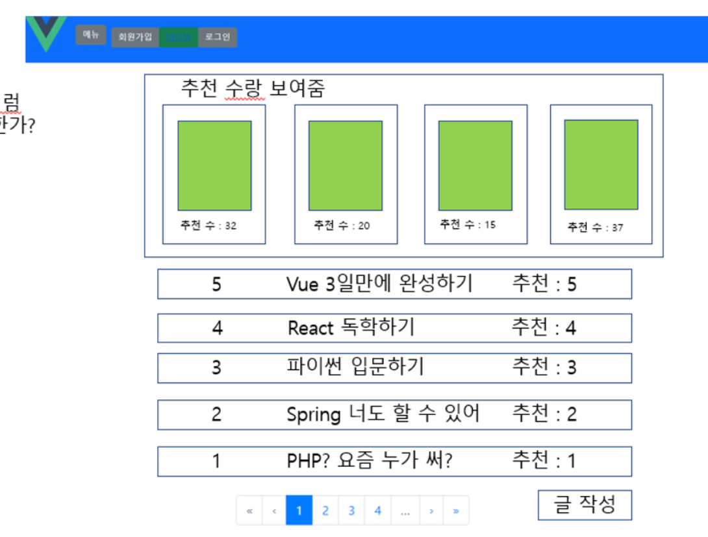
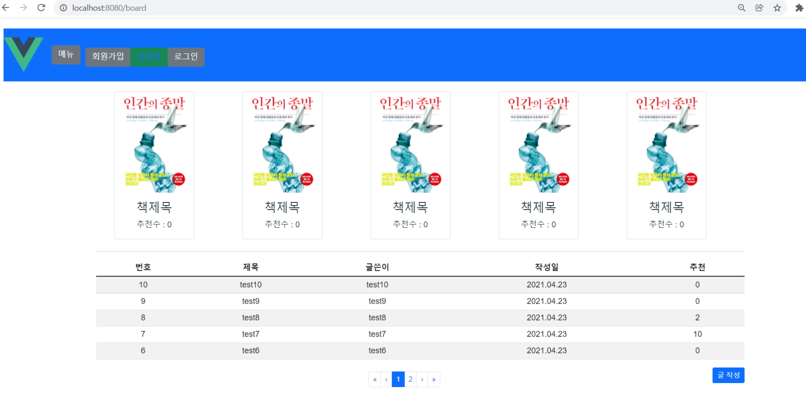
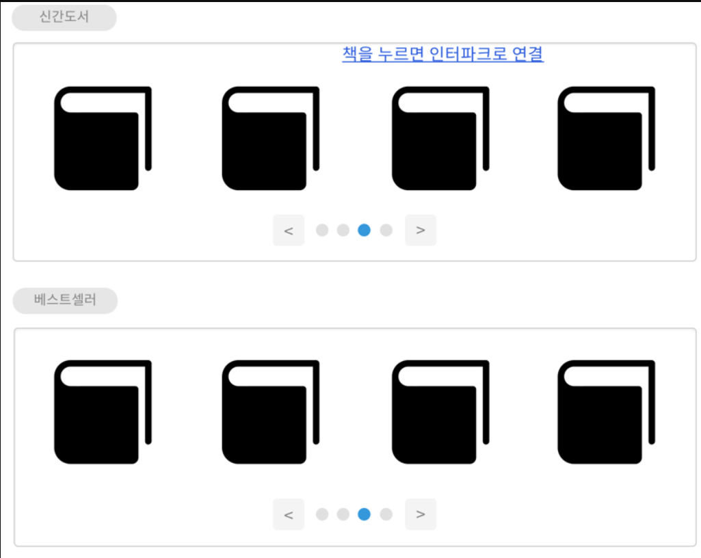
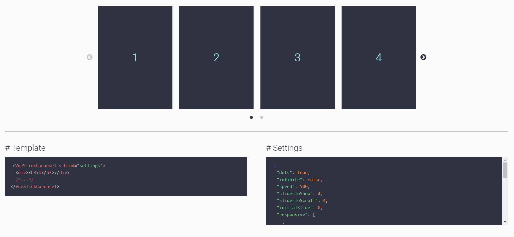
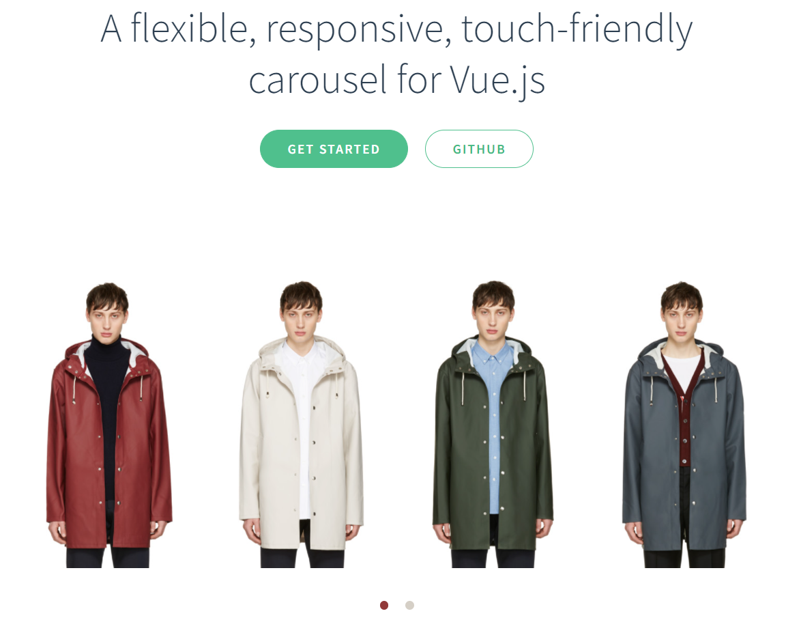

# 220119

### 공통PJT 관련 진행한 내용

- Review 게시판(Board.vue) 페이지 시안 확인



- 아직 Vue가 너무 감이 안오지만 조금이라도 코드에 익숙해지기 위해

  기존에 만들어져있는 디자인 시안을 참조해 레이아웃만 유사하게 만들어 봄

- bootstrap-vue 사용

  - card / table / pagination
    - table / pagination 은 구글링하여 코드 참조했음



- code

  ```
  <template>
    <div id="app">
      <b-card-group deck class="container">
        <div class="row row-cols-1 row-cols-sm-2 row-cols-md-3 row-cols-xxl-4 g-4 mb-3">
          <!--1-->
          <b-card
            title="책제목"
            img-src="http://image.kyobobook.co.kr/images/book/xlarge/893/x9791196961893.jpg"
            img-alt="Image"
            img-top
            tag="article"
            style="max-width: 10rem;"
            class="mb-4 mx-5"
          >
            <b-card-text>
              추천수 : 0
            </b-card-text>
  
          </b-card>
          <!--2-->
          <b-card
            title="책제목"
            img-src="http://image.kyobobook.co.kr/images/book/xlarge/893/x9791196961893.jpg"
            img-alt="Image"
            img-top
            tag="article"
            style="max-width: 10rem;"
            class="mb-4 mx-5"
          >
            <b-card-text>
              추천수 : 0
            </b-card-text>
  
          </b-card>
          <!--3-->
          <b-card
            title="책제목"
            img-src="http://image.kyobobook.co.kr/images/book/xlarge/893/x9791196961893.jpg"
            img-alt="Image"
            img-top
            tag="article"
            style="max-width: 10rem;"
            class="mb-4 mx-5"
          >
            <b-card-text>
              추천수 : 0
            </b-card-text>
  
          </b-card>
          <!--4-->
          <b-card
            title="책제목"
            img-src="http://image.kyobobook.co.kr/images/book/xlarge/893/x9791196961893.jpg"
            img-alt="Image"
            img-top
            tag="article"
            style="max-width: 10rem;"
            class="mb-4 mx-5"
          >
            <b-card-text>
              추천수 : 0
            </b-card-text>
  
          </b-card>
          <!--5-->
          <b-card
            title="책제목"
            img-src="http://image.kyobobook.co.kr/images/book/xlarge/893/x9791196961893.jpg"
            img-alt="Image"
            img-top
            tag="article"
            style="max-width: 10rem;"
            class="mb-4 mx-5"
          >
            <b-card-text>
              추천수 : 0
            </b-card-text>
  
          </b-card>
        </div>
      </b-card-group>
    
      <div class="container">
        <!-- <h1>Board</h1> -->    
        <hr/>
  
        <!-- <p class="mt-3">현재 페이지: {{ currentPage }}</p> -->
        <b-table id="my-table" striped hover 
          :items="items"
          :per-page="perPage"
          :current-page="currentPage" small
        ></b-table>
  
        <b-button variant="primary float-end" size="sm">글 작성</b-button>
  
        <b-pagination
          v-model="currentPage"
          :total-rows="rows"
          :per-page="perPage"
          size="sm"
          align="center"
          class="mt-4">
        </b-pagination>
      </div>
  
  </div>
  </template>
  
  <script>
    export default {
      data(){
        return {
          perPage: 5,
          currentPage: 1,
          items: [
            {번호: 10, 제목: "test10", 글쓴이: "test10", 
            작성일: "2021.04.23", 추천: 0},
            {번호: 9, 제목: "test9", 글쓴이: "test9", 
            작성일: "2021.04.23", 추천: 0},
            {번호: 8, 제목: "test8", 글쓴이: "test8", 
            작성일: "2021.04.23", 추천: 2},
            {번호: 7, 제목: "test7", 글쓴이: "test7", 
            작성일: "2021.04.23", 추천: 10},
            {번호: 6, 제목: "test6", 글쓴이: "test6", 
            작성일: "2021.04.23", 조회: 34, 추천: 0},
            {번호: 5, 제목: "test5", 글쓴이: "test5",
            작성일: "2021.04.23", 추천: 0},
            {번호: 4, 제목: "test4", 글쓴이: "test4",
            작성일: "2021.04.23", 추천: 0},
            {번호: 3, 제목: "test3", 글쓴이: "test3",
            작성일: "2021.04.23", 추천: 0},
            {번호: 2, 제목: "test2", 글쓴이: "test2",
            작성일: "2021.04.23", 추천: 0},
            {번호: 1, 제목: "test1", 글쓴이: "test1",
            작성일: "2021.04.23", 추천: 0}
          ]
        }
      },
      computed: {
        rows() {
          return this.items.length
        }
      }
    }
  </script>
  
  <style>
  #app {
    margin: 20px;
  }
  </style>
  ```

- 추후 DB에서 데이터 연동하여 card 부분은 for문을 사용해야 할텐데 아직 감이 오지 않음.......

- 말그대로 모양새만 만들었고 이게 페이지에 당장 표시가 되는게 중요한 게 아니라 DB에서 데이터를 가지고 오는게 기능 구현의 핵심

- 게시판 부분도 마찬가지로 DB에서 연동한 데이터를 출력하고, 제목의 링크를 통해 해당 게시글 상세 조회 페이지로 이동이 되어야 함

- axios를 사용해서 REST api 데이터를 연동해야 하는데

  -  어떻게 해야할지 아직 감이 안오니 게시판 관련 코드를 더 찾아보기

- 게시글 상세 조회 페이지와 게시글을 올릴 수 있는 글작성 form 페이지가 추가로 필요함

----

- Book.vue carousel / slider 로 추천도서 페이지 구현하기



- carousel / slider 관련 라이브러리를 검색해서 적용해보려고 했으나 실패했다

  - https://gs-shop.github.io/vue-slick-carousel/#/

    - 

      ```
      # Installation
      	# npm
          npm i vue-slick-carousel
          # yarn
          yarn add vue-slick-carousel
          # bit
          bit import gsshop.vue-slick-carousel/vue-slick-carousel
          
      # API & Examples
      <template>
        <div>
          <VueSlickCarousel :arrows="true" :dots="true">
            <div>1</div>
            <div>2</div>
            <div>3</div>
            <div>4</div>
          </VueSlickCarousel>
        </div>
      </template>
      
      <script>
        import VueSlickCarousel from 'vue-slick-carousel'
        // optional style for arrows & dots
        import 'vue-slick-carousel/dist/vue-slick-carousel-theme.css'
      
        export default {
          name: 'MyComponent',
          components: { VueSlickCarousel },
        }
      </script>
      ```

      

  - https://ssense.github.io/vue-carousel/

    - 

      ```
      # Installation
      npm install -S vue-carousel
      
      # Usage(Global)
      import Vue from 'vue';
      import VueCarousel from 'vue-carousel';
      Vue.use(VueCarousel);
      
      # Usage(Local)
      import { Carousel, Slide } from 'vue-carousel';
      export default {
        ...
        components: {
          Carousel,
          Slide
        }
        ...
      };
      
      # HTML Structure
      <carousel>
        <slide>
          Slide 1 Content
        </slide>
        <slide>
          Slide 2 Content
        </slide>
      </carousel>
      ```

  - 친절한 공식문서, 그러나...

    - 원리를 너무 몰라서 그런가.. 다들 찾아가면서 한다는데... 어떻게 해결해야 할지 고민 

### 공통PJT 2주 3일차 학습후기

```
시간 내내 앉아서 열심히 구글링을 했지만 효율은 낮았던 것 같습니다. 너무 되는 대로만 하려고 해서 그런 것 같은데 원리를 공부하려니 그게 또 막연하게 느껴집니다. 어떤 방식이 프로젝트에 기여하고 실력도 늘릴 수 있는 정답인지 모르겠습니다. 이게 바로 메타인지 부족인걸까요. 안타깝지만 스스로 안된다 못한다 하니 더 안 되는 것 같아서.. 그래도 최선을 다하고 내일은 오늘보다 내가 나아졌으면 좋겠습니다.
```

