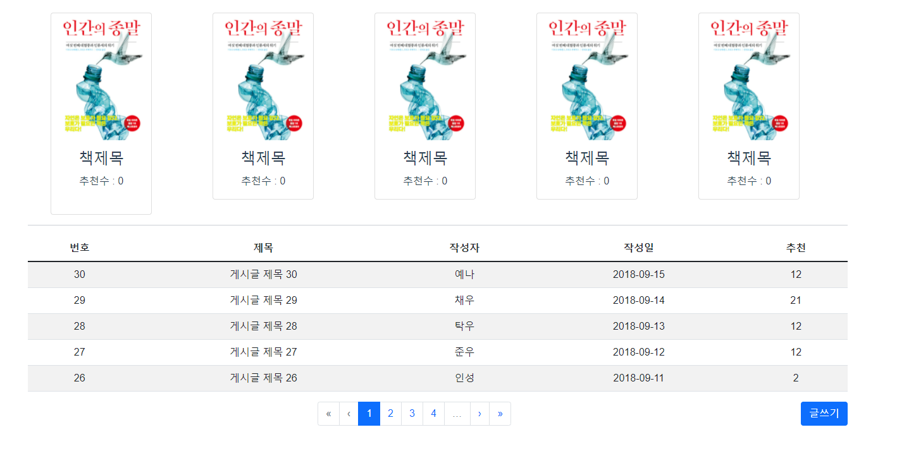
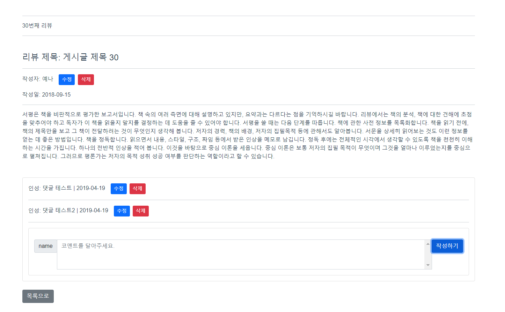
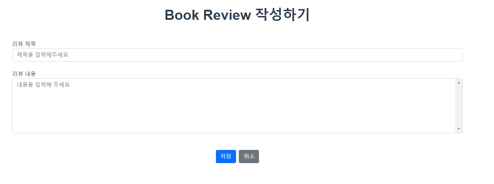

# 220120

### 공통PJT 관련 진행한 내용

- Board 관련 기능 파악 : 아래와 같은 기능이 필요하다
  - Board (리뷰 전체 조회(테이블 + 페이지네이션) + 상단 추천 도서 5개(카드))
  - BoardDetail (리뷰 상세  / 리뷰 추천기능)
  - BoardCreate (리뷰 작성 및 수정 form)
  - CommentCreate (코멘트 작성)
  - CommentList (코멘트 전체 목록)
  - CommentListItem (코멘트 세부 내용)

- 게시판 관련 code 추가적으로 찾아봄(codesandbox.io)
  - https://codesandbox.io/s/3v0m1?file=/src/components/board/BoardCreate.vue
    - 크게 심미적인 부분이 좋은 것 같지는 같지만 bootstrap-vue를 활용한 board 및 게시글 생성/수정/삭제 및 댓글 생성/수정/삭제 기능이 작성 되어있어 참조함

- Review 게시판(Board.vue) 페이지 레이아웃

  - 
  - 어제와 그대로인것 같지만 살짝 수정..했지만 크게 다르지는 않다. 실질적인 기능 반영은 전혀 안된 상황이다

- Review 상세 조회(BoardDetail.vue / CommentCreate.vue / CommentList.vue / CommentListItem.vue)

  - 
  - 마찬가지로 모양새만 만들어본 상황이다
  - 참조한 원본 코드가 계층형 댓글 기능(댓글 밑에 sub댓글을 작성하는 기능)을 사용하는 코드인데 해당 부분은 삭제하려고 하다가 실패함(에러가 남) / 일단 메소드는 남기고 버튼만 없앰
  - 그리고 댓글 수정/삭제 기능은 button만 있고 작성되어있지 않다.

- BoardCreate.vue

  - 

    - form은 일단 제목 / 내용 입력창만 고려

      

### 공통PJT 2주 4일차 학습후기

```
- Vue.js와 JavaScript에 대한 이해도가 낮아 할 수 있는 대로 레이아웃(?..근데 레이아웃이라는 표현은 적절한 표현인가..?) 만 만들어보는 상황인데.. 데이터 가져오는 부분에 대해 감이 거의 안오는 상황이다
- 팀원분의 도움으로, Vue.js 프로젝트의 게시판 관련 프론트엔드 코드를 받기는 했는데, 인증 관련 부분 주석처리하고, 데이터도 임시로 입력해보고 하면서 연구해봤지만 아직은 잘 모르겠다.. 그래서 모른다는 소리 언제까지 할텐가..? 답답...
- 그래서 지금 하는 작업이 실질적으로 의미가 있는 작업인지 약간 모르겠다는 것 + 시간만 시간대로 쓰고 하나도 도움 안돼면 어떡하지 하는 걱정이 든다.
- 1학기때 Vue.js로 프로젝트는 안했지만 게시판/댓글기능 다 해봤던 기능인데 프레임워크 좀 바뀌었다고 새로 보는 기능인 것 처럼 머리가 완전 리셋된 것 같다..큰 일이다.
- 내일 실질적으로 DB에 있는 데이터를 가져올 수 있도록 기능을 수정할 수 있다면 좋겠고, 안된다면 주말을 다 써서라도 Vue.js의 기능을 이해해서 코드를 작성해보고 싶다.
```

