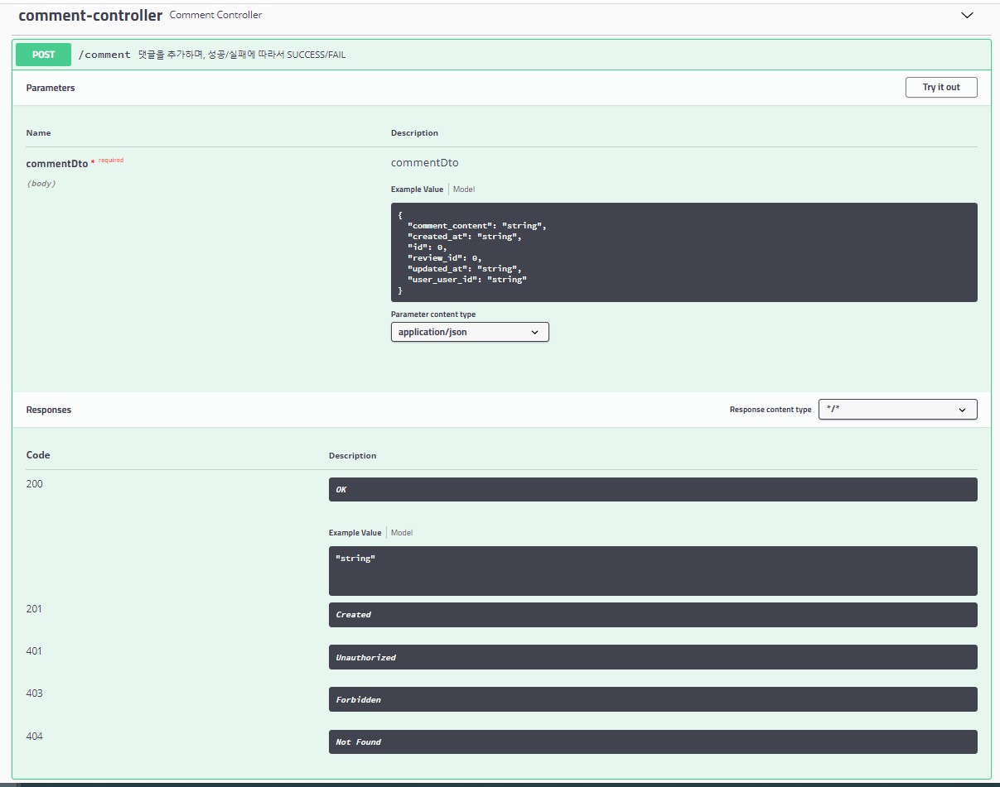

# 0121

### 공통PJT 관련 진행사항

 - 서버 실행
    - backend > springboot 서버 실행
    - frontend > npm run serve하여 서버 실행
      	- 꼭 npm run build 해서 생성된 파일을 backend 폴더의 static 폴더에 위치시켜야 적용되는 것은 아니라고 함
      	- 동시 실행시키고 localhost:7000으로 접속

- 서버 실행시 아래와 같은 에러발생

  - DB 문제로 발생하는 에러로 추정
  -  ' ### Error updating database.  Cause: org.springframework.jdbc.CannotGetJdbcConnectionException: Failed to obtain JDBC Connection; nested exception is java.sql.SQLSyntaxErrorException: Unknown database 'ssafy_web_db'

  ```java
  	at org.apache.catalina.core.ApplicationFilterChain.doFilter(ApplicationFilterChain.java:166) [tomcat-embed-core-9.0.39.jar:9.0.39]
  	at org.apache.catalina.core.StandardWrapperValve.invoke(StandardWrapperValve.java:202) [tomcat-embed-core-9.0.39.jar:9.0.39]
  	at org.apache.catalina.core.StandardContextValve.invoke(StandardContextValve.java:97) [tomcat-embed-core-9.0.39.jar:9.0.39]
  	at org.apache.catalina.authenticator.AuthenticatorBase.invoke(AuthenticatorBase.java:542) [tomcat-embed-core-9.0.39.jar:9.0.39]
  	at org.apache.catalina.core.StandardHostValve.invoke(StandardHostValve.java:143) [tomcat-embed-core-9.0.39.jar:9.0.39]
  	at org.apache.catalina.valves.ErrorReportValve.invoke(ErrorReportValve.java:92) [tomcat-embed-core-9.0.39.jar:9.0.39]
  	at org.apache.catalina.core.StandardEngineValve.invoke(StandardEngineValve.java:78) [tomcat-embed-core-9.0.39.jar:9.0.39]
  	at org.apache.catalina.connector.CoyoteAdapter.service(CoyoteAdapter.java:343) [tomcat-embed-core-9.0.39.jar:9.0.39]
  	at org.apache.coyote.http11.Http11Processor.service(Http11Processor.java:374) [tomcat-embed-core-9.0.39.jar:9.0.39]
  	at org.apache.coyote.AbstractProcessorLight.process(AbstractProcessorLight.java:65) [tomcat-embed-core-9.0.39.jar:9.0.39]
  	at org.apache.coyote.AbstractProtocol$ConnectionHandler.process(AbstractProtocol.java:868) [tomcat-embed-core-9.0.39.jar:9.0.39]
  	at org.apache.tomcat.util.net.NioEndpoint$SocketProcessor.doRun(NioEndpoint.java:1590) [tomcat-embed-core-9.0.39.jar:9.0.39]
  	at org.apache.tomcat.util.net.SocketProcessorBase.run(SocketProcessorBase.java:49) [tomcat-embed-core-9.0.39.jar:9.0.39]
  	at java.util.concurrent.ThreadPoolExecutor.runWorker(ThreadPoolExecutor.java:1149) [na:1.8.0_192]
  	at java.util.concurrent.ThreadPoolExecutor$Worker.run(ThreadPoolExecutor.java:624) [na:1.8.0_192]
  	at org.apache.tomcat.util.threads.TaskThread$WrappingRunnable.run(TaskThread.java:61) [tomcat-embed-core-9.0.39.jar:9.0.39]
  	at java.lang.Thread.run(Thread.java:748) [na:1.8.0_192]
  
  2022-01-21 15:09:53.690 DEBUG 11584 --- [0.1-7000-exec-6] o.s.web.servlet.DispatcherServlet        : Failed to complete request: org.mybatis.spring.MyBatisSystemException: nested exception is org.apache.ibatis.exceptions.PersistenceException: 
  ### Error updating database.  Cause: org.springframework.jdbc.CannotGetJdbcConnectionException: Failed to obtain JDBC Connection; nested exception is java.sql.SQLSyntaxErrorException: Unknown database 'ssafy_web_db'
  ### The error may exist in file [C:\Users\SSAFY\Desktop\공통PJT\S06P12C205\Backend-spring\target\classes\mapper\user.xml]
  ### The error may involve com.ssafy.backend.model.mapper.UserMapper.registerUser
  ### The error occurred while executing an update
  ### Cause: org.springframework.jdbc.CannotGetJdbcConnectionException: Failed to obtain JDBC Connection; nested exception is java.sql.SQLSyntaxErrorException: Unknown database 'ssafy_web_db'
  2022-01-21 15:09:53.691 ERROR 11584 --- [0.1-7000-exec-6] o.a.c.c.C.[.[.[/].[dispatcherServlet]    : Servlet.service() for servlet [dispatcherServlet] in context with path [] threw exception [Request processing failed; nested exception is org.mybatis.spring.MyBatisSystemException: nested exception is org.apache.ibatis.exceptions.PersistenceException: 
  ### Error updating database.  Cause: org.springframework.jdbc.CannotGetJdbcConnectionException: Failed to obtain JDBC Connection; nested exception is java.sql.SQLSyntaxErrorException: Unknown database 'ssafy_web_db'
  ### The error may exist in file [C:\Users\SSAFY\Desktop\공통PJT\S06P12C205\Backend-spring\target\classes\mapper\user.xml]
  ### The error may involve com.ssafy.backend.model.mapper.UserMapper.registerUser
  ### The error occurred while executing an update
  ### Cause: org.springframework.jdbc.CannotGetJdbcConnectionException: Failed to obtain JDBC Connection; nested exception is java.sql.SQLSyntaxErrorException: Unknown database 'ssafy_web_db'] with root cause
  
  java.sql.SQLSyntaxErrorException: Unknown database 'ssafy_web_db'
  	at com.mysql.cj.jdbc.exceptions.SQLError.createSQLException(SQLError.java:120) ~[mysql-connector-java-8.0.22.jar:8.0.22]
  	at com.mysql.cj.jdbc.exceptions.SQLError.createSQLException(SQLError.java:97) ~[mysql-connector-java-8.0.22.jar:8.0.22]
  	at com.mysql.cj.jdbc.exceptions.SQLExceptionsMapping.translateException(SQLExceptionsMapping.java:122) ~[mysql-connector-java-8.0.22.jar:8.0.22]
  	at com.mysql.cj.jdbc.ConnectionImpl.createNewIO(ConnectionImpl.java:836) ~[mysql-connector-java-8.0.22.jar:8.0.22]
  	at com.mysql.cj.jdbc.ConnectionImpl.<init>(ConnectionImpl.java:456) ~[mysql-connector-java-8.0.22.jar:8.0.22]
  	at com.mysql.cj.jdbc.ConnectionImpl.getInstance(ConnectionImpl.java:246) ~[mysql-connector-java-8.0.22.jar:8.0.22]
  	at com.mysql.cj.jdbc.NonRegisteringDriver.connect(NonRegisteringDriver.java:198) ~[mysql-connector-java-8.0.22.jar:8.0.22]
  	at com.zaxxer.hikari.util.DriverDataSource.getConnection(DriverDataSource.java:138) ~[HikariCP-3.4.5.jar:na]
  	at com.zaxxer.hikari.pool.PoolBase.newConnection(PoolBase.java:358) ~[HikariCP-3.4.5.jar:na]
  	at com.zaxxer.hikari.pool.PoolBase.newPoolEntry(PoolBase.java:206) ~[HikariCP-3.4.5.jar:na]
  	at com.zaxxer.hikari.pool.HikariPool.createPoolEntry(HikariPool.java:477) ~[HikariCP-3.4.5.jar:na]
  	at com.zaxxer.hikari.pool.HikariPool.checkFailFast(HikariPool.java:560) ~[HikariCP-3.4.5.jar:na]
  	at com.zaxxer.hikari.pool.HikariPool.<init>(HikariPool.java:115) ~[HikariCP-3.4.5.jar:na]
  	at com.zaxxer.hikari.HikariDataSource.getConnection(HikariDataSource.java:112) ~[HikariCP-3.4.5.jar:na]
  	at org.springframework.jdbc.datasource.DataSourceUtils.fetchConnection(DataSourceUtils.java:158) ~[spring-jdbc-5.3.1.jar:5.3.1]
  	at org.springframework.jdbc.datasource.DataSourceUtils.doGetConnection(DataSourceUtils.java:116) ~[spring-jdbc-5.3.1.jar:5.3.1]
  	at org.springframework.jdbc.datasource.DataSourceUtils.getConnection(DataSourceUtils.java:79) ~[spring-jdbc-5.3.1.jar:5.3.1]
  	at org.mybatis.spring.transaction.SpringManagedTransaction.openConnection(SpringManagedTransaction.java:80) ~[mybatis-spring-2.0.6.jar:2.0.6]
  	at org.mybatis.spring.transaction.SpringManagedTransaction.getConnection(SpringManagedTransaction.java:67) ~[mybatis-spring-2.0.6.jar:2.0.6]
  	at org.apache.ibatis.executor.BaseExecutor.getConnection(BaseExecutor.java:337) ~[mybatis-3.5.9.jar:3.5.9]
  	at org.apache.ibatis.executor.SimpleExecutor.prepareStatement(SimpleExecutor.java:86) ~[mybatis-3.5.9.jar:3.5.9]
  	at org.apache.ibatis.executor.SimpleExecutor.doUpdate(SimpleExecutor.java:49) ~[mybatis-3.5.9.jar:3.5.9]
  	at org.apache.ibatis.executor.BaseExecutor.update(BaseExecutor.java:117) ~[mybatis-3.5.9.jar:3.5.9]
  	at org.apache.ibatis.executor.CachingExecutor.update(CachingExecutor.java:76) ~[mybatis-3.5.9.jar:3.5.9]
  	at org.apache.ibatis.session.defaults.DefaultSqlSession.update(DefaultSqlSession.java:194) ~[mybatis-3.5.9.jar:3.5.9]
  	at org.apache.ibatis.session.defaults.DefaultSqlSession.insert(DefaultSqlSession.java:181) ~[mybatis-3.5.9.jar:3.5.9]
  	at sun.reflect.NativeMethodAccessorImpl.invoke0(Native Method) ~[na:1.8.0_192]
  	at sun.reflect.NativeMethodAccessorImpl.invoke(NativeMethodAccessorImpl.java:62) ~[na:1.8.0_192]
  	at sun.reflect.DelegatingMethodAccessorImpl.invoke(DelegatingMethodAccessorImpl.java:43) ~[na:1.8.0_192]
  	at java.lang.reflect.Method.invoke(Method.java:498) ~[na:1.8.0_192]
  	at org.mybatis.spring.SqlSessionTemplate$SqlSessionInterceptor.invoke(SqlSessionTemplate.java:427) ~[mybatis-spring-2.0.6.jar:2.0.6]
  	at com.sun.proxy.$Proxy68.insert(Unknown Source) ~[na:na]
  	at org.mybatis.spring.SqlSessionTemplate.insert(SqlSessionTemplate.java:272) ~[mybatis-spring-2.0.6.jar:2.0.6]
  	at org.apache.ibatis.binding.MapperMethod.execute(MapperMethod.java:62) ~[mybatis-3.5.9.jar:3.5.9]
  	at org.apache.ibatis.binding.MapperProxy$PlainMethodInvoker.invoke(MapperProxy.java:145) ~[mybatis-3.5.9.jar:3.5.9]
  	at org.apache.ibatis.binding.MapperProxy.invoke(MapperProxy.java:86) ~[mybatis-3.5.9.jar:3.5.9]
  	at com.sun.proxy.$Proxy74.registerUser(Unknown Source) ~[na:na]
  	at com.ssafy.backend.model.service.UserServiceImpl.registerUser(UserServiceImpl.java:25) ~[classes/:na]
  	at com.ssafy.backend.controller.UserController.register(UserController.java:61) ~[classes/:na]
  	at sun.reflect.NativeMethodAccessorImpl.invoke0(Native Method) ~[na:1.8.0_192]
  	at sun.reflect.NativeMethodAccessorImpl.invoke(NativeMethodAccessorImpl.java:62) ~[na:1.8.0_192]
  	at sun.reflect.DelegatingMethodAccessorImpl.invoke(DelegatingMethodAccessorImpl.java:43) ~[na:1.8.0_192]
  	at java.lang.reflect.Method.invoke(Method.java:498) ~[na:1.8.0_192]
  	at org.springframework.web.method.support.InvocableHandlerMethod.doInvoke(InvocableHandlerMethod.java:197) ~[spring-web-5.3.1.jar:5.3.1]
  	at org.springframework.web.method.support.InvocableHandlerMethod.invokeForRequest(InvocableHandlerMethod.java:141) ~[spring-web-5.3.1.jar:5.3.1]
  	at org.springframework.web.servlet.mvc.method.annotation.ServletInvocableHandlerMethod.invokeAndHandle(ServletInvocableHandlerMethod.java:106) ~[spring-webmvc-5.3.1.jar:5.3.1]
  	at org.springframework.web.servlet.mvc.method.annotation.RequestMappingHandlerAdapter.invokeHandlerMethod(RequestMappingHandlerAdapter.java:893) ~[spring-webmvc-5.3.1.jar:5.3.1]
  	at org.springframework.web.servlet.mvc.method.annotation.RequestMappingHandlerAdapter.handleInternal(RequestMappingHandlerAdapter.java:807) ~[spring-webmvc-5.3.1.jar:5.3.1]
  	at org.springframework.web.servlet.mvc.method.AbstractHandlerMethodAdapter.handle(AbstractHandlerMethodAdapter.java:87) ~[spring-webmvc-5.3.1.jar:5.3.1]
  	at org.springframework.web.servlet.DispatcherServlet.doDispatch(DispatcherServlet.java:1061) ~[spring-webmvc-5.3.1.jar:5.3.1]
  	at org.springframework.web.servlet.DispatcherServlet.doService(DispatcherServlet.java:961) ~[spring-webmvc-5.3.1.jar:5.3.1]
  	at org.springframework.web.servlet.FrameworkServlet.processRequest(FrameworkServlet.java:1006) ~[spring-webmvc-5.3.1.jar:5.3.1]
  	at org.springframework.web.servlet.FrameworkServlet.doPost(FrameworkServlet.java:909) ~[spring-webmvc-5.3.1.jar:5.3.1]
  	at javax.servlet.http.HttpServlet.service(HttpServlet.java:652) ~[tomcat-embed-core-9.0.39.jar:4.0.FR]
  	at org.springframework.web.servlet.FrameworkServlet.service(FrameworkServlet.java:883) ~[spring-webmvc-5.3.1.jar:5.3.1]
  	at javax.servlet.http.HttpServlet.service(HttpServlet.java:733) ~[tomcat-embed-core-9.0.39.jar:4.0.FR]
  	at org.apache.catalina.core.ApplicationFilterChain.internalDoFilter(ApplicationFilterChain.java:231) ~[tomcat-embed-core-9.0.39.jar:9.0.39]
  	at org.apache.catalina.core.ApplicationFilterChain.doFilter(ApplicationFilterChain.java:166) ~[tomcat-embed-core-9.0.39.jar:9.0.39]
  	at org.apache.tomcat.websocket.server.WsFilter.doFilter(WsFilter.java:53) ~[tomcat-embed-websocket-9.0.39.jar:9.0.39]
  	at org.apache.catalina.core.ApplicationFilterChain.internalDoFilter(ApplicationFilterChain.java:193) ~[tomcat-embed-core-9.0.39.jar:9.0.39]
  	at org.apache.catalina.core.ApplicationFilterChain.doFilter(ApplicationFilterChain.java:166) ~[tomcat-embed-core-9.0.39.jar:9.0.39]
  	at org.springframework.web.filter.RequestContextFilter.doFilterInternal(RequestContextFilter.java:100) ~[spring-web-5.3.1.jar:5.3.1]
  	at org.springframework.web.filter.OncePerRequestFilter.doFilter(OncePerRequestFilter.java:119) ~[spring-web-5.3.1.jar:5.3.1]
  	at org.apache.catalina.core.ApplicationFilterChain.internalDoFilter(ApplicationFilterChain.java:193) ~[tomcat-embed-core-9.0.39.jar:9.0.39]
  	at org.apache.catalina.core.ApplicationFilterChain.doFilter(ApplicationFilterChain.java:166) ~[tomcat-embed-core-9.0.39.jar:9.0.39]
  	at org.springframework.web.filter.FormContentFilter.doFilterInternal(FormContentFilter.java:93) ~[spring-web-5.3.1.jar:5.3.1]
  	at org.springframework.web.filter.OncePerRequestFilter.doFilter(OncePerRequestFilter.java:119) ~[spring-web-5.3.1.jar:5.3.1]
  	at org.apache.catalina.core.ApplicationFilterChain.internalDoFilter(ApplicationFilterChain.java:193) ~[tomcat-embed-core-9.0.39.jar:9.0.39]
  	at org.apache.catalina.core.ApplicationFilterChain.doFilter(ApplicationFilterChain.java:166) ~[tomcat-embed-core-9.0.39.jar:9.0.39]
  	at org.springframework.web.filter.CharacterEncodingFilter.doFilterInternal(CharacterEncodingFilter.java:201) ~[spring-web-5.3.1.jar:5.3.1]
  	at org.springframework.web.filter.OncePerRequestFilter.doFilter(OncePerRequestFilter.java:119) ~[spring-web-5.3.1.jar:5.3.1]
  	at org.apache.catalina.core.ApplicationFilterChain.internalDoFilter(ApplicationFilterChain.java:193) ~[tomcat-embed-core-9.0.39.jar:9.0.39]
  	at org.apache.catalina.core.ApplicationFilterChain.doFilter(ApplicationFilterChain.java:166) ~[tomcat-embed-core-9.0.39.jar:9.0.39]
  	at org.apache.catalina.core.StandardWrapperValve.invoke(StandardWrapperValve.java:202) ~[tomcat-embed-core-9.0.39.jar:9.0.39]
  	at org.apache.catalina.core.StandardContextValve.invoke(StandardContextValve.java:97) [tomcat-embed-core-9.0.39.jar:9.0.39]
  	at org.apache.catalina.authenticator.AuthenticatorBase.invoke(AuthenticatorBase.java:542) [tomcat-embed-core-9.0.39.jar:9.0.39]
  	at org.apache.catalina.core.StandardHostValve.invoke(StandardHostValve.java:143) [tomcat-embed-core-9.0.39.jar:9.0.39]
  	at org.apache.catalina.valves.ErrorReportValve.invoke(ErrorReportValve.java:92) [tomcat-embed-core-9.0.39.jar:9.0.39]
  	at org.apache.catalina.core.StandardEngineValve.invoke(StandardEngineValve.java:78) [tomcat-embed-core-9.0.39.jar:9.0.39]
  	at org.apache.catalina.connector.CoyoteAdapter.service(CoyoteAdapter.java:343) [tomcat-embed-core-9.0.39.jar:9.0.39]
  	at org.apache.coyote.http11.Http11Processor.service(Http11Processor.java:374) [tomcat-embed-core-9.0.39.jar:9.0.39]
  	at org.apache.coyote.AbstractProcessorLight.process(AbstractProcessorLight.java:65) [tomcat-embed-core-9.0.39.jar:9.0.39]
  	at org.apache.coyote.AbstractProtocol$ConnectionHandler.process(AbstractProtocol.java:868) [tomcat-embed-core-9.0.39.jar:9.0.39]
  	at org.apache.tomcat.util.net.NioEndpoint$SocketProcessor.doRun(NioEndpoint.java:1590) [tomcat-embed-core-9.0.39.jar:9.0.39]
  	at org.apache.tomcat.util.net.SocketProcessorBase.run(SocketProcessorBase.java:49) [tomcat-embed-core-9.0.39.jar:9.0.39]
  	at java.util.concurrent.ThreadPoolExecutor.runWorker(ThreadPoolExecutor.java:1149) [na:1.8.0_192]
  	at java.util.concurrent.ThreadPoolExecutor$Worker.run(ThreadPoolExecutor.java:624) [na:1.8.0_192]
  	at org.apache.tomcat.util.threads.TaskThread$WrappingRunnable.run(TaskThread.java:61) [tomcat-embed-core-9.0.39.jar:9.0.39]
  	at java.lang.Thread.run(Thread.java:748) [na:1.8.0_192]
  
  2022-01-21 15:09:53.692 DEBUG 11584 --- [0.1-7000-exec-6] o.s.web.servlet.DispatcherServlet        : "ERROR" dispatch for POST "/error", parameters={}
  2022-01-21 15:09:53.692 DEBUG 11584 --- [0.1-7000-exec-6] s.w.s.m.m.a.RequestMappingHandlerMapping : Mapped to org.springframework.boot.autoconfigure.web.servlet.error.BasicErrorController#error(HttpServletRequest)
  2022-01-21 15:09:53.693 DEBUG 11584 --- [0.1-7000-exec-6] o.s.w.s.m.m.a.HttpEntityMethodProcessor  : Using 'application/json', given [application/json, text/plain, */*] and supported [application/json, application/*+json, application/json, application/*+json]
  2022-01-21 15:09:53.693 DEBUG 11584 --- [0.1-7000-exec-6] o.s.w.s.m.m.a.HttpEntityMethodProcessor  : Writing [{timestamp=Fri Jan 21 15:09:53 KST 2022, status=500, error=Internal Server Error, trace=org.mybatis. (truncated)...]
  2022-01-21 15:09:53.694 DEBUG 11584 --- [0.1-7000-exec-6] o.s.web.servlet.DispatcherServlet        : Exiting from "ERROR" dispatch, status 500
  2022-01-21 15:29:31.621 DEBUG 11584 --- [0.1-7000-exec-8] o.s.web.servlet.DispatcherServlet        : POST "/user", parameters={}
  2022-01-21 15:29:31.621 DEBUG 11584 --- [0.1-7000-exec-8] s.w.s.m.m.a.RequestMappingHandlerMapping : Mapped to com.ssafy.backend.controller.UserController#register(UserDto)
  2022-01-21 15:29:31.621 DEBUG 11584 --- [0.1-7000-exec-8] m.m.a.RequestResponseBodyMethodProcessor : Read "application/json;charset=UTF-8" to [UserDto(user_id=test, user_name=test, password=abcd12341!)]
  2022-01-21 15:29:31.622  INFO 11584 --- [0.1-7000-exec-8] com.zaxxer.hikari.HikariDataSource       : HikariPool-1 - Starting...
  2022-01-21 15:29:31.658  INFO 11584 --- [0.1-7000-exec-8] com.zaxxer.hikari.HikariDataSource       : HikariPool-1 - Start completed.
  2022-01-21 15:29:31.702 DEBUG 11584 --- [0.1-7000-exec-8] o.s.web.servlet.DispatcherServlet        : Failed to complete request: org.springframework.jdbc.BadSqlGrammarException: 
  ### Error updating database.  Cause: java.sql.SQLSyntaxErrorException: Table 'ssafy_web_db.user' doesn't exist
  ### The error may exist in file [C:\Users\SSAFY\Desktop\공통PJT\S06P12C205\Backend-spring\target\classes\mapper\user.xml]
  ### The error may involve com.ssafy.backend.model.mapper.UserMapper.registerUser-Inline
  ### The error occurred while setting parameters
  ### SQL: insert into user (user_id, password, user_name)   values (?, ?, ?)
  ### Cause: java.sql.SQLSyntaxErrorException: Table 'ssafy_web_db.user' doesn't exist
  ; bad SQL grammar []; nested exception is java.sql.SQLSyntaxErrorException: Table 'ssafy_web_db.user' doesn't exist
  2022-01-21 15:29:31.703 ERROR 11584 --- [0.1-7000-exec-8] o.a.c.c.C.[.[.[/].[dispatcherServlet]    : Servlet.service() for servlet [dispatcherServlet] in context with path [] threw exception [Request processing failed; nested exception is org.springframework.jdbc.BadSqlGrammarException: 
  ### Error updating database.  Cause: java.sql.SQLSyntaxErrorException: Table 'ssafy_web_db.user' doesn't exist
  ### The error may exist in file [C:\Users\SSAFY\Desktop\공통PJT\S06P12C205\Backend-spring\target\classes\mapper\user.xml]
  ### The error may involve com.ssafy.backend.model.mapper.UserMapper.registerUser-Inline
  ### The error occurred while setting parameters
  ### SQL: insert into user (user_id, password, user_name)   values (?, ?, ?)
  ### Cause: java.sql.SQLSyntaxErrorException: Table 'ssafy_web_db.user' doesn't exist
  ; bad SQL grammar []; nested exception is java.sql.SQLSyntaxErrorException: Table 'ssafy_web_db.user' doesn't exist] with root cause
  
  java.sql.SQLSyntaxErrorException: Table 'ssafy_web_db.user' doesn't exist
  	at com.mysql.cj.jdbc.exceptions.SQLError.createSQLException(SQLError.java:120) ~[mysql-connector-java-8.0.22.jar:8.0.22]
  	at com.mysql.cj.jdbc.exceptions.SQLError.createSQLException(SQLError.java:97) ~[mysql-connector-java-8.0.22.jar:8.0.22]
  	at com.mysql.cj.jdbc.exceptions.SQLExceptionsMapping.translateException(SQLExceptionsMapping.java:122) ~[mysql-connector-java-8.0.22.jar:8.0.22]
  	at com.mysql.cj.jdbc.ClientPreparedStatement.executeInternal(ClientPreparedStatement.java:953) ~[mysql-connector-java-8.0.22.jar:8.0.22]
  	at com.mysql.cj.jdbc.ClientPreparedStatement.execute(ClientPreparedStatement.java:370) ~[mysql-connector-java-8.0.22.jar:8.0.22]
  	at com.zaxxer.hikari.pool.ProxyPreparedStatement.execute(ProxyPreparedStatement.java:44) ~[HikariCP-3.4.5.jar:na]
  	at com.zaxxer.hikari.pool.HikariProxyPreparedStatement.execute(HikariProxyPreparedStatement.java) ~[HikariCP-3.4.5.jar:na]
  	at org.apache.ibatis.executor.statement.PreparedStatementHandler.update(PreparedStatementHandler.java:47) ~[mybatis-3.5.9.jar:3.5.9]
  	at org.apache.ibatis.executor.statement.RoutingStatementHandler.update(RoutingStatementHandler.java:74) ~[mybatis-3.5.9.jar:3.5.9]
  	at org.apache.ibatis.executor.SimpleExecutor.doUpdate(SimpleExecutor.java:50) ~[mybatis-3.5.9.jar:3.5.9]
  	at org.apache.ibatis.executor.BaseExecutor.update(BaseExecutor.java:117) ~[mybatis-3.5.9.jar:3.5.9]
  	at org.apache.ibatis.executor.CachingExecutor.update(CachingExecutor.java:76) ~[mybatis-3.5.9.jar:3.5.9]
  	at org.apache.ibatis.session.defaults.DefaultSqlSession.update(DefaultSqlSession.java:194) ~[mybatis-3.5.9.jar:3.5.9]
  	at org.apache.ibatis.session.defaults.DefaultSqlSession.insert(DefaultSqlSession.java:181) ~[mybatis-3.5.9.jar:3.5.9]
  	at sun.reflect.NativeMethodAccessorImpl.invoke0(Native Method) ~[na:1.8.0_192]
  	at sun.reflect.NativeMethodAccessorImpl.invoke(NativeMethodAccessorImpl.java:62) ~[na:1.8.0_192]
  	at sun.reflect.DelegatingMethodAccessorImpl.invoke(DelegatingMethodAccessorImpl.java:43) ~[na:1.8.0_192]
  	at java.lang.reflect.Method.invoke(Method.java:498) ~[na:1.8.0_192]
  	at org.mybatis.spring.SqlSessionTemplate$SqlSessionInterceptor.invoke(SqlSessionTemplate.java:427) ~[mybatis-spring-2.0.6.jar:2.0.6]
  	at com.sun.proxy.$Proxy68.insert(Unknown Source) ~[na:na]
  	at org.mybatis.spring.SqlSessionTemplate.insert(SqlSessionTemplate.java:272) ~[mybatis-spring-2.0.6.jar:2.0.6]
  	at org.apache.ibatis.binding.MapperMethod.execute(MapperMethod.java:62) ~[mybatis-3.5.9.jar:3.5.9]
  	at org.apache.ibatis.binding.MapperProxy$PlainMethodInvoker.invoke(MapperProxy.java:145) ~[mybatis-3.5.9.jar:3.5.9]
  	at org.apache.ibatis.binding.MapperProxy.invoke(MapperProxy.java:86) ~[mybatis-3.5.9.jar:3.5.9]
  	at com.sun.proxy.$Proxy74.registerUser(Unknown Source) ~[na:na]
  	at com.ssafy.backend.model.service.UserServiceImpl.registerUser(UserServiceImpl.java:25) ~[classes/:na]
  	at com.ssafy.backend.controller.UserController.register(UserController.java:61) ~[classes/:na]
  	at sun.reflect.NativeMethodAccessorImpl.invoke0(Native Method) ~[na:1.8.0_192]
  	at sun.reflect.NativeMethodAccessorImpl.invoke(NativeMethodAccessorImpl.java:62) ~[na:1.8.0_192]
  	at sun.reflect.DelegatingMethodAccessorImpl.invoke(DelegatingMethodAccessorImpl.java:43) ~[na:1.8.0_192]
  	at java.lang.reflect.Method.invoke(Method.java:498) ~[na:1.8.0_192]
  	at org.springframework.web.method.support.InvocableHandlerMethod.doInvoke(InvocableHandlerMethod.java:197) ~[spring-web-5.3.1.jar:5.3.1]
  	at org.springframework.web.method.support.InvocableHandlerMethod.invokeForRequest(InvocableHandlerMethod.java:141) ~[spring-web-5.3.1.jar:5.3.1]
  	at org.springframework.web.servlet.mvc.method.annotation.ServletInvocableHandlerMethod.invokeAndHandle(ServletInvocableHandlerMethod.java:106) ~[spring-webmvc-5.3.1.jar:5.3.1]
  	at org.springframework.web.servlet.mvc.method.annotation.RequestMappingHandlerAdapter.invokeHandlerMethod(RequestMappingHandlerAdapter.java:893) ~[spring-webmvc-5.3.1.jar:5.3.1]
  	at org.springframework.web.servlet.mvc.method.annotation.RequestMappingHandlerAdapter.handleInternal(RequestMappingHandlerAdapter.java:807) ~[spring-webmvc-5.3.1.jar:5.3.1]
  	at org.springframework.web.servlet.mvc.method.AbstractHandlerMethodAdapter.handle(AbstractHandlerMethodAdapter.java:87) ~[spring-webmvc-5.3.1.jar:5.3.1]
  	at org.springframework.web.servlet.DispatcherServlet.doDispatch(DispatcherServlet.java:1061) ~[spring-webmvc-5.3.1.jar:5.3.1]
  	at org.springframework.web.servlet.DispatcherServlet.doService(DispatcherServlet.java:961) ~[spring-webmvc-5.3.1.jar:5.3.1]
  	at org.springframework.web.servlet.FrameworkServlet.processRequest(FrameworkServlet.java:1006) ~[spring-webmvc-5.3.1.jar:5.3.1]
  	at org.springframework.web.servlet.FrameworkServlet.doPost(FrameworkServlet.java:909) ~[spring-webmvc-5.3.1.jar:5.3.1]
  	at javax.servlet.http.HttpServlet.service(HttpServlet.java:652) ~[tomcat-embed-core-9.0.39.jar:4.0.FR]
  	at org.springframework.web.servlet.FrameworkServlet.service(FrameworkServlet.java:883) ~[spring-webmvc-5.3.1.jar:5.3.1]
  	at javax.servlet.http.HttpServlet.service(HttpServlet.java:733) ~[tomcat-embed-core-9.0.39.jar:4.0.FR]
  	at org.apache.catalina.core.ApplicationFilterChain.internalDoFilter(ApplicationFilterChain.java:231) ~[tomcat-embed-core-9.0.39.jar:9.0.39]
  	at org.apache.catalina.core.ApplicationFilterChain.doFilter(ApplicationFilterChain.java:166) ~[tomcat-embed-core-9.0.39.jar:9.0.39]
  	at org.apache.tomcat.websocket.server.WsFilter.doFilter(WsFilter.java:53) ~[tomcat-embed-websocket-9.0.39.jar:9.0.39]
  	at org.apache.catalina.core.ApplicationFilterChain.internalDoFilter(ApplicationFilterChain.java:193) ~[tomcat-embed-core-9.0.39.jar:9.0.39]
  	at org.apache.catalina.core.ApplicationFilterChain.doFilter(ApplicationFilterChain.java:166) ~[tomcat-embed-core-9.0.39.jar:9.0.39]
  	at org.springframework.web.filter.RequestContextFilter.doFilterInternal(RequestContextFilter.java:100) ~[spring-web-5.3.1.jar:5.3.1]
  	at org.springframework.web.filter.OncePerRequestFilter.doFilter(OncePerRequestFilter.java:119) ~[spring-web-5.3.1.jar:5.3.1]
  	at org.apache.catalina.core.ApplicationFilterChain.internalDoFilter(ApplicationFilterChain.java:193) ~[tomcat-embed-core-9.0.39.jar:9.0.39]
  	at org.apache.catalina.core.ApplicationFilterChain.doFilter(ApplicationFilterChain.java:166) ~[tomcat-embed-core-9.0.39.jar:9.0.39]
  	at org.springframework.web.filter.FormContentFilter.doFilterInternal(FormContentFilter.java:93) ~[spring-web-5.3.1.jar:5.3.1]
  	at org.springframework.web.filter.OncePerRequestFilter.doFilter(OncePerRequestFilter.java:119) ~[spring-web-5.3.1.jar:5.3.1]
  	at org.apache.catalina.core.ApplicationFilterChain.internalDoFilter(ApplicationFilterChain.java:193) ~[tomcat-embed-core-9.0.39.jar:9.0.39]
  	at org.apache.catalina.core.ApplicationFilterChain.doFilter(ApplicationFilterChain.java:166) ~[tomcat-embed-core-9.0.39.jar:9.0.39]
  	at org.springframework.web.filter.CharacterEncodingFilter.doFilterInternal(CharacterEncodingFilter.java:201) ~[spring-web-5.3.1.jar:5.3.1]
  	at org.springframework.web.filter.OncePerRequestFilter.doFilter(OncePerRequestFilter.java:119) ~[spring-web-5.3.1.jar:5.3.1]
  	at org.apache.catalina.core.ApplicationFilterChain.internalDoFilter(ApplicationFilterChain.java:193) ~[tomcat-embed-core-9.0.39.jar:9.0.39]
  	at org.apache.catalina.core.ApplicationFilterChain.doFilter(ApplicationFilterChain.java:166) ~[tomcat-embed-core-9.0.39.jar:9.0.39]
  	at org.apache.catalina.core.StandardWrapperValve.invoke(StandardWrapperValve.java:202) ~[tomcat-embed-core-9.0.39.jar:9.0.39]
  	at org.apache.catalina.core.StandardContextValve.invoke(StandardContextValve.java:97) [tomcat-embed-core-9.0.39.jar:9.0.39]
  	at org.apache.catalina.authenticator.AuthenticatorBase.invoke(AuthenticatorBase.java:542) [tomcat-embed-core-9.0.39.jar:9.0.39]
  	at org.apache.catalina.core.StandardHostValve.invoke(StandardHostValve.java:143) [tomcat-embed-core-9.0.39.jar:9.0.39]
  	at org.apache.catalina.valves.ErrorReportValve.invoke(ErrorReportValve.java:92) [tomcat-embed-core-9.0.39.jar:9.0.39]
  	at org.apache.catalina.core.StandardEngineValve.invoke(StandardEngineValve.java:78) [tomcat-embed-core-9.0.39.jar:9.0.39]
  	at org.apache.catalina.connector.CoyoteAdapter.service(CoyoteAdapter.java:343) [tomcat-embed-core-9.0.39.jar:9.0.39]
  	at org.apache.coyote.http11.Http11Processor.service(Http11Processor.java:374) [tomcat-embed-core-9.0.39.jar:9.0.39]
  	at org.apache.coyote.AbstractProcessorLight.process(AbstractProcessorLight.java:65) [tomcat-embed-core-9.0.39.jar:9.0.39]
  	at org.apache.coyote.AbstractProtocol$ConnectionHandler.process(AbstractProtocol.java:868) [tomcat-embed-core-9.0.39.jar:9.0.39]
  	at org.apache.tomcat.util.net.NioEndpoint$SocketProcessor.doRun(NioEndpoint.java:1590) [tomcat-embed-core-9.0.39.jar:9.0.39]
  	at org.apache.tomcat.util.net.SocketProcessorBase.run(SocketProcessorBase.java:49) [tomcat-embed-core-9.0.39.jar:9.0.39]
  	at java.util.concurrent.ThreadPoolExecutor.runWorker(ThreadPoolExecutor.java:1149) [na:1.8.0_192]
  	at java.util.concurrent.ThreadPoolExecutor$Worker.run(ThreadPoolExecutor.java:624) [na:1.8.0_192]
  	at org.apache.tomcat.util.threads.TaskThread$WrappingRunnable.run(TaskThread.java:61) [tomcat-embed-core-9.0.39.jar:9.0.39]
  	at java.lang.Thread.run(Thread.java:748) [na:1.8.0_192]
  
  2022-01-21 15:29:31.703 DEBUG 11584 --- [0.1-7000-exec-8] o.s.web.servlet.DispatcherServlet        : "ERROR" dispatch for POST "/error", parameters={}
  2022-01-21 15:29:31.704 DEBUG 11584 --- [0.1-7000-exec-8] s.w.s.m.m.a.RequestMappingHandlerMapping : Mapped to org.springframework.boot.autoconfigure.web.servlet.error.BasicErrorController#error(HttpServletRequest)
  2022-01-21 15:29:31.704 DEBUG 11584 --- [0.1-7000-exec-8] o.s.w.s.m.m.a.HttpEntityMethodProcessor  : Using 'application/json', given [application/json, text/plain, */*] and supported [application/json, application/*+json, application/json, application/*+json]
  2022-01-21 15:29:31.704 DEBUG 11584 --- [0.1-7000-exec-8] o.s.w.s.m.m.a.HttpEntityMethodProcessor  : Writing [{timestamp=Fri Jan 21 15:29:31 KST 2022, status=500, error=Internal Server Error, trace=org.springfr (truncated)...]
  2022-01-21 15:29:31.705 DEBUG 11584 --- [0.1-7000-exec-8] o.s.web.servlet.DispatcherServlet        : Exiting from "ERROR" dispatch, status 500
  
  ```

- Dummy data 확인

  - 경로 : S06P12C205 > Backend-spring > src > main > resouces > res
  - 

  ```
  -- MySQL Workbench Forward Engineering
  
  SET @OLD_UNIQUE_CHECKS=@@UNIQUE_CHECKS, UNIQUE_CHECKS=0;
  SET @OLD_FOREIGN_KEY_CHECKS=@@FOREIGN_KEY_CHECKS, FOREIGN_KEY_CHECKS=0;
  SET @OLD_SQL_MODE=@@SQL_MODE, SQL_MODE='ONLY_FULL_GROUP_BY,STRICT_TRANS_TABLES,NO_ZERO_IN_DATE,NO_ZERO_DATE,ERROR_FOR_DIVISION_BY_ZERO,NO_ENGINE_SUBSTITUTION';
  
  -- -----------------------------------------------------
  -- Schema ssafy_web_db
  -- -----------------------------------------------------
  
  -- -----------------------------------------------------
  -- Schema ssafy_web_db
  -- -----------------------------------------------------
  CREATE SCHEMA IF NOT EXISTS `ssafy_web_db` DEFAULT CHARACTER SET utf8 ;
  USE `ssafy_web_db` ;
  
  -- -----------------------------------------------------
  -- Table `ssafy_web_db`.`user`
  -- -----------------------------------------------------
  DROP TABLE IF EXISTS `ssafy_web_db`.`user` ;
  
  CREATE TABLE IF NOT EXISTS `ssafy_web_db`.`user` (
    `user_id` VARCHAR(45) NOT NULL,
    `password` VARCHAR(45) NULL,
    `user_name` VARCHAR(45) NULL,
    PRIMARY KEY (`user_id`))
  ENGINE = InnoDB;
  
  
  -- -----------------------------------------------------
  -- Table `ssafy_web_db`.`book_category`
  -- -----------------------------------------------------
  DROP TABLE IF EXISTS `ssafy_web_db`.`book_category` ;
  
  CREATE TABLE IF NOT EXISTS `ssafy_web_db`.`book_category` (
    `id` INT NOT NULL AUTO_INCREMENT,
    `subject` VARCHAR(45) NULL,
    PRIMARY KEY (`id`))
  ENGINE = InnoDB;
  
  
  -- -----------------------------------------------------
  -- Table `ssafy_web_db`.`book_detail`
  -- -----------------------------------------------------
  DROP TABLE IF EXISTS `ssafy_web_db`.`book_detail` ;
  
  CREATE TABLE IF NOT EXISTS `ssafy_web_db`.`book_detail` (
    `id` INT NOT NULL AUTO_INCREMENT,
    `book_category_id` INT NOT NULL,
    `author` VARCHAR(45) NULL,
    `publisher` VARCHAR(45) NULL,
    `title_url` VARCHAR(45) NULL,
    `overview` VARCHAR(45) NULL,
    `sail_status` TINYINT NULL,
    `price` VARCHAR(45) NULL,
    PRIMARY KEY (`id`, `book_category_id`),
    INDEX `fk_book_detail_book_category1_idx` (`book_category_id` ASC),
    CONSTRAINT `fk_book_detail_book_category1`
      FOREIGN KEY (`book_category_id`)
      REFERENCES `ssafy_web_db`.`book_category` (`id`)
      ON DELETE NO ACTION
      ON UPDATE NO ACTION)
  ENGINE = InnoDB;
  
  
  -- -----------------------------------------------------
  -- Table `ssafy_web_db`.`review`
  -- -----------------------------------------------------
  DROP TABLE IF EXISTS `ssafy_web_db`.`review` ;
  
  CREATE TABLE IF NOT EXISTS `ssafy_web_db`.`review` (
    `id` INT NOT NULL AUTO_INCREMENT,
    `user_user_id` VARCHAR(45) NOT NULL,
    `book_detail_id` INT NOT NULL,
    `review_content` VARCHAR(45) NULL,
    `review_name` VARCHAR(45) NULL,
    `created_at` DATETIME NULL,
    `updated_at` DATETIME NULL,
    PRIMARY KEY (`id`, `user_user_id`, `book_detail_id`),
    INDEX `fk_review_user_idx` (`user_user_id` ASC),
    INDEX `fk_review_book_detail1_idx` (`book_detail_id` ASC),
    CONSTRAINT `fk_review_user`
      FOREIGN KEY (`user_user_id`)
      REFERENCES `ssafy_web_db`.`user` (`user_id`)
      ON DELETE NO ACTION
      ON UPDATE NO ACTION,
    CONSTRAINT `fk_review_book_detail1`
      FOREIGN KEY (`book_detail_id`)
      REFERENCES `ssafy_web_db`.`book_detail` (`id`)
      ON DELETE NO ACTION
      ON UPDATE NO ACTION)
  ENGINE = InnoDB;
  
  
  -- -----------------------------------------------------
  -- Table `ssafy_web_db`.`conference_type`
  -- -----------------------------------------------------
  DROP TABLE IF EXISTS `ssafy_web_db`.`conference_type` ;
  
  CREATE TABLE IF NOT EXISTS `ssafy_web_db`.`conference_type` (
    `name` VARCHAR(45) NOT NULL,
    PRIMARY KEY (`name`))
  ENGINE = InnoDB;
  
  
  -- -----------------------------------------------------
  -- Table `ssafy_web_db`.`conference`
  -- -----------------------------------------------------
  DROP TABLE IF EXISTS `ssafy_web_db`.`conference` ;
  
  CREATE TABLE IF NOT EXISTS `ssafy_web_db`.`conference` (
    `id` INT NOT NULL AUTO_INCREMENT,
    `user_user_id` VARCHAR(45) NOT NULL,
    `book_detail_id` INT NOT NULL,
    `conference_type_name` VARCHAR(45) NOT NULL,
    `call_start_time` DATETIME NULL DEFAULT CURRENT_TIMESTAMP,
    `call_end_time` DATETIME NULL,
    `thumbnail_url` VARCHAR(45) NULL,
    `title` VARCHAR(45) NULL,
    `is_active` TINYINT NULL,
    PRIMARY KEY (`id`, `user_user_id`, `book_detail_id`, `conference_type_name`),
    INDEX `fk_conference_user1_idx` (`user_user_id` ASC),
    INDEX `fk_conference_book_detail1_idx` (`book_detail_id` ASC),
    INDEX `fk_conference_conference_type1_idx` (`conference_type_name` ASC),
    CONSTRAINT `fk_conference_user1`
      FOREIGN KEY (`user_user_id`)
      REFERENCES `ssafy_web_db`.`user` (`user_id`)
      ON DELETE NO ACTION
      ON UPDATE NO ACTION,
    CONSTRAINT `fk_conference_book_detail1`
      FOREIGN KEY (`book_detail_id`)
      REFERENCES `ssafy_web_db`.`book_detail` (`id`)
      ON DELETE NO ACTION
      ON UPDATE NO ACTION,
    CONSTRAINT `fk_conference_conference_type1`
      FOREIGN KEY (`conference_type_name`)
      REFERENCES `ssafy_web_db`.`conference_type` (`name`)
      ON DELETE NO ACTION
      ON UPDATE NO ACTION)
  ENGINE = InnoDB;
  
  
  -- -----------------------------------------------------
  -- Table `ssafy_web_db`.`conference_history`
  -- -----------------------------------------------------
  DROP TABLE IF EXISTS `ssafy_web_db`.`conference_history` ;
  
  CREATE TABLE IF NOT EXISTS `ssafy_web_db`.`conference_history` (
    `id` INT NOT NULL,
    `user_user_id` VARCHAR(45) NOT NULL,
    `conference_id` INT NOT NULL,
    `action` INT NULL,
    `inserted_time` DATETIME NULL,
    PRIMARY KEY (`user_user_id`, `conference_id`, `id`),
    INDEX `fk_conference_history_user1_idx` (`user_user_id` ASC),
    INDEX `fk_conference_history_conference1_idx` (`conference_id` ASC),
    CONSTRAINT `fk_conference_history_user1`
      FOREIGN KEY (`user_user_id`)
      REFERENCES `ssafy_web_db`.`user` (`user_id`)
      ON DELETE NO ACTION
      ON UPDATE NO ACTION,
    CONSTRAINT `fk_conference_history_conference1`
      FOREIGN KEY (`conference_id`)
      REFERENCES `ssafy_web_db`.`conference` (`id`)
      ON DELETE NO ACTION
      ON UPDATE NO ACTION)
  ENGINE = InnoDB;
  
  
  -- -----------------------------------------------------
  -- Table `ssafy_web_db`.`user_book`
  -- -----------------------------------------------------
  DROP TABLE IF EXISTS `ssafy_web_db`.`user_book` ;
  
  CREATE TABLE IF NOT EXISTS `ssafy_web_db`.`user_book` (
    `id` INT NOT NULL AUTO_INCREMENT,
    `user_user_id` VARCHAR(45) NOT NULL,
    `book_detail_id` INT NOT NULL,
    PRIMARY KEY (`id`, `user_user_id`, `book_detail_id`),
    INDEX `fk_user_book_user1_idx` (`user_user_id` ASC),
    INDEX `fk_user_book_book_detail1_idx` (`book_detail_id` ASC),
    CONSTRAINT `fk_user_book_user1`
      FOREIGN KEY (`user_user_id`)
      REFERENCES `ssafy_web_db`.`user` (`user_id`)
      ON DELETE NO ACTION
      ON UPDATE NO ACTION,
    CONSTRAINT `fk_user_book_book_detail1`
      FOREIGN KEY (`book_detail_id`)
      REFERENCES `ssafy_web_db`.`book_detail` (`id`)
      ON DELETE NO ACTION
      ON UPDATE NO ACTION)
  ENGINE = InnoDB;
  
  
  -- -----------------------------------------------------
  -- Table `ssafy_web_db`.`user_conference`
  -- -----------------------------------------------------
  DROP TABLE IF EXISTS `ssafy_web_db`.`user_conference` ;
  
  CREATE TABLE IF NOT EXISTS `ssafy_web_db`.`user_conference` (
    `id` INT NOT NULL AUTO_INCREMENT,
    `conference_id` INT NOT NULL,
    `user_user_id` VARCHAR(45) NOT NULL,
    PRIMARY KEY (`id`, `conference_id`, `user_user_id`),
    INDEX `fk_user_conference_conference1_idx` (`conference_id` ASC),
    INDEX `fk_user_conference_user1_idx` (`user_user_id` ASC),
    CONSTRAINT `fk_user_conference_conference1`
      FOREIGN KEY (`conference_id`)
      REFERENCES `ssafy_web_db`.`conference` (`id`)
      ON DELETE NO ACTION
      ON UPDATE NO ACTION,
    CONSTRAINT `fk_user_conference_user1`
      FOREIGN KEY (`user_user_id`)
      REFERENCES `ssafy_web_db`.`user` (`user_id`)
      ON DELETE NO ACTION
      ON UPDATE NO ACTION)
  ENGINE = InnoDB;
  
  
  -- -----------------------------------------------------
  -- Table `ssafy_web_db`.`user_category`
  -- -----------------------------------------------------
  DROP TABLE IF EXISTS `ssafy_web_db`.`user_category` ;
  
  CREATE TABLE IF NOT EXISTS `ssafy_web_db`.`user_category` (
    `id` INT NOT NULL AUTO_INCREMENT,
    `book_category_id` INT NOT NULL,
    `user_user_id` VARCHAR(45) NOT NULL,
    PRIMARY KEY (`id`, `book_category_id`, `user_user_id`),
    INDEX `fk_user_category_book_category1_idx` (`book_category_id` ASC),
    INDEX `fk_user_category_user1_idx` (`user_user_id` ASC),
    CONSTRAINT `fk_user_category_book_category1`
      FOREIGN KEY (`book_category_id`)
      REFERENCES `ssafy_web_db`.`book_category` (`id`)
      ON DELETE NO ACTION
      ON UPDATE NO ACTION,
    CONSTRAINT `fk_user_category_user1`
      FOREIGN KEY (`user_user_id`)
      REFERENCES `ssafy_web_db`.`user` (`user_id`)
      ON DELETE NO ACTION
      ON UPDATE NO ACTION)
  ENGINE = InnoDB;
  
  
  SET SQL_MODE=@OLD_SQL_MODE;
  SET FOREIGN_KEY_CHECKS=@OLD_FOREIGN_KEY_CHECKS;
  SET UNIQUE_CHECKS=@OLD_UNIQUE_CHECKS;
  
  select * from user;
  select * from conference;
  select * from conference_type;
  use ssafy_web_db;
  insert into user ( user_name, user_id, password)
  values (1, 1, 1);
  insert into conference_type (name)
  values (1);
  select * from book_detail;
  insert into book_detail
  values (1, 1, 1, 1, 1, 1, 1, 1);
  insert into conference (id, user_user_id, book_detail_id, conference_type_name, thumbnail_url, title, is_active)
  values (1, 1, 1, 1, 1, 1, 1);
  select * from book_category;
  insert into book_category
  values (1, 1);
  insert into review(id, user_user_id, book_detail_id, review_content, review_name)
  values (1, 1, 1, 1, 1)
  
  ```

- MySQL Workbench

  

  - SSAFY로 로그인	
  - 

  - Query 1에 더미데이터 복사 > 붙여넣기

    - 번개모양 눌러서 적용시키기
    - 

    - 더미데이터에 아이디 1  / 비밀번호 1이 입력되어있어서 해당 유저데이터로 로그인 가능

    - 

    - 로그인 완료

    - 

      

      - 가입한 아이디/비밀번호로도 로그인 가능

- Swagger UI를 통한 조회

  - 

    - swagger-ui.html로 접속하여

    - user-controller

      - try it out 누른 뒤

      - 

        - excute 누르면
        - 

        - 더미데이터 + 회원가입을 통해 생성된 데이터를 조회할 수 있음

---

## Review Board 관련 swagger-UI 확인

### review-controller


----

### comment-controller




