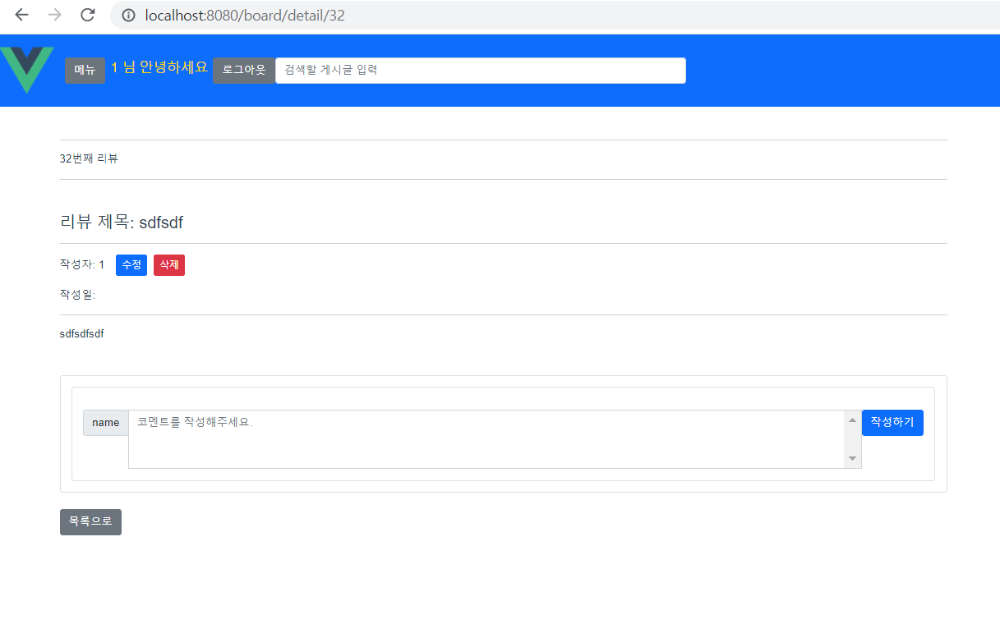

# 0124

### 공통PJT 관련 진행사항

1. Board -리뷰 관련 Rest API 연동(swagger ui 참조)

   - 자잘한 에러
     - 작성자(user_id) 제대로 반영 안됨
     - 수정 제대로 안됨(put 요청은 되나 처리가 안됨)
     - 글번호 / 리뷰 세부조회 번호 - 라우팅처리가 이상함

   - 전체조회

     - 상단 카드컴포넌트는 일단 어떤 데이터를 연동해야할지 애매해서 삭제함(백업은 있음)

     

   - 세부조회

     

   - 생성

     

     

   - 삭제

     

   - 수정

     

     - 204번 응답이 오기는 하나 수정 반영이 안됨

2. 로딩스피너 기능(vuex)

   - 검색을 통해 찾은 코드를 반영했으나 구조가 기존에 반영했던 Vuex 방향과 달라 수정 반영이 필요함

### 공통PJT 3주 1일차 학습후기

```
해야하는 체크리스트는 밀려있는데 실질적인 도움은 되지 않고, CRUD 구현을 시도해보긴 했는데 vuex는 반영을 못했고, 코드는 일관성 없이 난잡하고 그마저도 기능 반영도 미흡하고, 제대로 작동도 되지 않아서 쓸 수 있을지 모르겠습니다. 로딩스피너도 수정이 필요하고 명세서에서 요구하는대로 구현되지 않은 것 같습니다.. 이렇게까지 못하면 안되는 거 아닌가 양심도 찔리고 스스로에게 회의감이 드는 하루였습니다.
```

