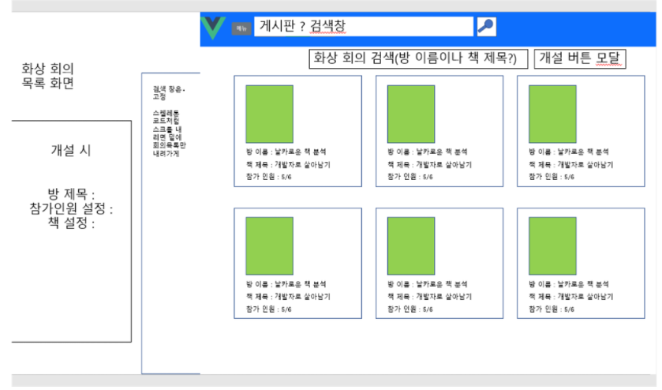
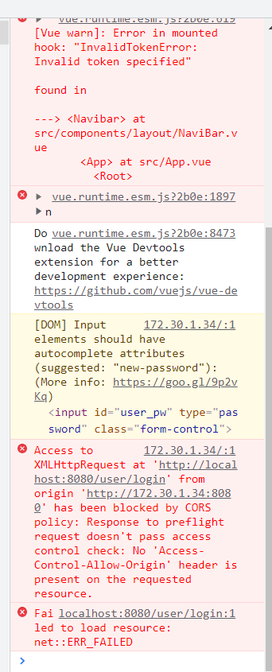

# 0125

### 공통PJT 관련 진행사항

- FE code 변경한부분 정리하여 전달 (feature branch : FE-moon 기준)

  - 경로 S06P12C205 \ frontend \ src

    - \components

      - \board
        - Board.vue(수정)
        - BoardCreate.vue(추가) / BoardDetail.vue(추가) / CommentCreate.vue(추가)  / CommentList.vue(추가)  / CommentListItem.vue(추가) 
      - \layout
        - Spinner.vue(추가)

    - \data(추가) - (게시글/댓글구현관련 임시파일)

      - index.js (추가)

    - \router

      - index.js (수정) - (Board관련 경로 routes 경로 추가 / 하단 spinner관련 설정 추가)

    - \config

      - http-common (수정) - (하단 spinner 관련 설정 추가)

    - \store

      - index.js (수정) - (로딩스피너관련 코드 수정 및 추가)
      - mutations.js (추가) - (로딩스피너 관련)

    - \App.vue(수정)

      - 수정사항: 스피너관련 

        ```
        - <template>: 라우터뷰 하단 <spinner :loading="$store.state.LoadingStatus"/> 추가
        
        - <script> : Spinner import Spinner from './components/layout/Spinner.vue';   +   Components : Spinner 추가
        
        ```
      
        

- Board 관련 기능 / Loading spinner 기능

  - 두 기능 아직 미흡한 부분이 많이 남아있지만 일단 FE code에 통합 반영되도록 함

  - 추후 보완 예정

    

----

#####  Conference List(방목록) 조회하기 기능

- 디자인 시안 참조

  

- 카드 컴포넌트를 활용해서 방목록을 조회하는 페이지를 구현
- axios - http get 메서드로 생성된 방 목록 조회 
- 방 이름 / 연관된 책 제목 / 참가 인원 표시
- http://vusc.surge.sh/guide/installation-and-usage.html#installation
  - 해당 카드컴포넌트 라이브러리를 활용해보려했으나 세부 내용을 디테일하게 반영하는 부분이 잘 안되는 문제점이 있어 일단 부트스트랩 뷰로 반영해보려고 함
- 카드 하나를 컴포넌트로 만들고 상위 컴포넌트에서 v-for로 반복해서 가져온 데이터를 출력할 수 있도록 진행해볼 예정
- 가급적 Vuex를 사용하여 구현해보려고함
- 금일은 오후에 조퇴하고 병원을 다녀오느라 많이는 못함
- 3주차 마친 후 평가가 얼마 남지 않았으므로 이전에 만들었던 자료도 참조하고 해서 내일까지는 최대한 빠르게 구현하는 것을 목표로 함

---

##### CORS 에러



- develop branch의 최신 백엔드 코드와 연동했을때 CORS와 관련된 문제가 발생해 기능 실행이 되지 않는 문제점이 있었음
- 백엔드 로컬호스트 포트넘버가 바뀌어 생긴문제인지??(그러나 기존과 동일하게 바꿔서 적용해보았음에도 안되었음)
- 아니면 스프링시큐리티 등에 의한 변경에 따라 발생한 문제인건지?
- 아직 원인 파악을 못해서 기존에 기능이 작동하던 서버 코드로 테스트했음

### CORS(Cross-Origin Resource Sharing / 교차 출처 리소스 공유)

- https://developer.mozilla.org/ko/docs/Web/HTTP/CORS MDN 문서 참조

```
교차 출처 리소스 공유(Cross-Origin Resource Sharing, CORS)는 추가 HTTP 헤더를 사용하여, 한 출처에서 실행 중인 웹 애플리케이션이 다른 출처의 선택한 자원에 접근할 수 있는 권한을 부여하도록 브라우저에 알려주는 체제입니다. 웹 애플리케이션은 리소스가 자신의 출처(도메인, 프로토콜, 포트)와 다를 때 교차 출처 HTTP 요청을 실행합니다.

교차 출처 요청의 예시: https://domain-a.com의 프론트 엔드 JavaScript 코드가 XMLHttpRequest를 사용하여 https://domain-b.com/data.json을 요청하는 경우.

보안 상의 이유로, 브라우저는 스크립트에서 시작한 교차 출처 HTTP 요청을 제한합니다. 예를 들어, XMLHttpRequest와 Fetch API는 동일 출처 정책을 따릅니다. 즉, 이 API를 사용하는 웹 애플리케이션은 자신의 출처와 동일한 리소스만 불러올 수 있으며, 다른 출처의 리소스를 불러오려면 그 출처에서 올바른 CORS 헤더를 포함한 응답을 반환해야 합니다.

CORS 체제는 브라우저와 서버 간의 안전한 교차 출처 요청 및 데이터 전송을 지원합니다. 최신 브라우저는 XMLHttpRequest 또는 Fetch와 같은 API에서 CORS를 사용하여 교차 출처 HTTP 요청의 위험을 완화합니다.

...(세부 내용은 문서 참조)
```

- 이래서 axios 등을 사용한 json 연동이 안되는가봄.... 1학기때 배웠던 Django에서도 frontend와 연동할 때 관련 헤더 설정을 django-cors-headers를 설치해서 settings.py에  추가로 설정해줬던 기억이 나기는 함

----

### 공통PJT 3주 2일차 학습후기

```
1인분의 길은 멀고도 험하다
```

