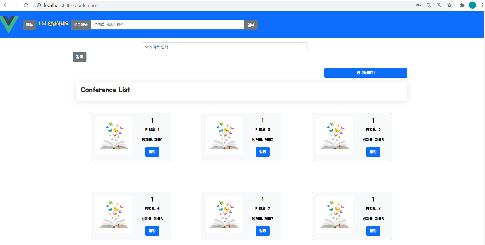
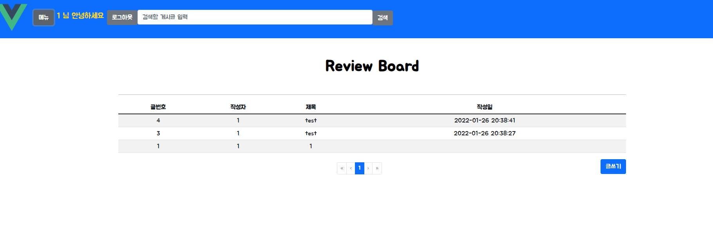
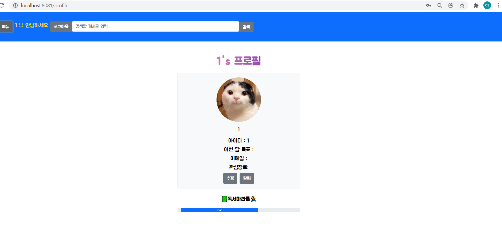

# 0126

### 공통PJT 관련 진행사항

##### Conference List(방목록) 조회하기 기능



- 우여곡절 끝에 axios http get 요청으로 받아온 회의 목록 데이터를... card 컴포넌트를 반복해서 출력하는 식으로 작성
- 컴포넌트 분리를 잘 할 수록 코드가 깔끔해진다.
- 더미데이터를 임의로 조금 더 추가함
- is_active가 0인 경우에는 종료된 컨퍼런스룸이므로 렌더링하지 않도록 v-if에 적용
- 여기에는 1학기 때 작성했었던 코드를 참조해서 Vuex로 작성
  - 내 수준에는 오히려 복잡해지는 것 같기도 하고 전체적인 코드 일관성ㅠㅠ을 해치는 것 같기도 하고 사실 아직도 뭐가 뭔지 잘 모르겠음
- 디자인 시안에 책 제목이 중요한것같아서 임시로 book_id를 크게 출력시켜놨는데 DB에 book 데이터가 없어서 일단 배제해야할지도....
- 썸네일 이미지는 업로드를 받는 것 같은데 업로드 된 경우에는 static하게 가져오도록 서버 내부에 이미지를 배치시키고 가져와야 할 것 같다..(지금은 네이버 이미지 링크를 따옴)
- 검색 form과 button이 대체 왜 나란히 배치가 안될까!?!? d-inline class도 추가해보고 부트스트랩 뷰 예시 코드도 참조해서 해보고 한참동안 온갖 것을 다 해봤지만 실패..... 간단한 거 같은데 대체로 이런거 1시간 이상 고민해본적 없는데 뭐가 문젠지 모르겠다!!

##### Google web font 적용해봄



- https://fonts.google.com/specimen/Jua

```vue
@import url('https://fonts.googleapis.com/css2?family=Dongle:wght@700&family=Jua&display=swap');

* {
  font-family: 'Jua', sans-serif;
}

```

- 쉽게 적용이 되어서 신기했다. 기본 폰트가 너무 투박해서 적용해봤는데 이것도 너무 아기자기한 폰트같기도?
- App.vue에 전역설정했는데 팀원들이 별로라고 하면 빼면 된다

##### 프로필페이지 css를 약간 수정



- vue-profile 같은 잘 만들어진 라이브러리를 활용하면 좋을 것 같긴 한데... 일단 익숙한 부트스트랩으로 수정해봄

  

##### book 관련 기능(api / DB) / 이전 회의 기록 관련해서 백엔드에 문의함

```
1. 지난 회의 이력 기능
-> 추후 이력 조회하는 메소드를 만들 예정
   백에서 보내주시면 로그인된 id기준으로 요청보내서 받아와서 출력하면 되지않을까..?

2. 책 DB 관련
-> 2-1. 알라딘api 요청 보냈을때 xml로 리턴 -> json으로 리턴되도록 수정
-> 2-2. api요청 보내서 받은 자료를 파싱해서 내부 DB에 올리는 건 아직 안되는 상태라
      지금은 api 요청만 가능한 상태라 현재 book 데이터 관련 연동은 안됨
      기능중에 화상회의 / 리뷰 기능은 book데이터 연동이 되어야 하는 부분이 있어서 일단 관련 부분은 보류하고 구현
```


---

### 공통PJT 3주 3일차 학습후기

```
뭔가 약간 감이 올듯 말듯🤨🤔
아직 뭘 만들어도 엉성하게만 느껴진다.. 언젠가 나도 코드를 깔끔하게 짜는 날이 올까?
익숙해질 때까지 시간을 많이 써야하는데 체력적으로 한계가 있어서 힘들다. 그래도 공통PJT에서 하는 만큼 이후 PJT에서 그나마 덜 헤매게 될 것 같다는 생각이 든다.(그래도 헤매긴 헤매겠지만.)
```

