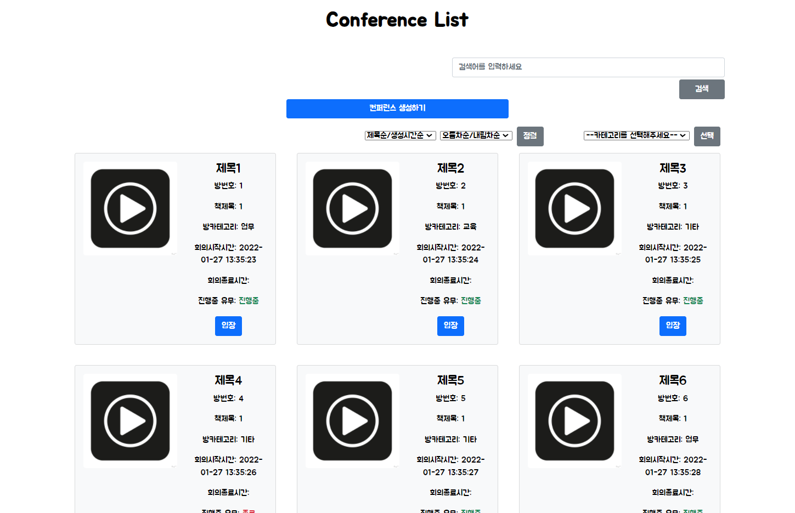
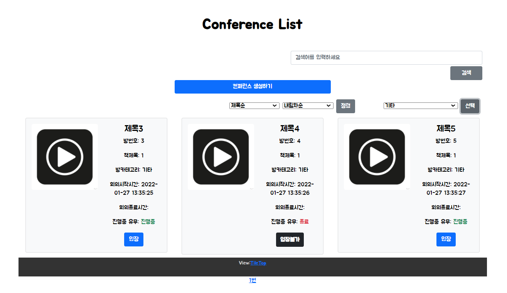
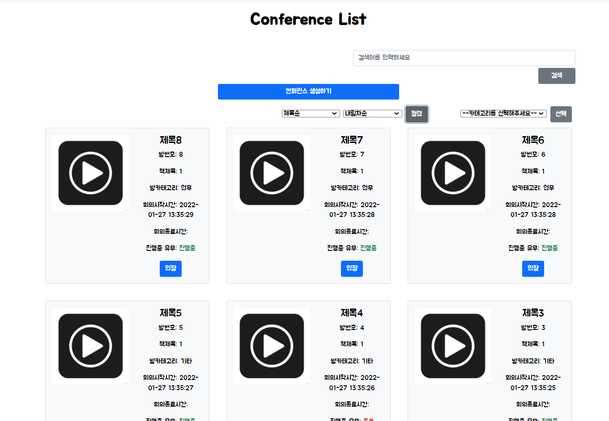
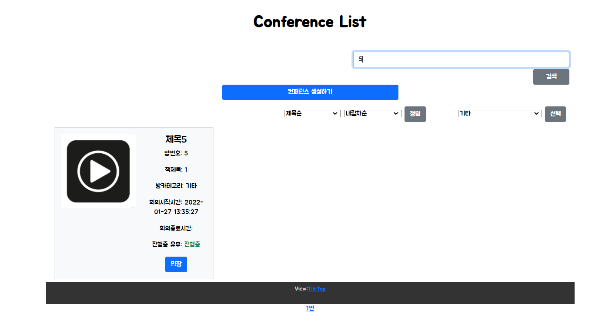

# 0127

### 공통PJT 관련 진행사항

- 기능 단위 컴포넌트 나눠 작성 + Vuex 활용을 최대한 해보려고 했다

##### Conference List(방목록) 조회하기 기능 - 전체적인 표시사항 수정



##### Conference List(방목록) 조회하기 - 카테고리 기준 filter



##### Conference List(방목록) 조회하기 - 제목순/생성시간 순 & 오름차순/내림차순 정렬



##### Conference List(방목록) 조회하기 - 제목 기준 검색



-----

### code

##### conferenceStore.js

```javascript
import http from "@/config/http-common.js";

const conferenceStore = {
  namespaced: true,
  state: {
    conferenceItems: []
  },
  mutations: {
    LOAD_CONFERENCE_ITEMS: function (state, results) {
      if (results.length == 0){
        state.conferenceItems = false;
      } else {
      state.conferenceItems = results;
      }
    },

  },
  actions: {
    LoadConferenceItems: function ({commit}) {
      http({
      method: 'get',
      url: `/conferences`,
      })
        .then((response) => {
          console.log(response);
          commit('LOAD_CONFERENCE_ITEMS', response.data)
        })
        .catch((err) => {
          console.dir(err);
          console.log(err);
      });
    },
    getConferenceByCategory : function ({commit}, conference_type) {
      http({
      method: 'get',
      url: `/conferences/getConferenceByCategory?categoryType=${conference_type}`,
      })
        .then((response) => {
          console.log(response);
          commit('LOAD_CONFERENCE_ITEMS', response.data);
        })
        .catch((err) => {
          console.dir(err);
          console.log(err);
          console.log(conference_type)
        });
    },
    getConferenceBySort : function ({commit}, sort_option) {
      console.log(sort_option)
      http({
      method: 'get',
      url: `/conferences/getConferenceBySort?asc=${sort_option}`,
      })
        .then((response) => {
          console.log('ok')
          console.log(response);
          commit('LOAD_CONFERENCE_ITEMS', response.data);
        })
        .catch((err) => {
          console.dir(err);
          console.log(err);
        });
    },
    searchByTitle : function ({commit}, search_value) {
      http({
      method: 'get',
      url: `/conferences/searchByTitle?word=${search_value}`,
      })
        .then((response) => {
          console.log(response);
          commit('LOAD_CONFERENCE_ITEMS', response.data);
        })
        .catch((err) => {
          console.dir(err);
          console.log(err);
          console.log(search_value)
        });
    },
  },
};

export default conferenceStore;

```

##### ConferenceListItem.vue

```vue
<template>
  <div class="col"> <!--활성중인 회의실만 렌더링하도록-->
    <b-card no-body bg-variant="light" class="overflow-hidden mx-2 my-2" style="max-width: 540px;">
      <b-row no-gutters>
        <b-col md="6">
          <b-card-img :src="thumbnail_url" alt="Image" class="rounded-3 mt-3 ms-3"></b-card-img>
        </b-col>
        <b-col md="6" class="mb-3">
          <b-card-body :title="item.title"> <!--방 제목-->
            <b-card-text>
              <p class="card-text">방번호: {{ item.id }}</p> <!--회의 번호-->
              <p class="card-text">책제목: {{ item.book_detail_id }}</p> <!--bookStore와 연결해서 책 제목 가져와야함..?-->
              <p class="card-text" v-if="item.conference_type==1">방카테고리: 업무</p> <!--카테고리번호-->
              <p class="card-text" v-if="item.conference_type==2">방카테고리: 교육</p> <!--카테고리번호-->
              <p class="card-text" v-if="item.conference_type==3">방카테고리: 기타</p> <!--카테고리번호-->
              <p class="card-text">회의시작시간: {{ item.call_start_time }}</p>
              <p class="card-text">회의종료시간: {{ item.call_end_time }}</p>
              <p v-if="item.is_active" class="card-text">진행중 유무: <span class="text-success">진행중</span> </p> 
              <p v-else class="card-text">진행중 유무: <span class="text-danger">종료</span></p> 
              
            </b-card-text>
          </b-card-body>
          <b-button variant="primary" @click="enterConference" v-if="item.is_active">입장</b-button> <!--클릭시 회의실id에 맞는 detail 링크와 연결-->
          <p class="badge bg-dark text-wrap fs-6 mb-1" v-else style="padding: 12px;">입장불가</p> <!--클릭시 회의실id에 맞는 detail 링크와 연결-->
        </b-col>
      </b-row>
    </b-card>
  </div>


</template>

<script>
export default {
  name: 'ConferenceListItem',
  props: {
    item: {
      type: Object,
      required: true,
    },
  },
  methods: {
    enterConference() {
      this.$router.push({
        path: `/Conference/view/${this.item.id}`,
      });
    }
  },
  data: function () {
    return {
      thumbnail_url: 'https://search.pstatic.net/common/?src=http%3A%2F%2Fblogfiles.naver.net%2F20150415_3%2Fkoowq_1429106016874OoUDk_PNG%2F%25C0%25E7%25BB%25FD_%25BE%25C6%25C0%25CC%25C4%25DC2-02.png&type=sc960_832' //임시 기본이미지
      // thumbnail_url: `https://iamge/${this.item.thumbnail_url}`,
    }
  }
}
</script>

<style>

</style>
```

##### ConferenceList.vue

```vue
<template>
  <div class="container">

    <div class="row row-cols-1 row-cols-lg-2 row-cols-xl-3 g-4" v-if="conferenceItems">
      <conference-list-item
        v-for="item in conferenceItems"
        :key="item.id"
        :item="item"
      >
      </conference-list-item>
    </div>
    <div v-else>
      <h3 class="text-danger my-3">- 현재 진행중인 회의가 없습니다 -</h3>
    </div>
  </div>
</template>

<script>
import { mapState } from "vuex";
import { mapActions } from "vuex";
import ConferenceListItem from './ConferenceListItem.vue';

const conferenceStore = "conferenceStore";

export default {
  name: 'Home',
  components: {
    ConferenceListItem
  },
  created: function () {
    this.LoadConferenceItems
  },
  computed: {
    ...mapActions(conferenceStore, ['LoadConferenceItems']),
    ...mapState(conferenceStore, ['conferenceItems'])    
  }
}
</script>

```

##### ConferenceFilter.vue

```vue
<template>
  <div>
    <b-form-select v-model="selected" :options="options" class="mb-3">
      <!-- This slot appears above the options from 'options' prop -->
      <template #first>
        <b-form-select-option :value="null" disabled>--카테고리를 선택해주세요--</b-form-select-option>
      </template>
    </b-form-select>
    <b-button class="ms-2" @click="getFilter">선택</b-button>

    <!-- <div class="mt-3">Selected: <strong>{{ selected }}</strong></div> -->
  </div>

</template>

<script>
import { mapActions } from "vuex";

const conferenceStore = "conferenceStore";

export default {
  name: 'ConferenceFilter',
  methods: {
    ...mapActions(conferenceStore, ['getConferenceByCategory']),
    getFilter() {
      // console.log(this.selected)
      if (this.selected == null) {
        alert('카테고리를 선택해주세요')
      } else {
        this.getConferenceByCategory(this.selected)
      }
  }
  },
  data: function () {
    return {
      selected: null,
      options: [
        { value: '1', text: '업무' },
        { value: '2', text: '교육' },
        { value: '3', text: '기타' },
      ]
    }
  },

}
</script>

<style>

</style>
```

##### conferenceSearch.vue

```vue
<template>
  <div class="container"> <!-- 명세서에서는 팝업 적용하라고 되어있음-->
    <b-form inline class="searchBox mt-3 row offset-7 col-5" autocomplete="off" onsubmit="return false"> 
            <!-- autocomplet / onsubmit 설정 안하면 엔터치면 페이지 새로고침됨(form 태그 안에 버튼태그가 있어서 엔터를 누르면 button의 submit이 동작해서 그렇다고 함) -->
      <b-form-input
        class="form-control d-inline"
        v-model.trim="text"
        placeholder="검색어를 입력하세요"
        @keyup.enter="conferenceSearch"
      >
      </b-form-input>
      <b-button class="offset-10 col-2 mt-1" @click="conferenceSearch">검색</b-button>
    </b-form>
  </div>

</template>

<script>
import { mapActions } from "vuex";

const conferenceStore = "conferenceStore";

export default {
  name: 'ConferenceSearch',
  methods: {
    ...mapActions(conferenceStore, ['searchByTitle']),
    conferenceSearch() {
      console.log(this.text)
      const value = this.text
      if( value == "" || value == null || value == undefined || ( value != null && typeof value == "object" && !Object.keys(value).length ) ){ 
        return alert('검색어를 입력해주세요!')
        }else{ 
          return this.searchByTitle(value)
        }
    }
  },
  data: function () {
    return {
      text: ''
    }
  },

}
</script>

<style>

</style>
```

##### conferenceSort.vue

```vue
<template>
  <div>
    <b-form-select v-model="selected_sort_value" :options="sort_value_options"></b-form-select>
    <b-form-select v-model="selected_sort_option" :options="sort_options" class="mx-2"></b-form-select>
    <!-- <div class="mt-3">Selected: <strong>{{ selected_sort_option }}</strong></div>
    <div class="mt-3">Selected: <strong>{{ selected_sort_value }}</strong></div> -->
    <b-button @click="conferenceSort">정렬</b-button>
  </div>

</template>

<script>
import { mapActions } from "vuex";

const conferenceStore = "conferenceStore";

export default {
  name: 'ConferenceSort',
  methods: {
    ...mapActions(conferenceStore, ['getConferenceBySort']),
    conferenceSort() {
      if (this.selected_sort_option == null || this.selected_sort_value == null) {
        alert('옵션을 모두 선택해주세요')
      } else {
        this.getConferenceBySort((`${this.selected_sort_option}&sort=${this.selected_sort_value}`)) // payload 한개밖에 안돼서 문자열로 붙여서 보냄
      }
    }
  },
  data: function () {
    return {
      selected_sort_value: null,
      selected_sort_option: null,
      sort_value_options: [
        { value: null, text: '제목순/생성시간순', disabled: true },
        { value: 'title', text: '제목순' },
        { value: 'call_start_time', text: '생성시간순' },
      ],
      sort_options: [
        { value: null, text: '오름차순/내림차순', disabled: true },
        { value: 'asc', text: '오름차순' },
        { value: 'desc', text: '내림차순' },
      ],
    }
  },

}
</script>

<style>

</style>
```

----

#### 공통PJT 3주 4일차 학습후기

```
간단한 데이터 받아오기 기능인데도 get요청할때 파라미터 넘기는걸 지금까지 제대로 해본 적이 없어서 하루 종일 씨름했다.. 파라미터가 여러개일때도..?? 그래도 여러가지 코드상의 에러를 넘어 기능을 적용시킬 수 있었다. 다음에는 이런 에러 만나면 덜 당황하겠지! 아직 명세서 기준으로 반영 안된 기능이 많아서 그리고 반영한 기능도 완벽한 게 아니라서 갈 길은 멀지만.. 🔥🔥🔥
```

