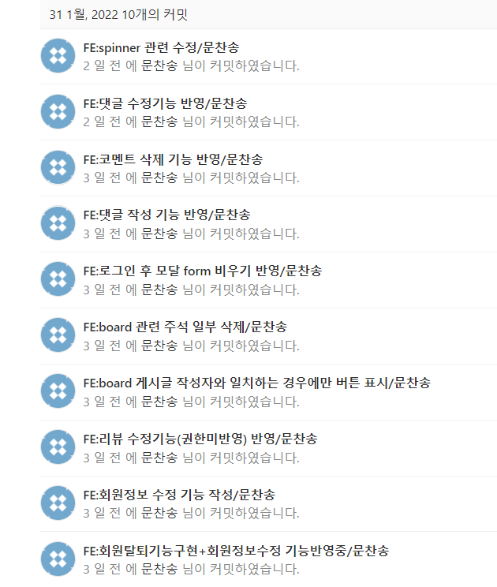
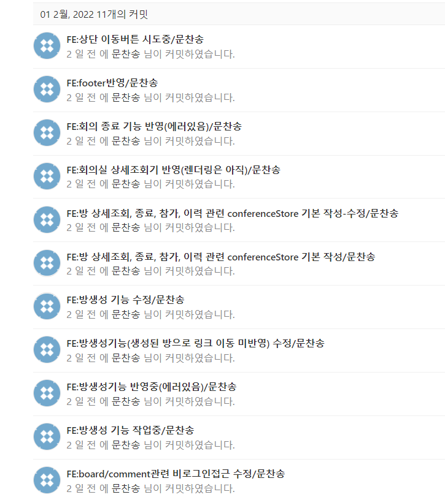
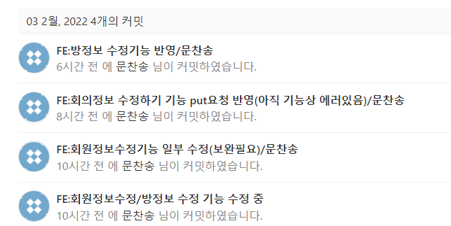

# 0203

### 공통PJT 관련 진행사항

#### 1/31 ~ 2/2 연휴동안 진행한 내용

- 유저관련
  - 회원정보 수정 <-- 에러가 있어 수정 필요
  - 회원 탈퇴
- 게시판
  - 게시글 수정
  - 댓글 조회
  - 댓글 생성
  - 댓글 수정
  - 댓글 삭제
- 회의 방 관련
  - 방 생성
  - 방 정보 조회
  - 종료
  - 방정보 수정 <-- 진행중

##### git commit 기록(feature branch:FE-moon에 반영)

#### 2/3 진행한 내용

- 회원정보 수정 기능 에러 수정 및 반영

- 회의 방 정보 수정 기능 에러 수정 및 반영

- Book 관련(성당현님 업무 도움)

  - 베스트셀러 조회 

  - 신간 조회
  - 검색
    - axios - http get요청 코드 형식이 틀리지 않았음에도 불구하고 네트워크 에러로 인해 제대로 안되는 문제가 있었는데 새로 바뀐 서버에서는 response가 리턴이 되어 작업을 진행할 수 있게 되었음
      -  book 관련 controller 작업한 김성준님께서 크게 바뀐게 없다고 했는데 아무튼 해결

##### git commit 기록(feature branch:FE-moon에 반영)

##### 새 서버(backend-java) 환경설정 및 실행

- ssafy_web db 새로 설정 => 기존 스켈레톤코드의 readme를 잘 살펴봤어야 했는데;; 경험에 의존해서 하다보니 db가 없다는 에러가 나서 BE 담당 김성준님께 도움 요청하여 해결

- jpa는 코드 실행시 테이블은 자동 생성이 된다고 함

- 코드 실행시 에러가 발생해 cache관련 설정하니 해결됨
  - File -> Invalidate Caches/Restart 캐시 무효화하고 다시 시작

----

### BE에 요청한 사항

- 컨퍼런스 방 생성시 (생성된 방으로 이동할 수 있도록) pk를 리턴하도록 요청

- 컨퍼런스 방 "설명" 관련 db 항목 추가 요청

- 컨퍼런스 방 종료시 is_active 0으로 변경되도록 요청

- 컨퍼런스 방 수정시 is_active는 변경되지 않도록 요청

  

### 내일 할 일

- 회의 참여 기능
- 회의 참여 이력 생성 기능
- 회의 참여 이력 조회 기능 반영
- 방목록 - 인피니티 스크롤 반영

### 어려운 점

- 기능이 반영이 안되는 부분이 많아 아직은 기능 반영에 중점을 두고 작업하고 있기 때문에 화면단이 심미적으로는 미흡한 부분이 많음
  - 템플릿이나 라이브러리 활용이 아직 (많이) 미숙함 ㅠ
  - 어느정도 작업이 되면 라이브러리 등을 사용해 화면을 구성하는데 중점을 둘 예정....
- book 관련된 기능도 아직 남아 있는 부분들이 다소 있음..(아직 DB 데이터가 없어 BE FE 모두 미구현)
  - 리뷰와 책 DB 연동
  - 회의 방과 책 DB연동
  - 독서 마라톤 기능
- 남은 작업 기간이 얼마 남지 않았다는 생각에 기능 구현에 다소 급급해 너무 되는대로 만들지 않았나 싶은 생각이 듬(아예 구현도 안되는 것보다는 그나마 낫다는 판단...............)
- DB 관련하여 myBatis -> JPA로 변경되면서 api가 다소 변경된 부분이 많음(db 항목 명칭 / 외래키 관련 파라미터 data 부분들) 기존에 구현된 기능을 동작하도록 다시 반영하는데 시간이 다소 소요될 것으로 예상됨
  - 항목들을 아주 꼼꼼히 봐야할 것 같음(난관..)
  - 부지런히 해서 가능하면 이번 주 안으로 반영하고 싶음

