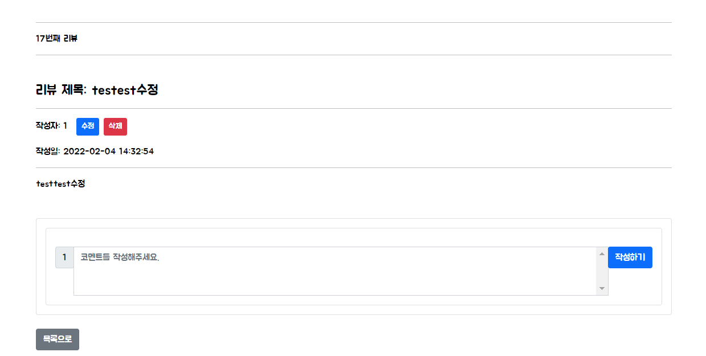

# 0204

### 공통PJT 관련 진행한 사항

##### 간략화 과정 : 프로젝트 완성도 향상을 위해 우선순위가 낮은 Review 관련 기능 삭제

- 사라져버린 BOARD 기능을 추모하며

  - 게시글

    - 전체 조회

      - 로그인상태

      

      - 비로그인 상태

        

    - 세부 조회

      - 작성자 로그인 상태

      

      - 비작성자 로그인 상태

        

      - 비로그인 상태

        

    - 작성

      

    - 수정

      

      

    - 삭제

    - code

  - 댓글

    - 조회 / 작성

      

    - 수정 / 삭제

      

    - code

  - 관련 code

    - Review 관련

      - Board.vue

        ```vue
        <template>
          <div class="container">
            <h1 class="fw-bold my-5">Review Board</h1>
            <hr />
        
            <!-- <p class="mt-3">Current Page: {{ currentPage }}</p> -->
            <b-table
              id="my-table"
              striped
              hover
              :fields="fields"
              :items="items"
              :per-page="perPage"
              :current-page="currentPage"
              small
              @row-clicked="rowClick"
            ></b-table>
        
            <router-link to="/board/create">
              <b-button variant="primary float-end" v-if="isLogin">글쓰기</b-button> <!-- 로그인 한 경우에만 글쓰기 버튼 보이도록 -->
            </router-link>
            <b-pagination
              v-model="currentPage"
              :total-rows="rows"
              :per-page="perPage"
              size="sm"
              align="center"
              class="mt-4"
            >
            </b-pagination>
          </div>
        </template>
        
        <script>
        import http from "@/config/http-common.js";
        import { mapState } from "vuex";
        
        export default {
          name: "Board",
          data() {
            return {
              perPage: 5,
              currentPage: 1,
              fields: [
                { id: "글번호" },
                { user_user_id: "작성자" },
                { review_name: "제목" },
                { created_at: "작성일" },
              ],
              items: [],
            };
          },
          methods: {
            rowClick(item) {
              this.$router.push({
                path: `/board/detail/${item.id}`,
              });
            },
          },
          mounted() {  
            http({
                method: "get",
                url: `/review/index`,
              })
                .then((response) => {
                  // this.items = response.data;
                  console.log(response)
                  console.log(response.data)
                  //정렬
                  let contentItems = response.data.sort((a, b) => {
                    return b.id - a.id;
                  }); // 내림차순
                  this.items = contentItems;
                })
                .catch((err) => {
                  console.dir(err);
                  console.log(err);
                });
          },
          computed: {
            rows() {
              return this.items.length;
            }, // 페이지네이터 관련 
            ...mapState("userStore", ["isLogin"])
        
          },
        };
        </script>
        
        ```

      - BoardCreate.vue

        ```vue
        <template>
          <div class="container">
            <h1 class="fw-bold my-5">Book Review 작성(수정)하기</h1>
        
            <b-form>
              <b-form-group
                label="리뷰 제목"
                label-for="subject"
                description=""
                class="text-start mb-4"
              >
                <b-form-input
                  id="subject"
                  v-model="subject"
                  placeholder="제목을 입력해주세요."
                  required
                ></b-form-input>
              </b-form-group>
        
              <b-form-group
                label="리뷰 내용"
                label-for="context"
                description=""
                class="text-start mb-4"
              >
                <b-form-textarea
                  id="context"
                  v-model="context"
                  placeholder="내용을 입력해 주세요"
                  rows="6"
                  max-rows="10"
                  required
                ></b-form-textarea>
              </b-form-group>
        
              <br />
              <b-button
                @click="updateMode ? updateContent() : uploadContent()"
                variant="primary"
                >저장</b-button
              >&nbsp;
              <b-button @click="cancle">취소</b-button>
            </b-form>
          </div>
        </template>
        
        <script>
        import http from "@/config/http-common.js";
        import { mapState } from "vuex";
        
        export default {
          name: "BoardCreate",
          data() {
            return {
              subject: "",
              context: "",
              created_at: "",
              updated_at: null,
              updateObject: null,
              updateMode: this.$route.params.contentId > 0 ? true : false,
              review_id: null,
              user_id: "",
              book_detail_id: null,
            };
          },
          computed: {
            ...mapState("userStore", ["userInfo"]),
          },
          created() {
            if (this.$route.params.contentId > 0) {
              // 수정
              // const contentId = Number(this.$route.params.contentId)
              // 데이터 가져오기
              http({
                method: "get",
                url: `/review/${this.$route.params.contentId}`,
              })
                .then((response) => {
                  this.review_id = response.data.id,
                  this.subject = response.data.review_name,
                  this.context = response.data.review_content,
                  this.user = response.data.user_user_id,
                  this.created_at = response.data.created_at;
                  this.updated_at = response.data.updated_at;
                  this.book_detail_id = response.data.book_detail_id;
                  // console.log(response);
                  // console.log(response.data.id)
                  // console.log(response.data.book_detail_id)
                  // console.log(this.updateMode);
                })
                .catch((err) => {
                  console.dir(err);
                  console.log(err);
                });
        
            }
          },
          methods: {
            date_time() {
              let today = new Date();
        
              let year = today.getFullYear(); // 년도
              let month = today.getMonth() + 1; // 월
              let date = today.getDate(); // 날짜
              let hours = today.getHours(); // 시
              let minutes = today.getMinutes(); // 분
              let seconds = today.getSeconds(); // 초
        
              return (
                year +
                "/" +
                month +
                "/" +
                date +
                " " +
                hours +
                ":" +
                minutes +
                ":" +
                seconds
              );
            },
            uploadContent() {
              // 저장
              http({
                method: "post",
                url: `/review`,
                data: {
                  book_detail_id: 1, // 임시
                  review_content: this.context,
                  review_name: this.subject,
                  user_user_id: this.userInfo.user_id,
                  created_at: this.date_time(),
                },
              })
                .then((response) => {
                  console.log(response);
                  this.$router.push({
                    path: `/board`,
                  });
                })
                .catch((error) => {
                  console.dir(error);
                  console.log(this.userInfo);
                  console.log(this.userInfo.user_id);
                });
            },
        
            updateContent() {
              // 수정
              // console.log(this.context);
              // console.log(this.subject);
              // console.log(this.book_detail_id);
              http({
                method: "put", 
                url: `/review/${this.review_id}`,
                data: {
                  book_detail_id: this.book_detail_id,
                  created_at: this.created_at,
                  id: this.review_id,
                  review_content: this.context,
                  review_name: this.subject,
                  updated_at: this.date_time(),
                  user_user_id: this.userInfo.user_id,
                },
              })
                .then((response) => {
                  console.log(response);
        
                  this.$router.push({
                    path: `/board/detail/${this.review_id}`,
                  });
                })
                .catch((error) => {
                  console.dir(error);
                  console.log(this.userInfo.user_id);
                });
            },
        
            cancle() {
              this.$router.push({
                path: "/board",
              });
            },
          },
        };
        </script>
        
        <style></style>
        
        ```

      - BoardDetail.vue

        ```vue
        <template>
          <div class="container mt-5 text-start">
            <hr />
            <p>{{ contentId }}번째 리뷰</p>
            <hr class="mb-5" />
            <h4>리뷰 제목: {{ title }}</h4>
            <hr />
            <p class="d-inline me-3">작성자: {{ user }}</p>
        
        
            <span v-if="isLogin">
              <b-button variant="primary" size="sm" @click="updateData" class="me-2" v-if="userInfo.user_name==user">수정</b-button>
              <b-button variant="danger" size="sm" @click="deleteData" v-if="userInfo.user_name==user">삭제</b-button>
            </span>
        
            <p class="mt-3">작성일: {{ created_at }}</p>
            <hr />
            <p class="mb-5">{{ context }}</p>
        
            <b-card>
              <CommentList :contentId="contentId"></CommentList>
            </b-card>
        
            <b-button @click="back" class="mt-4 mb-5">목록으로</b-button>
          </div>
        </template>
        
        <script>
        import CommentList from "./CommentList";
        import http from "@/config/http-common.js";
        import { mapState } from "vuex";
        
        
        export default {
          name: "BoardDetail",
          data() {
            const contentId = Number(this.$route.params.contentId);
            return {
              bookDetailId: 0,
              contentId: contentId,
              review_id: null,
              title: "",
              context: "",
              user: "",
              created_at : "",
            };
          },
          methods: {
            // 작성한 유저와 같다면 삭제 => 구현 목표
            // 아닐시 alert창 알림과 함께 무효 
              // --> 작성한 유저와 다르면 버튼 렌더링하지 않도록 함
            deleteData() {
              http({
                method: "delete",
                url: `/review/${this.review_id}`,
              });
              this.$router.push({
                path: "/board/",
              });
            },
            updateData() {
              this.$router.push({
                path: `/board/create/${this.contentId}`,
              });
            },
            back() {
              this.$router.push({
                path: "/board",
              });
            },
          },
          computed: {
            ...mapState("userStore", ["userInfo", "isLogin"]),
          },
          created() {
            http({
              method: "get",
              url: `/review/${this.$route.params.contentId}`,
            })
              .then((response) => {
                (this.bookDetailId = response.data.book_detail_id),
                  (this.review_id = response.data.id),
                  (this.title = response.data.review_name),
                  (this.context = response.data.review_content),
                  (this.user = response.data.user_user_id),
                  (this.created_at = response.data.created_at);
                console.log(response);
              })
              .catch((err) => {
                console.dir(err);
                console.log(err);
              });
          },
        
          components: {
            CommentList,
          },
        };
        </script>
        <style></style>
        
        ```

    - Comment 관련

      - CommentCreate.vue

        ```vue
        <template>
          <div v-if="isLogin">
            <b-card>
              <b-input-group :prepend="userInfo.user_name" class="mt-3">
                <b-form-textarea
                  id="textarea"
                  v-model="context"
                  :placeholder="'코멘트를 작성해주세요.'"
                  rows="3"
                  max-rows="6"
                ></b-form-textarea>
                <b-input-group-append>
                  <b-button variant="primary" @click="commentId ? updateComment() : createComment()"
                    >작성하기</b-button
                  >
                </b-input-group-append>
              </b-input-group>
            </b-card>
          </div>
          <div v-else>
            <b-card>
              <h5>코멘트를 작성하려면 로그인하세요.</h5>
            </b-card>
          </div>
        </template>
        
        <script>
        import http from "@/config/http-common.js";
        import { mapState } from "vuex";
        
        export default {
          name: "CommentCreate",
          props: {
            contentId: Number,
            reloadComment: Function,
            commentId: Number,
            commentContent: String,
          },
          emits: [
            'updateModeToggle'
          ],
          data() {
            return {
              context: "",
            };
          },
          created() {
            if (this.commentContent) {
              this.context = this.commentContent
              // console.log(this.commentContent)
            }
          },
          methods: {
            date_time() {
              let today = new Date();
        
              let year = today.getFullYear(); // 년도
              let month = today.getMonth() + 1; // 월
              let date = today.getDate(); // 날짜
              let hours = today.getHours(); // 시
              let minutes = today.getMinutes(); // 분
              let seconds = today.getSeconds(); // 초
        
              return (
                year +
                "/" +
                month +
                "/" +
                date +
                " " +
                hours +
                ":" +
                minutes +
                ":" +
                seconds
              );
            },
            createComment() {
              http({
                method: "post",
                url: `/comment`,
                data: {
                  comment_content: this.context,
                  review_id: this.contentId, // props받은 리뷰id
                  created_at: this.date_time(),
                  user_user_id: this.userInfo.user_id,
                },
              })
                .then((response) => {
                  console.log(response);
                  this.reloadComment();
                })
                .catch((error) => {
                  console.dir(error);
                });
              this.context = "";
            },
            updateComment() {
              http({
                method: "put", 
                url: `/comment/${this.commentId}`,
                data: {
                  comment_content: this.context,
                  id: this.commentId,
                  review_id: this.contentId,
                  created_at: this.date_time(),
                  user_user_id: this.userInfo.user_id
                },
              })
                .then((response) => {
                  console.log(response);
                  // console.log(this.contentId)
                  // console.log(this.commentId)
                  this.reloadComment()
                  this.$emit('updateModeToggle', false)
                })
                .catch((error) => {
                  console.dir(error);
                });
            }
          },
          computed: {
            ...mapState("userStore", ["userInfo", "isLogin"]),
          },
        };
        </script>
        
        <style scoped>
        .comment-create {
          display: flex;
          margin-bottom: 1em;
        }
        </style>
        

      - CommentList.vue

        ```vue
        <template>
          <div>
            <div :key="item.id" v-for="item in comments">
              <CommentListItem :commentObj="item" :reloadComment="reloadComment"></CommentListItem>
            </div>
            <CommentCreate :contentId="contentId" :reloadComment="reloadComment"></CommentCreate>
          </div>
        </template>
        
        <script>
        import CommentListItem from "./CommentListItem";
        import CommentCreate from "./CommentCreate";
        import http from "@/config/http-common.js";
        
        export default {
          name: "CommentList",
          props: {
            contentId: Number,
          },
          data() {
            return {
              comments: []
            };
          },
          components: {
            CommentListItem,
            CommentCreate,
          },
          created() {
            this.reloadComment()
          },
          methods: {
            reloadComment() {
              // console.log('reload')
              http({
              method: "get",
              url: `/comment/index`,
            })
              .then((response) => {
                console.log(response)
                this.comments = response.data.filter((commentItem) => {
                  return commentItem.review_id === this.contentId;
                });
              })
              .catch((err) => {
                console.dir(err);
                console.log(err);
              });
            },
          },
        };
        </script>
        
        <style></style>
        

      - CommentListItem.vue

        ```vue
        <template>
          <div>
            <div class="comment-list-item">
              <span>{{ commentObj.user_user_id }}: </span>
        
              <p class="d-inline me-3">
                {{ commentObj.comment_content }} | {{ commentObj.created_at }}
              </p>
              
              <span v-if="isLogin">
                <span v-if="commentObj.user_user_id==userInfo.user_id"> <!-- 작성자일 때만 수정,삭제 버튼 표시되도록 -->
                  <b-button variant="primary" size="sm" class="me-2" @click="commentUpdate()">수정</b-button>
                  <b-button variant="danger" size="sm" @click="commentDelete()">삭제</b-button>
                  <CommentCreate 
                    @updateModeToggle="updateModeFalse" 
                    :commentId="commentObj.id" 
                    :contentId="commentObj.review_id" 
                    :commentContent="commentObj.comment_content" 
                    :reloadComment="reloadComment" 
                    v-if="updateMode"
                  ></CommentCreate>
                </span>
              </span>
              <hr />
            </div>
          </div>
        </template>
        
        <script>
        import { mapState } from "vuex";
        import http from "@/config/http-common.js";
        import CommentCreate from "./CommentCreate";
        
        export default {
          name: "CommentListItem",
          props: {
            commentObj: Object,
            reloadComment: Function,
          },
          components: {
            CommentCreate,
          },
          computed: {
            ...mapState("userStore", ["userInfo", "isLogin"]),
          },
          data() {
            return {
              updateMode: false,
            };
          },
          methods: {
            commentDelete() {
              http({
                method: 'delete',
                url: `/comment/${this.commentObj.id}`,
              })
                .then((response) => {
                  console.log(response)
                  this.reloadComment() // props 받은 함수 // 목록 갱신
                })
            },
            commentUpdate() {
              this.updateMode = true
              // console.log(this.commentObj.comment_content)
              // console.log(typeof(this.commentObj.comment_content))
            },
            updateModeFalse(toggleValue) { // 하위 컴포넌트가 변경되면 emit된 이벤트를 받아 업데이트모드를 false로 바꿔준다
              this.updateMode = toggleValue
            }
          }
        };
        </script>
        
        <style>
        </style>
        
        ```

        

  - Book 관련 데이터를 연동까지 했다면 잔류를 주장했겠지만 그렇지 않은데다가 JPA로 변환하는 과정이 순탄치 않은듯 했고 새 서버에 맞춰서 돌아가도록 기능 다시 반영하기 + 레이아웃 고치기 하려면 이래저래 손이 많이 갈거라(합리화) 과감히 삭제에 동의를... Vue.js로 CRUD 기능 해본 것에 의의를.... 생각해보면 만들었다기 보다는 인터넷에서 다른 사람 코드를 찾아 발췌한 부분이 많았고 기능은 다 돌아가지만 맞게 작성이 되었는지도 모르겠다. 언젠가는 제대로 된 게시판을 만들 수 있기를. 

---

### 메인페이지 재작업

- 로그인 관련 부분이 실행이 안되어 다른 부분을 보류하고, 서버와 크게 연관이 없는 메인페이지를 작업했다
- 다른 라이브러리를 사용할 수 있었다면 좋았겠지만 시간이 다소 촉박한 감이 있어 접근성이 좋은 부트스트랩 캐러셀을 사용했다
- 이미지를 화면 비율에 맞게 크롭하고 독서 관련 격언이 표시되도록 했다.
- 영어 폰트와 한글 폰트를 별도 적용했다


```vue
<template>
  <div>
    <div>
      <div id="carouselExampleCaptions" class="carousel slide carousel-fade" data-bs-ride="carousel">
        <div class="carousel-indicators">
          <button type="button" data-bs-target="#carouselExampleCaptions" data-bs-slide-to="0" class="active" aria-current="true" aria-label="Slide 1"></button>
          <button type="button" data-bs-target="#carouselExampleCaptions" data-bs-slide-to="1" aria-label="Slide 2"></button>
          <button type="button" data-bs-target="#cAFarouselExampleCaptions" data-bs-slide-to="2" aria-label="Slide 3"></button>
        </div>
        <div class="carousel-inner">
          <div class="carousel-item active" data-bs-interval="3000">
            
            <div class="carousel-caption d-none d-md-block">
              <h1>Live always in the best company when you read.</h1>
              <h5><span class="ko">독서할 때 당신은 항상 가장 좋은 친구와 함께 있다.</span> - Sydney Smith</h5>
            </div>
          </div>
          <div class="carousel-item" data-bs-interval="3000">
            
            <div class="carousel-caption d-none d-md-block">
              <h1>We read to know we are not alone.</h1>
              <h5><span class="ko">우리는 혼자가 아니라는 것을 알기 위해 독서를 한다.</span> - C.S. Lewis</h5>
            </div>
          </div>
          <div class="carousel-item" data-bs-interval="3000">
            
            <div class="carousel-caption d-none d-md-block">
              <h1>Life-transforming ideas have always come to me through books.</h1>
              <h5><span class="ko">나는 삶을 변화시키는 아이디어를 항상 책에서 얻었다.</span> - Bell Hooks</h5>
            </div>
          </div>
        </div>
        <button class="carousel-control-prev" type="button" data-bs-target="#carouselExampleCaptions" data-bs-slide="prev">
          <span class="carousel-control-prev-icon" aria-hidden="true"></span>
          <span class="visually-hidden">Previous</span>
        </button>
        <button class="carousel-control-next" type="button" data-bs-target="#carouselExampleCaptions" data-bs-slide="next">
          <span class="carousel-control-next-icon" aria-hidden="true"></span>
          <span class="visually-hidden">Next</span>
        </button>
      </div>
    </div>
  </div>
</template>

<script>


export default {
  name: "Main",
  components: {

  },
  data() {
    return {

    };
  },
};
</script>


<style scoped>
@import url('https://fonts.googleapis.com/css2?family=Raleway:ital,wght@1,900&display=swap&family=Gothic+A1:wght@600&display=swap');

* {
  font-family: 'Raleway', sans-serif;
}

.ko {
  font-family: 'Gothic A1', sans-serif;
}
</style>

```


