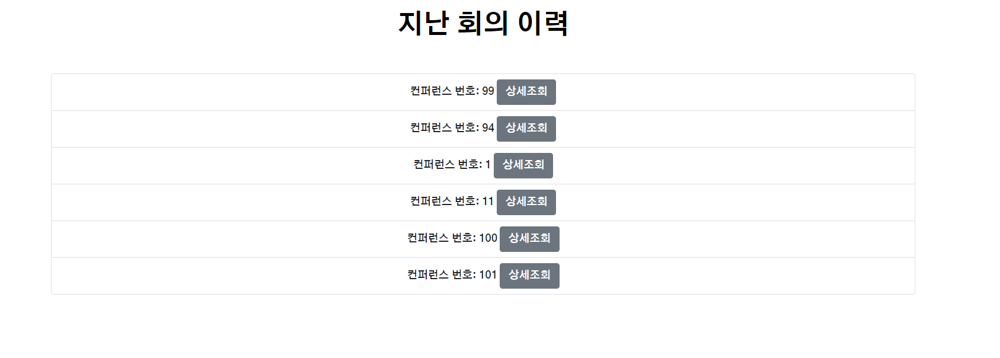
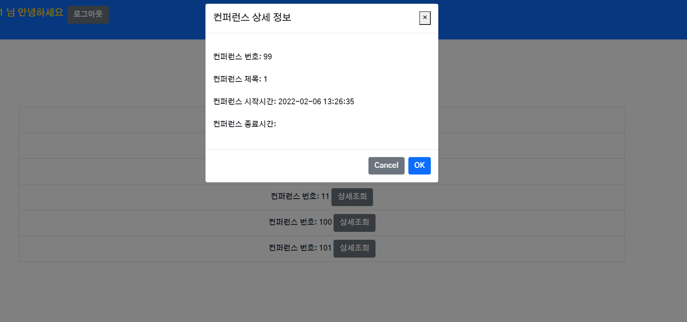
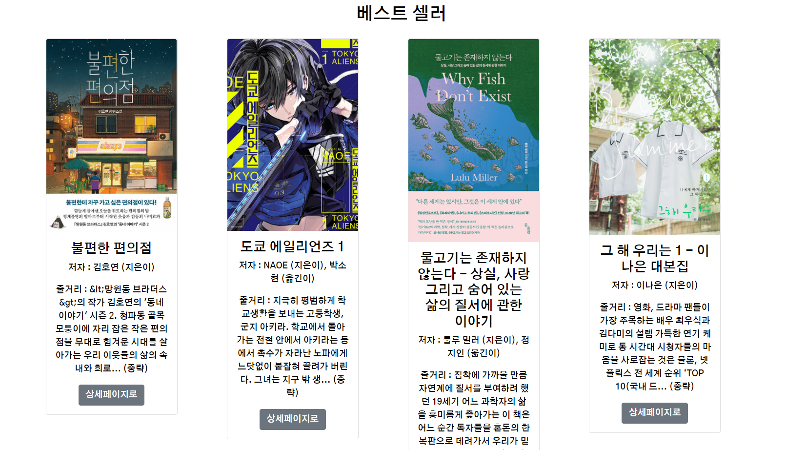

# 0207

### 공통PJT 관련 진행한 사항

(JPA로 작성한 새 서버가 안되서 myBatis로 작성한 새 서버 기준으로 작업함)

#### 회의 기록 조회





- 회의 상세 정보를 동시에 띄우는 것에는 실패했다
- 회의 정보를 따로 저장하는 리스트를 만들어 띄우려고 했지만 
  - 컨퍼런스 번호에 맞는 상세정보 를 조회했을때 axios http요청이 비동기요청이라서 그런건지 저장이 순차적으로 조회된 데이터가 들어가는 것이 아니라 한개의 데이터로 일괄 저장되었다
- 회의 상세 정보에는 컨퍼런스 종료시간이 없다
- 컨퍼런스 히스토리에는 컨퍼런스 번호만 저장되기 때문에 (active와 inserted_time이 있는데 active는 항상 기본값 0이 inserted_time은 datetime 필드이지만 항상 null값이다. --백엔드에 문의 필요)
- 회의상세정보를 컨퍼런스 번호로 조회해서 띄웠는데 컨퍼런스 종료시 DB를 삭제해버리면(삭제하기로 기능을 정한 것으로 알고 있다) 조회를 어떻게하지?
  - 컨퍼런스 히스토리에 그냥 회의 정보도 같이 저장되도록 할 수 없는지 백엔드에 문의 해봐야 할 것 같다
- 보다시피 UI가 무척 guri지만 일단 기능 구현만 먼저 했다

```vue
 <template>
  <div class="container">
    <h1 class="fw-bold my-5">지난 회의 이력</h1>
    <b-list-group>

        <b-list-group-item v-for="(history, index) in conferenceHistory" :key="index">컨퍼런스 번호: {{ history.conference_id }} <b-button v-b-modal.modal-1 @click="getConferenceInfo(history.conference_id)">상세조회</b-button></b-list-group-item>

      <b-modal id="modal-1" title="컨퍼런스 상세 정보">
        <p class="my-4">컨퍼런스 번호: {{ conferenceDetail.id }}</p>
        <p class="my-4">컨퍼런스 제목: {{ conferenceDetail.title }}</p>
        <p class="my-4">컨퍼런스 시작시간: {{ conferenceDetail.call_start_time }}</p>
        <p class="my-4">컨퍼런스 종료시간: {{ conferenceDetail.call_end_time }}</p> <!-- 조회가 안됨 -->
      </b-modal>
    </b-list-group>
  </div>
</template>

<script>

import { mapState, mapActions } from "vuex";


export default {
  name: "ConferenceHistory",
  components: {
  },
  data() {
    return {
    };
  },
  created() {
    this.getConferenceHistory(this.userInfo.user_id) // 지난 회의 이력 가져오기
  },
  computed: {
    ...mapState("userStore", ["userInfo"]),
    ...mapState("conferenceStore", ["conferenceHistory", "conferenceDetail"]),
  },
  methods: {
    ...mapActions("conferenceStore", ["getConferenceHistory", "getConferenceInfo"]),


  },
};
</script>

<style>

</style>

```

#### 베스트셀러 / 신간도서 조회




- 총 10개의 신간도서와 베스트셀러를 조회하는데 부트스트랩 그리드 시스템을 사용하다보니.... 
- 5개씩 띄우는 것이 안된다
  - offset을 사용하여 시도 해보았으나 안되었다.. 내가 잘못한건지.. 그냥 5개면 어떻게 했을 것도 같은데 10개라서 안되는건가..?
  - 8개로 조정하거나 재시도 하거나......
  - 캐러셀로 넘길 수 있으면 좋은데 그부분을 시도해 보거나...

- api에서 제공하는 이미지 화질이 너무 안좋아서 고화질 이미지로 대체하는데.. url을 재구성하는 규칙이 number로 되어있는 숫자의 일부분을 두개를 가져와서.. 또 하나는 다시 숫자로(앞에 0을 날려야 이미지 url이 생성되는 부분이 있었다)... 새 imgPath로 변환하는 부분이 약간 까다로웠다.
  - 해놓고 나니 어려운 부분같지는 않은데 해본적이 없어서 해멨다..
- 줄거리는 100자가 넘을 때만 100자로 잘라주었다
  - 해놓고나니 난잡해서 아예 빼버려야 할 수도....

```vue
<template>
  <div>
    <div>
      <h2 class="my-4">베스트 셀러</h2>
      
      <b-row class="justify-content-center">
        <b-col 
        col
        cols="12"
        sm="6"
        md="4"
        lg="3"
        v-for="(item, index) in bestSellerItems"
        :key="index"
        >
          <b-card
          :title="item.title"
          :img-src="imgPath(item.itemId, item.isbn)"
          img-alt="Image"
          img-top
          tag="article"
          style="max-width: 15rem;"
          class="mb-3"
          >
            <b-card-text>
              <p>저자 : {{ item.author }}</p>
              <p>줄거리 : {{ truncDiscription(item.description) }}</p>
            </b-card-text>

            <b-button :href="item.link" variant="secondary">상세페이지로</b-button>
          </b-card>
        </b-col>

      </b-row>


    </div>
    <hr />
    <div>
      <h2 class="my-4">신간 도서</h2>
      <b-row class="justify-content-center">
        <b-col 
        col
        cols="12"
        sm="6"
        md="4"
        lg="3"
        v-for="(item, index) in newSpecialItems"
        :key="index"
        >
          <b-card
          :title="item.title"
          :img-src="imgPath(item.itemId, item.isbn)"
          img-alt="Image"
          img-top
          tag="article"
          style="max-width: 15rem;"
          >
            <b-card-text>
              <p>저자 : {{ item.author }}</p>
              <p>줄거리 : {{ truncDiscription(item.description) }}</p>
            </b-card-text>

            <b-button :href="item.link" variant="secondary">상세페이지로</b-button>
          </b-card>
        </b-col>

      </b-row>

    </div>
  </div>
  
</template>

<script>
import http from "@/config/http-common.js";

export default {
  name:"bookList",
  data() {
    return {
      bestSellerItems: [],
      newSpecialItems: [],
    };
  },

  created() {
    this.getBestSeller(),
    this.getNewSpecial()
  },
  methods:{
    getBestSeller() {
      http({
        method: "get",
        url: `/search/bestseller`,
      })
      .then((response) => {
        console.log(response.data.item)
        this.bestSellerItems = response.data.item
        // this.bestSellerItems.replace('sum', '500')
      })
      .catch((err) => {
        console.log(err)
      })
    },
    getNewSpecial() {
      http({
        method: "get",
        url: `/search/newspecial`,
      })
      .then((response) => {
        console.log(response.data.item)
        this.newSpecialItems = response.data.item
      })
      .catch((err) => {
        console.log(err)
      })
    },
    imgPath(itemId, isbn) {
      // console.log(typeof(itemId))
      // console.log(isbn)
      // console.log(itemId.toString().substr(0,5))
      // console.log(itemId.toString().substr(5,2))
      // console.log(`https://image.aladin.co.kr/product/${itemId.toString().substr(0,5)}/${itemId.toString().substr(5,2)}/cover500/${isbn}_1.jpg`)
      return `https://image.aladin.co.kr/product/${itemId.toString().substr(0,5)}/${Number(itemId.toString().substr(5,2))}/cover500/${isbn}_1.jpg`
    },
    truncDiscription(dis) {
      if (dis.length <= 100) {
        return dis
      } else {
        return `${dis.substr(0, 100)}... (중략)`
      }
      
    },
  },
};

</script>

<style scoped>

</style>
```

- JPA로 바뀐 서버에 aixos 요청하는 규칙이 너무 많이 바뀌어서(필드명, 외래키 관련) 이전 서버 기준으로 작성한 기능을 옮기는 게 제대로 될지 걱정이다

#### 이번주 중으로 크게 해야하는 일

##### 1. myBatis로 작성된 서버에서 작성한 기능 JPA로 작성한 서버로 옮기기

##### 2. UI / 디자인개선하기

##### 3. 백엔드에 일부 기능 문의하기

- 방 생성 기능 : 생성직후 response로 pk를 리턴하는지?
  - 이전에 요청했으므로 확인필요

- 방 참여 기능 : 수정한 것으로 알고 있기는 함
- 회의 이력 기능 : 컨퍼런스ID + 회의 관련 데이터도 함께 저장할 수는 없는지? / active, inserted_time 관련 동작유무

