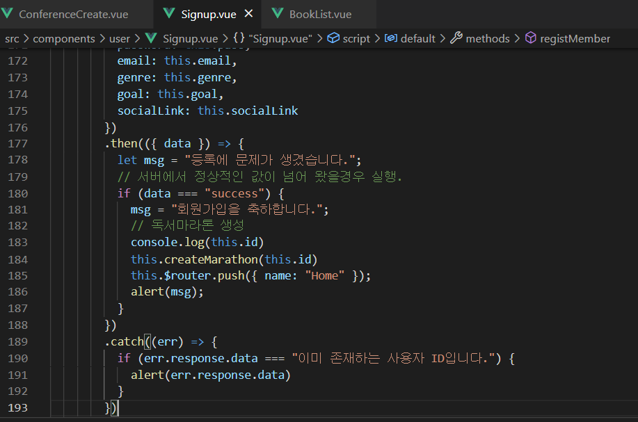
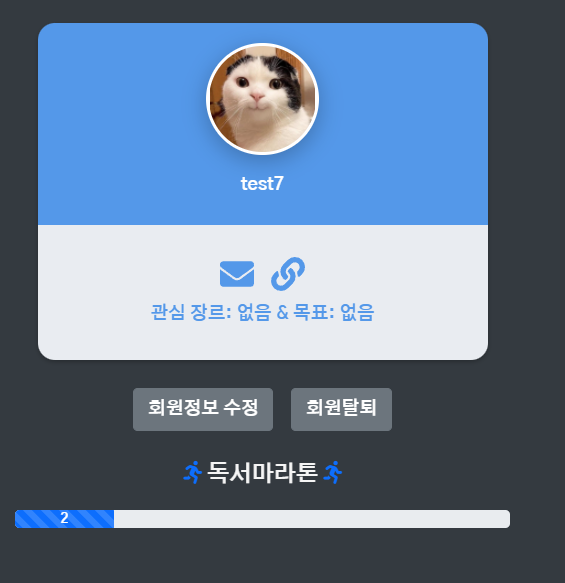
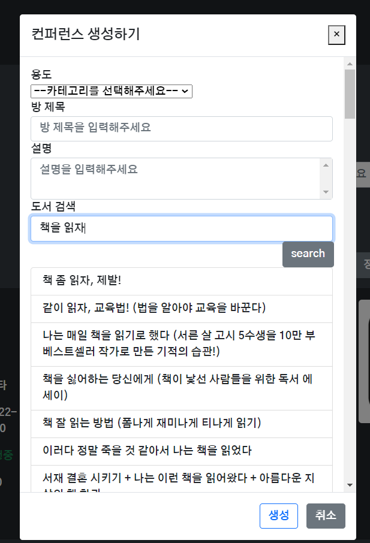

# 0210

## 공통 PJT 관련 진행한 사항

- 회원가입시 id 중복 체크 관련 

  - 에러메시지 존재하는 경우 (다양한 처리 방식이 있을 수 있음 / 실제로 버튼으로 id 중복 체크하는 기능이 BE에는 있지만 시간관계상 구현은 보류하기로 함)
  - 

- 데이터 미입력시 default값 지정 관련

  - v-model 사용할때 꼭 미리 data에 일치하는 데이터가 없어도 된다는걸 알았다.. (data에 일치하는 값이 있으면 form에 미리 입력해놓을 수 있기는 하지만..)
  - code

  ```
  <template>
    <div class="container my-5 px-4 px-lg-5">
      <div class="row gx-4 gx-lg-5 justify-content-center">
        <div class="col-md-10 col-lg-8 col-xl-7">
          <h1>회원가입</h1>
          <div class="my-5">
            <form id="userform" method="post" action="">
              <div class="text-start">
                <label for="name">이름</label>
                <input
                  class="form-control"
                  id="name"
                  type="text"
                  v-model="name"
                  placeholder="이름을 입력해주세요."
                />
              </div>
              <div class="text-start">
                <label for="id">ID</label>
                <input
                  class="form-control"
                  id="id"
                  type="text"
                  v-model="id"
                  placeholder="ID를 입력해주세요."
                />
                <div id="idresult" class="mt-1"></div>
              </div>
              <div class="text-start">
                <label for="pass">Password</label>
                <input
                  class="form-control"
                  id="pass"
                  type="password"
                  v-model="pass"
                  placeholder="비밀번호를 입력해주세요."
                />
              </div>
              <div class="text-start">
                <label for="pass">Password Check</label>
                <input
                  class="form-control"
                  id="passcheck"
                  type="password"
                  v-model="passcheck"
                  placeholder="비밀번호를 다시 입력해주세요."
                />
              </div>
              <!-- email 주소 -->
              <div class="text-start">
                <p class="mt-3 mb-0">(선택정보)</p>
                <label for="email">E-mail</label>
                <input
                  class="form-control"
                  id="email"
                  type="e-mail"
                  v-model="email"
                  placeholder="e-mail을 입력해주세요.(example: -----@-----.--- 형식으로 입력)"
                />
              </div>
              <!-- 관심장르 -->
              <div class="text-start">
                <label for="genre">관심 장르</label>
                <input
                  class="form-control"
                  id="genre"
                  type="text"
                  v-model="genre"
                  placeholder="관심 장르를 입력해주세요."
                />
              </div>
              <!-- 목표 -->
               <div class="text-start">
                <label for="goal">목표</label>
                <input
                  class="form-control"
                  id="goal"
                  type="text"
                  v-model="goal"
                  placeholder="목표를 입력해주세요."
                />
              </div>           
              <!-- 소셜 링크 -->
               <div class="text-start">
                <label for="socialLink">SNS 링크</label>
                <input
                  class="form-control"
                  id="socialLink"
                  type="url"
                  v-model="socialLink"
                  placeholder="소셜링크를 입력해주세요.(example: https://----.--- 형식으로 입력)"
                />
              </div>    
              <br />
              <!-- Submit Button-->
              <b-button variant="primary" @click="checkValue"
                >Sign Up</b-button
              >&nbsp;
              <b-button variant="danger" @click="resetValue"
                >Cancel</b-button
              >
            </form>
          </div>
        </div>
      </div>
    </div>
  </template>
  
  <script>
  import http from "@/config/http-common.js";
  
  export default {
    name: "Signup",
    data() {
      return {
        name: "",
        id: "",
        pass: "",
        passcheck: "",
        // email: "", // data에 v-model로 양방향 바인딩 된 값이 없어도 데이터를 보낼 수 있다(null)
        // genre: null,
        // goal: null,
        // socialLink: ""
      };
    },
  ... 중략(유효성 검사 부분) ...
  
  registMember() {
        http
          .post(`/users`, {
            userName: this.name,
            userId: this.id,
            password: this.pass,
            email: this.email,
            genre: this.genre,
            goal: this.goal,
            socialLink: this.socialLink
          })
          .then(({ data }) => {
            // 서버에서 정상적인 값이 넘어 왔을경우 실행.
            let msg = "등록에 문제가 생겼습니다.";
            if (data === "success") {
              msg = "회원가입을 축하합니다.";
            }
            alert(msg);
            this.$router.push({ name: "Home" });
          })
          // 수정한 부분 // err.response를 접근할 수 있다 (에러 코드와 에러 메시지 확인 가능)
          .catch((err) => {
            if (err.response.data === "이미 존재하는 사용자 ID입니다.") {
              alert(err.response.data)
            }
          })
      },
      resetValue() {
        this.$router.push("/");
      },
    },
  };
  </script>
  
  <style></style>
  
  
  ```

- conference detail 관련

  - DB가 변경되면서 기존에는 외래키로 별도로 타 테이블을 참조했었던 카테고리 name값을 이제는 그대로 detail에 return해주기 때문에 기존에 match category 함수로 별도로 찾았던 카테고리 name을 찾을 필요는 없어졌다.

    - 서버 바뀌면서 이 부분은 편해졌다

      - 사실 그걸 프론트에서 찾는게 말이 안되긴 하는듯(비효율적)

    - 편리해지긴 했는데 기존에 함수 작성하고 데이터 바인딩한다고 뻘짓했던 시간들이여..

      

  - code

    - 기존

      ```vue
      // html
            <p>
              conference name: {{ conferenceDetail.title }} / conference type: {{ categoryName }}
            </p>
      // 데이터
        data() {
          return {
            categoryName: "",
          };
      // 함수
        methods: {
          // 카테고리 아이디와 일치하는 카테고리명 찾기
          matchCategory() {
            for (const cc of this.conferenceCategory)
              if (cc.id === this.conferenceDetail.conferenceType.id) {
                this.categoryName = cc.name;
              }
          },
      // 외
        created() {
          // 회의실 상세 데이터 가져오기    
          this.getConferenceInfo(this.conferenceId);
          // 카테고리 아이디와 일치하는 카테고리명 찾기
          this.matchCategory();
      }
      ```

    - 변경

      ```vue
            <p>
              conference name: {{ conferenceDetail.title }} / conference type: {{ conferenceDetail.conferenceType.name }}
            </p>
      ```

      - 다 필요없고 한줄로 평정이 가능해짐

- 독서마라톤 기능 달기

  - 

  - 별도로 생성할 수 있으나 구현 편의상 회원가입할 때 기본값으로 자동 생성하도록 설정
  
    ```vue
    // method
    // 일단 회원가입할 때 독서 마라톤을 생성한다
        createMarathon(id) {
          http
            .post(`/marathon/create`, {
              userId: id,
              goalPages: 50 // 기본적으로 50으로 생성
            })
            .then(({ data }) => {
              // 서버에서 정상적인 값이 넘어 왔을경우 실행.
              console.log(data)
            })
            .catch((err) => {
              console.log(err.response)
              alert("독서마라톤 생성에 실패했습니다. 관리자에게 문의하세요.")
            })
        },
        registMember() {
          http
            .post(`/users`, {
              userName: this.name,
              userId: this.id,
              password: this.pass,
              email: this.email,
              genre: this.genre,
              goal: this.goal,
              socialLink: this.socialLink
            })
            .then(({ data }) => {
              // 서버에서 정상적인 값이 넘어 왔을경우 실행.
              let msg = "등록에 문제가 생겼습니다.";
              if (data === "success") {
                msg = "회원가입을 축하합니다.";
                // 독서마라톤 생성
                console.log(this.id)
                this.createMarathon(this.id)
                this.$router.push({ name: "Home" });
              }
              alert(msg);
            })
            .catch((err) => {
              if (err.response.data === "이미 존재하는 사용자 ID입니다.") {
                alert(err.response.data)
              }
            })
        },
    ```

    - 표시는 프로필에서 막대로

    - code
  
      ```
            <b-row class="justify-content-center mt-4">  
              <p class="fs-5 fw-bold"><i class="fas fa-running text-primary"></i> 독서마라톤 <i class="fas fa-running text-primary"></i></p> <!-- 폰트어썸 아이콘 -->
              <b-progress
                :value="marathon.value"
                :max="marathon.max"
                show-value
                class="mb-3 col-4 px-0"
                animated 
              >
              </b-progress>
            </b-row>
      ```

      
  


- DB 입력시 책 검색해서 선택 반영중

  

  - 데이터에 있는 br 여는태그 닫는태그를 프론트에서 삭제해서 출력시키다보니 그런건지 데이터가 많아질 수록 속도가 장난 아니게 느리다...

  - code

    ```vue
    // html
    	  <div v-if="bookData===1">
            <p>도서를 검색하여 선택해주세요.</p>
          </div>
          <div v-else-if="bookData.length===0">
            <p>검색결과가 없습니다.</p>
          </div>
          <div v-else-if="bookData">
            <!-- {{ bookData }} -->
            <b-list-group>
              <b-list-group-item v-for="book in bookData" :key=book.isbn>
                {{ transStr(book.title) }}
              </b-list-group-item>
            </b-list-group>
          </div>
    // script
        bookSearch() {
           http({
            method: "get",
            url: `/search/naver?query=${this.bookSearchValue}`,
          })
            .then((response) => {
              console.log(response);
              this.bookData = response.data.items
            })
            .catch((error) => {
              console.dir(error);
            });
        },
        transStr(str) {
          // return str
          var transedStr = str.replaceAll('<b>', '')
          transedStr = transedStr.replaceAll('</b>', '')
          return transedStr
        }
    ```

> 2.10 7시까지 작업한 내용들

##### 공통PJT 일지

```
구현하기가 급해서 코드의 컴포넌트화가 잘 안되고(엄청나게 길어지는 코드.... 유지보수성 급하강하는 소리가 들리나 불가피하게 일정에 맞춰 가는 중)
코드 정리 등 문서화가 잘 안되는 부분이 있어서 아쉽다.
감으로 찍어맞추거나 제대로 된 데이터가 나올때까지 검색창과 콘솔을 두들겨 패는 다소 무식한 방식으로 구현하고 있어 불안한 마음도 있지만...... 한없이 무식하다가도 구현하면서 알아가는 즐거움도 있는 것 같다.
```

