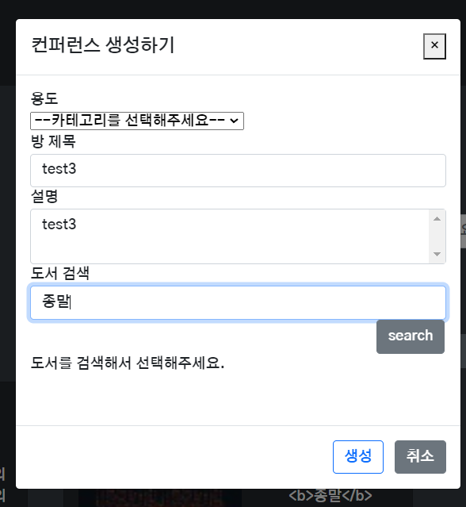
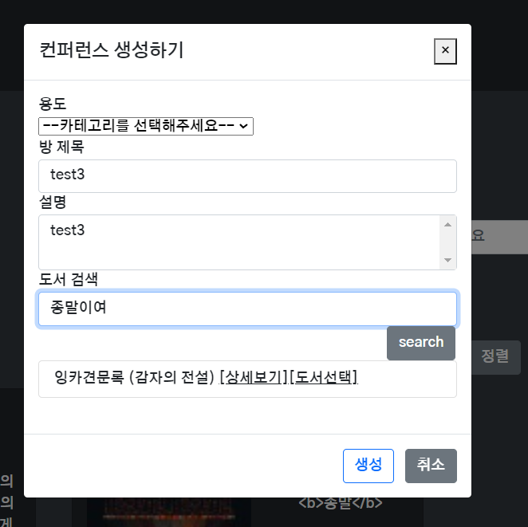
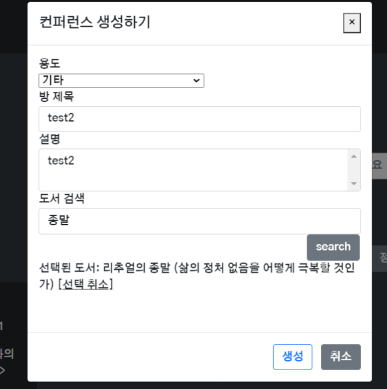
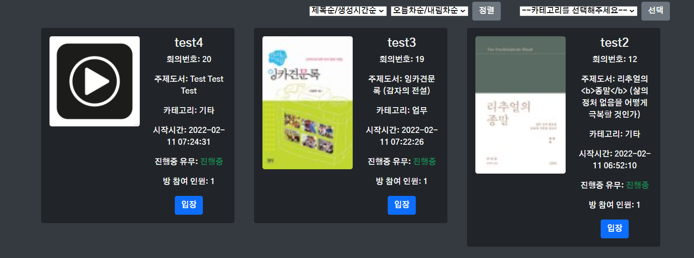

# 0211










- 검색해서 저장된 db를 isbn으로 검색해서 pk를 얻어와서 방 생성 데이터에 입력

- 북 이미지가 없는 경우 기본이미지를 띄운다...

  - 기본이미지 바꿔야 하지 않을까...?

- 썸네일 데이터는 화질이 낮아 출력할때 url 가공이 필요하다 -- 예정

- b태그 replace 해야한다 -- 예정

- code

  ````
  <template>
    <div>
      <b-button
        v-b-modal.modal3-prevent-closing
        variant="primary"
        class="col-4 mb-3"
        @click="$bvModal.show('modal-scoped')"
        >컨퍼런스 생성하기</b-button
      >
      <b-modal scrollable id="modal3-prevent-closing" ref="modal" title="컨퍼런스 생성하기">
        <form ref="form">
          <b-form-group
            class="roommodal"
            id="dropdown-1"
            label="용도"
            label-for="usage-roominput"
          >
            <b-form-select v-model="selectedOption" :options="options">
              <template #first>
                <b-form-select-option :value="null" disabled
                  >--카테고리를 선택해주세요--</b-form-select-option
                >
              </template>
            </b-form-select>
          </b-form-group>
        </form>
        <form ref="form">
          <b-form-group
            class="roommodal"
            label="방 제목"
            label-for="title"
          >
            <b-form-input
              id="title"
              v-model="roomName"
              placeholder="방 제목을 입력해주세요"
            ></b-form-input>
          </b-form-group>
        </form>
        <form ref="form">
          <b-form-group
            type="textarea"
            class="roommodal"
            label="설명"
            label-for="description"
          >
            <b-form-textarea
              id="description"
              v-model="roomContent"
              placeholder="설명을 입력해주세요"
              row="3"
              max-rows="6"
            ></b-form-textarea>
          </b-form-group>
        </form>
        <form ref="form" class="">
          <b-form-group
            type="search"
            class="searchmodal"
            label="도서 검색"
            label-for="bookSearch"
          >
            <b-form-input
              id="bookSearch"
              placeholder="키워드 입력"
              v-model="bookSearchValue"
              plain
              @keydown.enter.prevent="bookSearch()"
            >
            </b-form-input>
            <b-button class="offset-10" @click="bookSearch()">search</b-button>
          </b-form-group>
        </form>
        <div v-if="bookData===1">
          <p>도서를 검색해서 선택해주세요.</p>
        </div>
        <div v-else-if="bookData===2">
          <p>선택된 도서: {{ selectedBook }}    <span class="text-decoration-underline" @click="bookData=1">[선택 취소]</span></p>
        </div>
        <div v-else-if="bookData.length===0">
          <p>검색결과가 없습니다.</p>
        </div>
        <div v-else>
          <!-- {{ bookData }} -->
          <b-list-group>
            <b-list-group-item v-for="book in bookData" :key=book.isbn>
              {{ transStr(book.title) }}    
              <a :href="book.link" class="text-reset" onclick="window.open(this.href, '_blank', 'width=800, height=600'); return false;">[상세보기]</a>
              <span class="text-decoration-underline" @click="selectBook(book)">[도서선택]</span>
            </b-list-group-item>
          </b-list-group>
        </div>
  
  
        <br />
        <template #modal-footer="{ ok, cancel }">
          <b-button
            variant="outline-primary"
            class="me-2"
            @click="roomCreate() ? ok() : _"
          >
            생성
          </b-button>
          <b-button
            @click="
              formReset();
              cancel();
            "
          >
            취소
          </b-button>
        </template>
      </b-modal>
    </div>
  </template>
  
  <script>
  import { mapState, mapActions } from "vuex";
  import Swal from "sweetalert2";
  import http from "@/config/http-common.js";
  
  export default {
    name: "ConferenceCreate",
    data() {
      return {
        roomName: "",
        roomContent: "",
        bookSearchValue: "",
        selectedOption: null, // (명세서 상) 업무를 기본값으로 하라고 하지만 선택사항 없는 상황에서 선택하는 것이 나은 것 같아서 수정
        options: [ // 카테고리를 조회해서 DB에서 데이터를 연동했으면 좋았겠지만 구현 편의상 직접 작성함 // 카테고리 명칭 바뀌면 이 부분을 수정해야함
          { value: "1", text: "업무" },
          { value: "2", text: "교육" },
          { value: "3", text: "기타" },
        ],
        bookData: 1,
        selectedBook: '',
        bookDetailId: null
      };
    },
    created() {},
    computed: {
      ...mapState("userStore", ["userInfo"]),
    },
    methods: {
      ...mapActions("conferenceStore", ["createRoom"]),
      roomIsValid: function () {
        if (this.selectedOption === null || this.roomName === "" || this.bookDetailId === null) {
          Swal.fire({
            icon: "error",
            title: "Stop!",
            text: "용도, 제목, 도서는 필수 입력사항입니다.",
          });
          return false;
        } else if (this.roomName.length > 31) {
          Swal.fire({
            icon: "error",
            title: "RoomnameError",
            text: "제목은 최대 30자까지 입력 가능합니다.",
          });
          return false;
        } else {
          return true;
        }
      },
      roomData() {
        return {
          user: {
            userId: this.userInfo.userId, 
          },
          bookDetail: {
            id: this.bookDetailId, 
          }, // 임시 - book DB와 연동 필요
          conferenceType: { 
            id: this.selectedOption,
          },
          title: this.roomName,
          description: this.roomContent,
          isActive: 1
        };
      },
      formReset() {
        this.selectedOption = null;
        this.thumbnailFile = "";
        this.roomName = "";
        this.roomContent = "";
        this.roomSearchValue = "";
        this.bookData = 1 ;
      }, // 입력된 form 지우기
      roomCreate() {
        if (this.roomIsValid()) {
          this.createRoom(this.roomData()); // 회의실 생성하기 // 바인딩된 데이터 payload로 전달
          this.formReset(); // 입력된 form 지우기
          return true;
        } else {
          return false;
        }
      },
      bookSearch() {
         http({
          method: "get",
          url: `/search/naver?query=${this.bookSearchValue}`,
        })
          .then((response) => {
            console.log(response);
            this.bookData = response.data.items
          })
          .catch((error) => {
            console.dir(error);
          });
      },
      transStr(str) {
        // return str
        var transedStr = str.replaceAll('<b>', '')
        transedStr = transedStr.replaceAll('</b>', '')
        return transedStr
      },
      // DB에 선택한 책 정보가 있는지 isbn으로 check // get
      checkBookInDB(book) {
         console.log(book)
         const isbn = book.isbn.split(" ")[1]
         console.log(isbn)
         http({
          method: "get",
          url: `/search/${isbn}`,
        })
          .then((response) => {
            console.log(response);
            this.bookDetailId = response.data
          })
          .catch((error) => {
            console.dir(error);
          });
      },
      selectBook(book) {
        this.selectedBook = this.transStr(book.title)
        this.bookData = 2
        this.bookDetail.id = this.checkBookInDB(book)
      }
    },
  };
  </script>
  
  <style>
  
  </style>
  
  ````

- 발견한 에러

  ```
  * 에러 확인
  
  -동일한 유저가 두개 이상의 컨퍼런스를 못만듬
  -회의를 생성하면 fk제약사항 때문에 탈퇴가 안됨
  -히스토리때문에 fk제약사항 때문에 방 삭제는 안됨 --> 이 기능은 그냥 빼야하지 않을까? 삭제 안하고 db 남기는게 나을 수도 있다고 생각함
  -방 입장 기능이 안되어있어서 회의 참가시에도 독서마라톤 게이지가 증가되지 않음
  	-회의 개설한 사람은 증가함
  -탈퇴한 유저 독서마라톤 db가 삭제되지 않음
  	-삭제가 안되어서 생기는 문제점
  		-같은 아이디로 재가입하는 경우 2개의 독서마라톤 데이터가 생성되는데 독서마라톤 데이터가 2개 이상인 경우에는 조회가 되지 않는 에러가 있음(에러코드는 안뜨는데 반환되는 리스폰스는 사용할 수 없는 값임)
  			- 사실 이건 같은 아이디로 재가입하지 않으면된다... 테스트하면서 user데이터가 쌓이는게 싫어 삭제 / 재가입을했는데 알게된사실이다
  ```

  

> 2.11 7시 30분까지 작업한 내용 + 야간 추가 작업 예정

### 공통PJT 일지

```
스파게티도 내 코드보다는 안꼬였을 거라는 생각을 한다.
싼타파이브 조단원 수료생님 특강에서 얼레벌레 일단 기능이 돌아게 구현해도 괜찮다는 말에 조금이나마 용기를 얻어(지금 시점에 와서 어쩔 수 없어....) 포기하지 않고 끝까지 가야 할 것 같다.
```

