# 0214 

### 공통PJT 관련 진행한 사항

##### 미처 기록은 다 하지 못했지만 많은 것을 했다...

- 화면단 열혈 수정중

  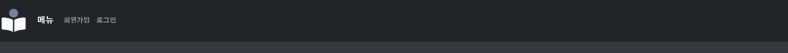

  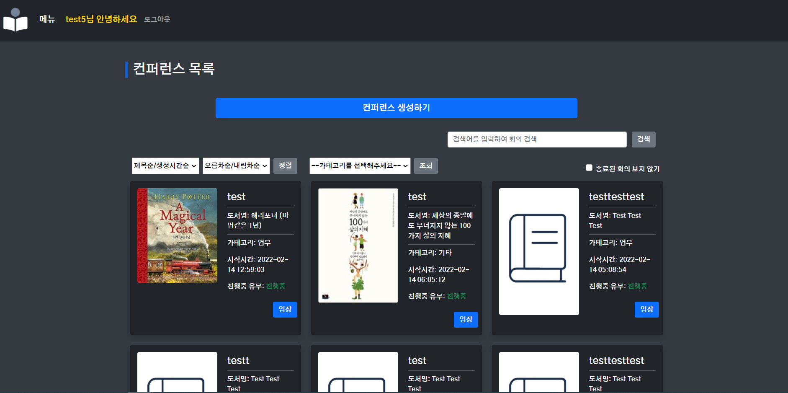

  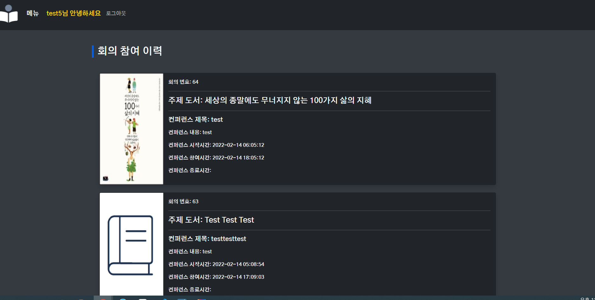

  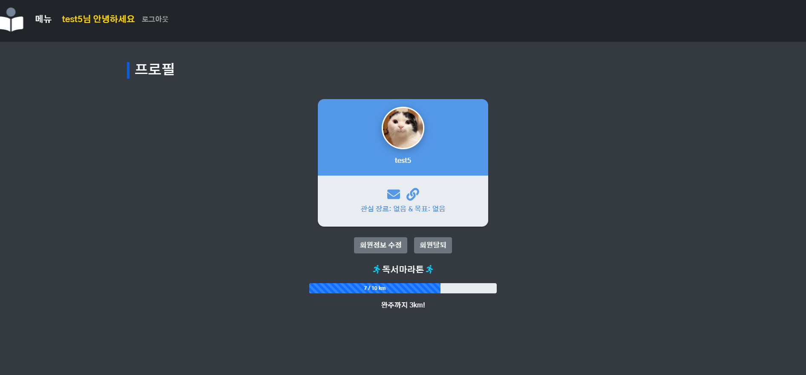

- alert 관련

  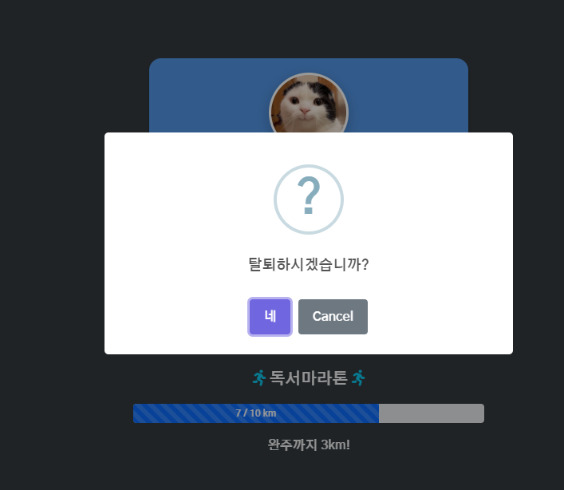

  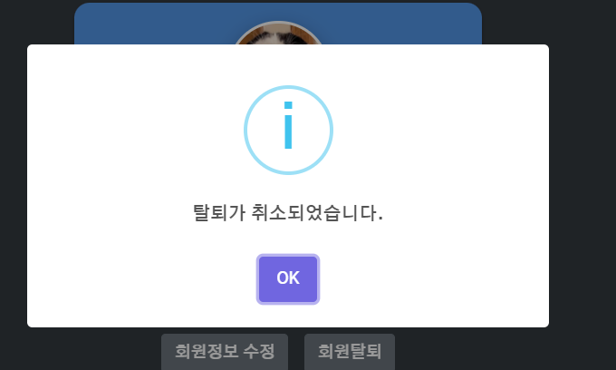

  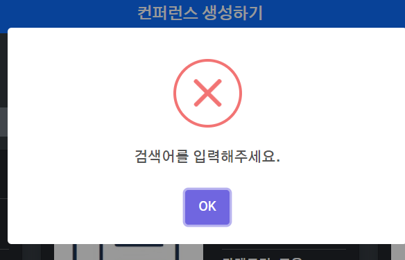

  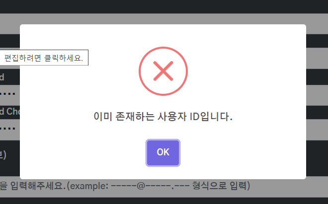

  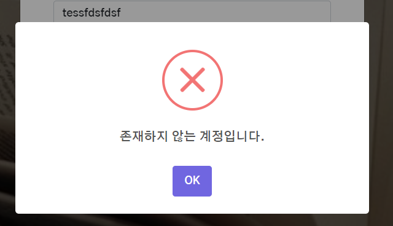

  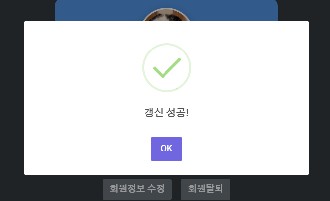

  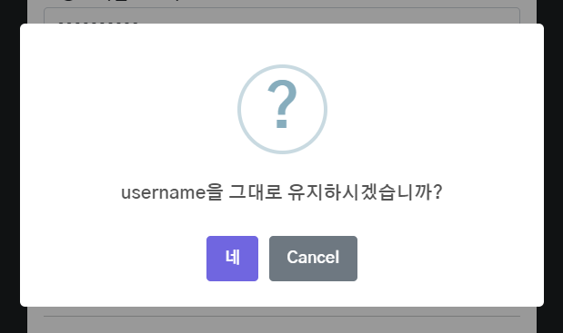

  - 수많은 alert들...

- book random

  - lodash sampleSize 사용하여 top 50 중 랜덤하게 출력되도록 조정

    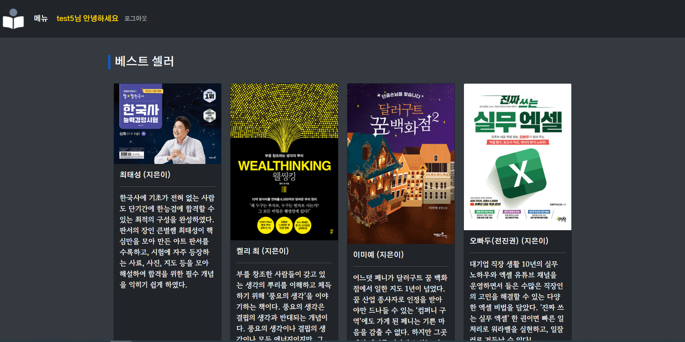

    

- infinite scroll

  - https://daily-life-of-bsh.tistory.com/209
  - 백엔드에서 수정한 부분은 다음과 같고

  ```
  public List<Conference> getConferencesLimit(int limit){
          QConference qConference = conference;
          List<Conference> list = (List<Conference>) queryFactory
                  .from(qConference)
                  .limit(limit)
                  .orderBy(qConference.id.desc())
                  .fetch();
  
      return list;
  }
  ```

  ```
  	@ApiOperation(value = "infinite Loading")
  	@GetMapping("/conferencesLimit")
  	public Object getConferencesLimit(@RequestParam("limit") int limit) throws Exception {
  		List<Conference> list = conferenceService.getConferencesLimit(limit);
  		return new ResponseEntity<>(list, HttpStatus.OK);
  	} // 수정했다고 했는데 git에 올려지지가 않음
  ```

  - 프론트에서 수정한 부분은 다음과 같다

  ```
   <conference-list-item
   id="conference"
   v-for="item in list"
   :key="item.id"
   :item="item"
   :checked="checked"
   >
   </conference-list-item> -->
   <infinite-loading @infinite="infiniteHandler"></infinite-loading>
  ```

  ```
  data() {
      return {
        list : [],
        limit : 0,
      }
  },
  methods: {
      infiniteHandler($state) {
        http({
          method: "get",
          url: `/conferences/conferencesLimit?limit=${this.limit}`,
          // url: `/conferences/conferencesLimit?limit=1`,
        })
          .then((response) => {
            console.log(response)
            setTimeout(() => {
              // this.list = this.list.concat(response.data);
              // $state.complete();
              console.log(response.data.length)
              if (response.data.length < this.conferenceItems.length) {
                console.log(response.data.length)
                console.log(this.conferenceItems.length)
                this.list = this.list.concat(response.data);
                this.limit += 6;
                $state.loaded();
              } else {
                $state.complete();
              }
            }, 1000);
          })
          .catch((error) => {
            console.log(error.response)
          });
      },
    },
  }
  ```

  - 시간만 왕창 버리고 소득은 없었던 문제의 기능
  - 블로그 코드는 간단해보였으나... 프론트는 코드를 거의 그대로 사용할 수 있었는데 백엔드는 그게 아니다보니 
  - 백엔드에서 요청해서  넘어오는 데이터가 요청하는 params에 따라 알맞게 잘라서 페이징되어서 리스폰스로 넘어오는게 아니라 1부터 다시 불러오고 다시 불러오고 무한반복 상태라 프론트에서는 어떻게 조정해도 성공할 수가 없는 상황으로 판단된다
  - 질문해서 해결하면 좋겠지만 백엔드도 채팅 등 이것저것 구현하느라 바쁜 것 같고 내가 백엔드 코드에 손을 댈 수는 없고 아쉽지만 시간 관계상 보류하고 다음 프로젝트에서는 반영할 수 있으면 좋겠다

-----

### 공통PJT 일지

```
밥먹고 플젝하고 자고 일어나서 플젝하고 * @ 무한반복
```

