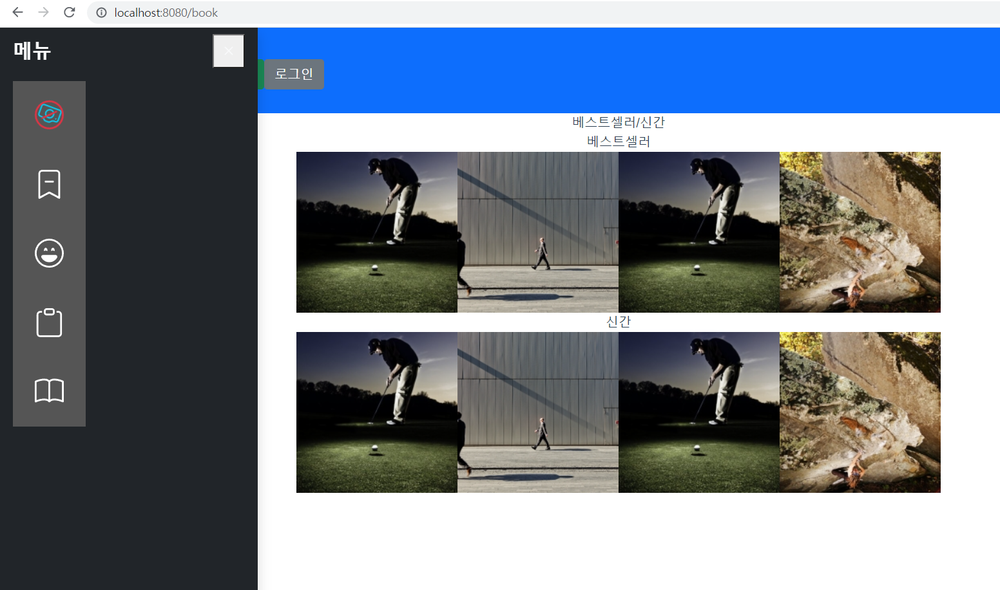

21.01.14

## 캐러셀

## 들어가며

신간도서와 베스트셀러를 캐러셀로 보여주기 위해 찾아보았다.


### 설치

```
npm i vue-owl-carousel
```

### 용법

```
<script>

import carousel from 'vue-owl-carousel'

export default {
    components: { carousel },
}

</script>
```


```
// 기본 사용법
<carousel>

    

    

    

    

</carousel>
```

```
// 옵션 설정
<carousel :autoplay="true" :nav="false">

//

</carousel>
```

```
// 이전 및 다음 버튼
<carousel>

    <template slot="prev"><span class="prev">prev</span></template>

    //

    <template slot="next"><span class="next">next</span></template>

</carousel>
```

```
// 이벤트 설정
<carousel @changed="changed" @updated="updated">

//

</carousel>
```





### 사용 가능한 옵션

현재 다음 옵션을 사용할 수 있습니다.

- \### 항목

유형 : `number`

기본 : `3`

화면에서 보고 싶은 항목의 수입니다.

- \### 여백

유형 : `number`

기본 : `0`

항목의 오른쪽 여백(px).

- \### 루프

유형 : `boolean`

기본 : `false`

무한 루프. 루프 환상을 얻으려면 마지막 항목과 첫 번째 항목을 복제하십시오.

- \#### 센터

유형: `Boolean`

기본: `false`

센터 아이템. 홀수 개수의 항목에도 잘 작동합니다.

- \#### 탐색

유형: `Boolean`

기본: `false`

다음/이전 버튼을 표시합니다.

- \#### 자동 재생

유형: `Boolean`

기본: `false`

자동 재생.

- \#### 자동 재생 속도

유형: `Number/Boolean`

기본: `false`

자동 재생 속도.

- \#### 되감기

유형: `Boolean`

기본: `true`

경계에 도달하면 뒤로 이동합니다.

- \#### 마우스 끌기

유형: `Boolean`

기본: `true`

마우스 드래그가 활성화되었습니다.

- \#### 터치드래그

유형: `Boolean`

기본: `true`

터치 드래그가 활성화되었습니다.

- \#### 풀드래그

유형: `Boolean`

기본: `true`

스테이지를 가장자리로 당깁니다.

- \#### 프리드래그

유형: `Boolean`

기본: `false`

항목을 가장자리로 당깁니다.

- \#### 스테이지패딩

유형: `Number`

기본: `0`

무대에서 왼쪽과 오른쪽 채우기(이웃을 볼 수 있음).

- \#### 자동 너비

유형: `Boolean`

기본: `false`

그리드가 아닌 콘텐츠를 설정합니다. div에서 너비 스타일을 사용해보십시오.

- \#### 자동 높이

유형: `Boolean`

기본: `false`

그리드가 아닌 콘텐츠를 설정합니다. div에서 높이 스타일을 사용해보십시오.

- \#### 점

유형: `Boolean`

기본: `true`

점 탐색을 표시합니다.

- \#### 자동 재생 시간 초과

유형: `Number`

기본: `5000`

자동 재생 간격 시간이 초과되었습니다.

- \#### autoplayHoverPause

유형: `Boolean`

기본: `false`

마우스를 가져가면 일시 중지됩니다.

- \#### 반응

유형: `Object`

기본: `{}`

예시 : `:responsive="{0:{items:1,nav:false},600:{items:3,nav:true}}"`

반응형 옵션이 포함된 개체입니다. 응답 기능을 제거하려면 false로 설정할 수 있습니다.


## 마치며

이전 및 다음 버튼과 이벤트 설정, 사용 가능한 옵션 등은 정확히 이해를 못해 아직 구현하지 않았다.

(논외로 1주 팀원 간의 상호평가도 진행하였고, 몇점을 줄지 고민하느라 생각보다 시간을 많이 썼다.)


#### 참고

https://www.npmjs.com/package/vue-owl-carousel

https://question0.tistory.com/14

