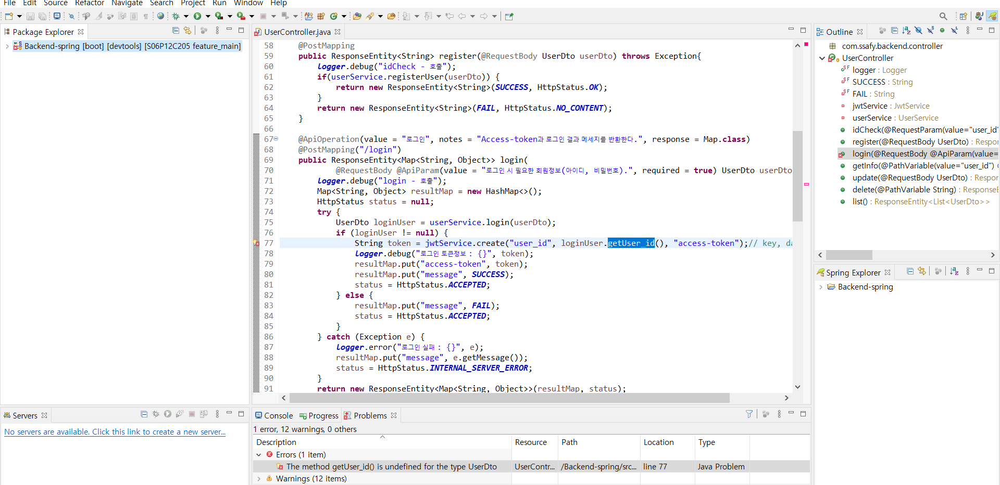

22.01.17

## Eclipse 개발환경

## 들어가며

우리팀은 주어진 명세서와는 개발환경설정이 조금 달라서 혼자 주말에 명세서를 보면서 해보다가 막힌 부분들을 팀원들에게 다시 물어보았다.

### Eclipse 프로젝트 Import

Description	Resource	Path	Location	Type
The method getUser_id() is undefined for the type UserDto	UserController.java	/Backend-spring/src/main/java/com/ssafy/backend/controller	line 77	Java Problem

## 마치며

getUser_id가 정의되지 않았다는 에러가 뜬다. 다른 팀원들은 되는걸로 보아 나혼자 다른 부분이 있거나 뭔가를 빼먹었다는 소린데 그런건 전혀 발견하지 못한 상태이다. 개발환경설정에서 시간도 너무 허비하고 있어 힘들다.

