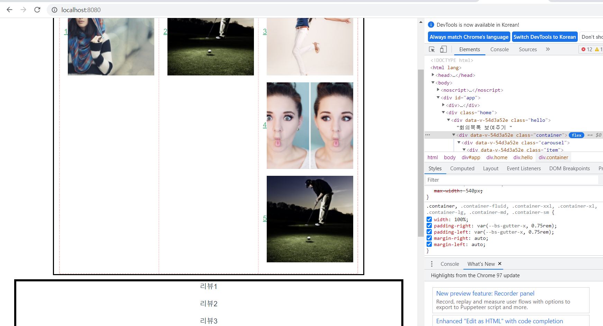

22.01.17

## main 틀

## 들어가며

화면 배치를 하려면 어떤걸 써야 하는지 정확히 모르겠어서 이것저것 구글링 해보면서 찾아보고 web할때 배운 box_model, d-flex, grid 등등 썼다 지웠다 해보았다.


### Main.vue

```
<template>
  <div class="hello">회의목록 보여주기
    <div class="container">
      <div class="carousel">
      <div class="item"><router-link :to="{name: 'Book'}">1</router-link>
      
      </div>
      </div>
      <div class="carousel">
      <div class="item"><router-link :to="{name: 'Profile'}">2</router-link>
      
      </div>
      </div>
      <div>
      <p><router-link :to="{name: 'Board'}">3</router-link>
      
      </p>
      <p><router-link :to="{name: 'Conference'}">4</router-link>
      
      </p>
      <p><router-link :to="{name: 'About'}">5</router-link>
      
      </p>
      </div>
    </div>
    <div class="box2">
      <p>리뷰1</p>
      <p>리뷰2</p>
      <p>리뷰3</p>
      <p>리뷰4</p>
      <p>리뷰5</p>
    </div>

  </div>
</template>

<script>
export default {
  name: "Main",
  props: {
    msg: String,
  },
};
</script>

<!-- Add "scoped" attribute to limit CSS to this component only -->
<style scoped>
h3 {
  margin: 40px 0 0;
}
ul {
  list-style-type: none;
  padding: 0;
}
li {
  display: inline-block;
  margin: 0 10px;
}
a {
  color: #42b983;
}
.box {
  position: absolute;
  margin: 10px auto 100px;
  border: 5px solid black;
  width: 500px;
  height: 500px;
}
.box2 {
  position: relative;
  margin: 10px auto 100px;
  border: 5px solid black;
  width: 900px;
  height: 500px;
}

.fade-enter-active, .fade-leave-active {transition: opacity .5s;}
.fade-enter, .fade-leave-to {opacity: 0; }

.container {
    display: flex;
    border: 3px solid black;
}

.container>* {
    margin: 0 auto 10px;
    flex: 1;
}
.container2 {
    display: flex;
}

.container2>* {
    margin: 0 10px;
    flex: 1;
}

.carousel {
  width: 220px;
  height: 150px;
  position: relative;
  transform-style: preserve-3d;
  animation: spin 5s infinite linear;
}
</style>

```




## 마치며

script에 남아있는 불필요한 코드의 흔적들은 나중에 다시 적용할 수 있을까 싶어 남겨두도록 한다.


#### 참고

Column layouts: https://developer.mozilla.org/en-US/docs/Web/CSS/Layout_cookbook/Column_layouts

vue.js 페이지 전환효과(fade, slide) *router 사용: https://yoyostudy.tistory.com/32?category=398415

3D 캐러셀 슬라이드: https://taesung1993.tistory.com/92
