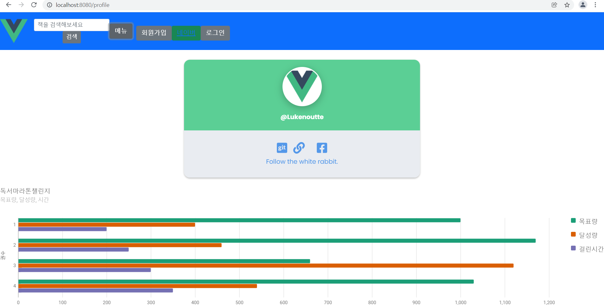
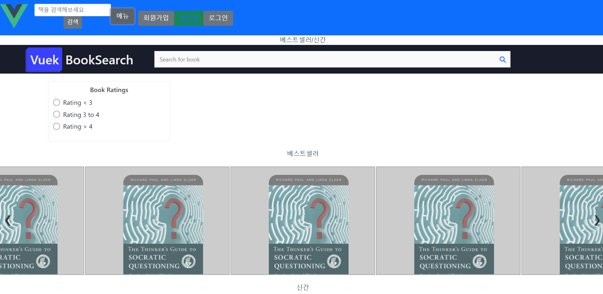

22.01.19

## Navibar & Profile 및 book 수정

## 들어가며

전체적인 명세를 다시 훑어본뒤 기존 작업에서 바로 추가해놓아도 되겠다 싶은 것들을 손보았다. 작업속도도 더디긴 하지만 오전중에는 클라우드 강의도 봤고, 공식문서와 예제사이트 등에서 활용할만한 코드들을 찾아보았다.

### Navibar & Profile

### Book

## 마치며

다른 두 프론트팀원이 수정한 board와 profile이 더 괜찮은거 같아 브랜치에 올리면 합칠 예정이고, Navbar도 제대로 정렬이 안돼 임시로 그밑에 추가해놓았다. 그리고 book을 수정하는 중에 하위 components를 더 만들 필요가 있지 않나 하는 고민이 있던 찰나에, 마침 컨설턴트님이 각 컴포넌트에 하나의 기능씩만 넣어 조립하기 쉽도록 하는게 좋다는 이야기를 해주셔서 어떻게 진행하는게 나을지 더 생각해보고 백엔드팀에서 도서api 서버데이터를 주면 그걸 적용시켜봐야겠다.

