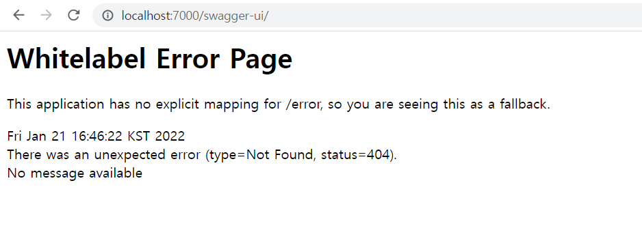
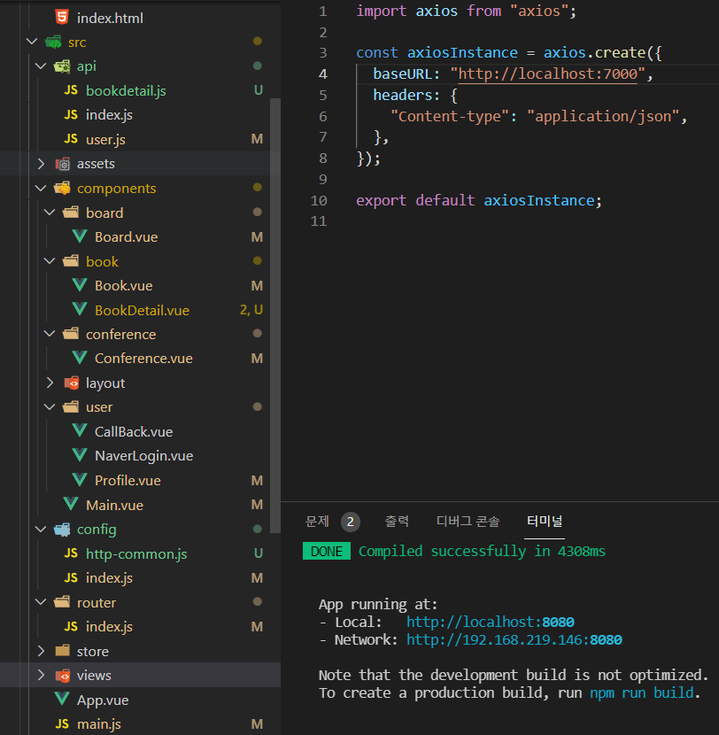

22.01.21

## api연동 & swagger-ui 및 각종 오류

기존 feature branch에서 작업하던 것이 충돌이 날거 같아 코드 정리 겸 새로 feature branch를 하나 더 만들었다.

backend를 python으로 했을 때는 api를 data.py에 써서 연동시켰는데 Java가 sever로 있으니 뭘 해야 하는건지 구조파악이 잘 안된다. 백엔드팀에서 알라딘api키를 받긴 했는데 결국 제대로 된 시도도 못하고 실패했다.

mySQL Workbench에서 src/main/resources/res/backend_dump.txt를 넣어 번개모양의 Execute를 눌러보면 여기까진 잘 뜨는데 http://localhost:7000/swagger-ui.html은 안된다. localhost가 7000으로 바뀌지도 않았다. develop에서 pull 받고 서버를 실행시키면 swagger-ui가 적용이 돼서 user-controller에도 맞게 떠야 하는 거라는데 어디가 문제인지 파악을 못했다.

