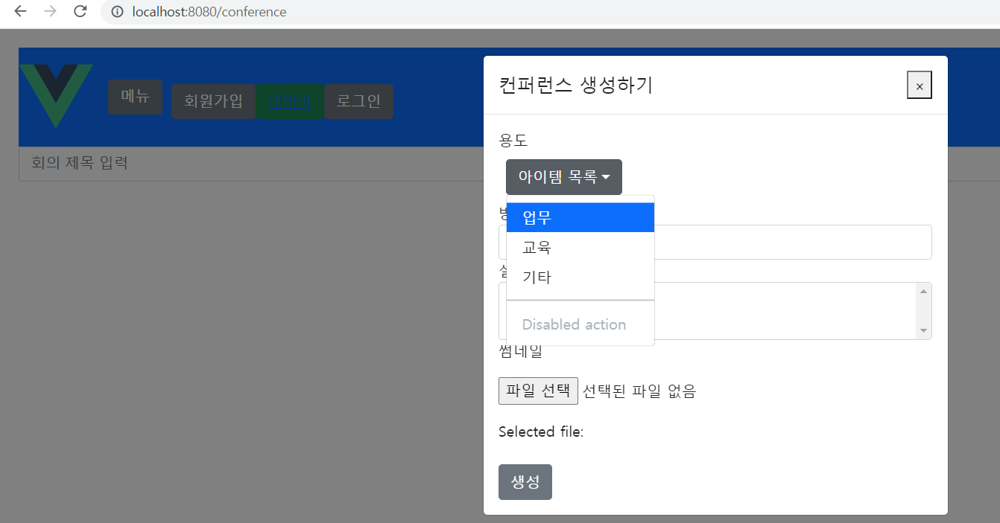

22.01.24

## 생성하기 버튼

## 들어가며

3주차에 접어들며 지금까지의 명세서와 체크리스트를 함께 보며 빠진 부분을 체크하였다.

1주차는 현재 axios에서 401에러와 403에러의 처리 기능이 구현되지 않았고, 로딩스피너가 적용되지 않았다.

2주차는 팀의 프로젝트 주제에 관련된 화면 쪽을 먼저 하고 있었기에  공용WS모듈, 방 생성, 프로필수정, 방목록, 방 상세보기, WebRTC 등이 거의 구현되지 않았고, 방생성 쪽을 어느정도 한 후에 돌아가기로 방향을 바꿨다.

## 마치며

필수 입력 항목이지만 파일명 필드의 값을 빈 값으로 표시할 수 있게 하는 법과 최대 파일 사이즈를 지정하는 법을 아직 찾지 못했다. 이외에도 여러 가지 아직 해결하지 못한 문제들이 있고, 코드를 몇번 되돌린건지도 모르겠다.
