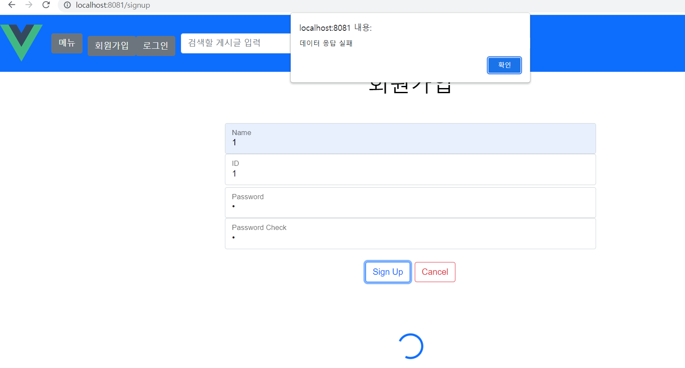
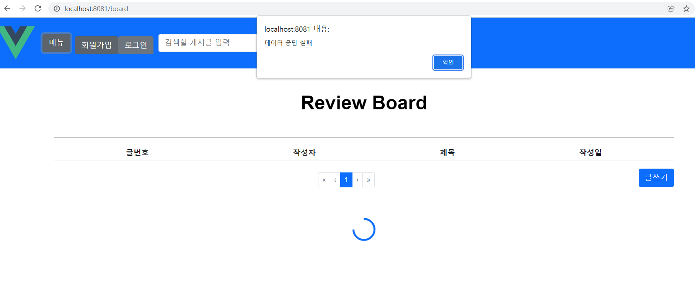

22.01.25

## 통합테스트

## 들어가며

feature branch에서 각자 짜던 프론트 코드들을 통합해 서버까지 잘 되는지 테스트해보았다.

### frontend\src
- \api
  - bookdetail.js (추가)
- \components
  - \book
    - Book.vue
    - BookDetail.vue (추가)
  - \conference
    - Conference.vue
  - \layout
    - NaviBar.vue
  - \user
    - Profile.vue
  - \router
    - index.js
  - Main.vue
  - main.js

## 마치며

로그인이 안되고 "InvalidTokenError: Invalid token specified" 에러가 뜬다. 다른 팀원도 모두 안되다가 해결이 된 팀원이 있는데 아직까지도 난 되지 않고 있다. 서버와 연결 문제인지 뭘 빼먹은건지 도통 모르겠다.
