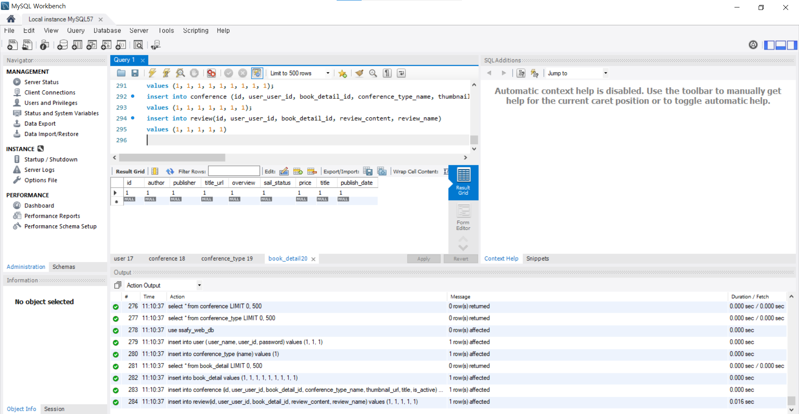
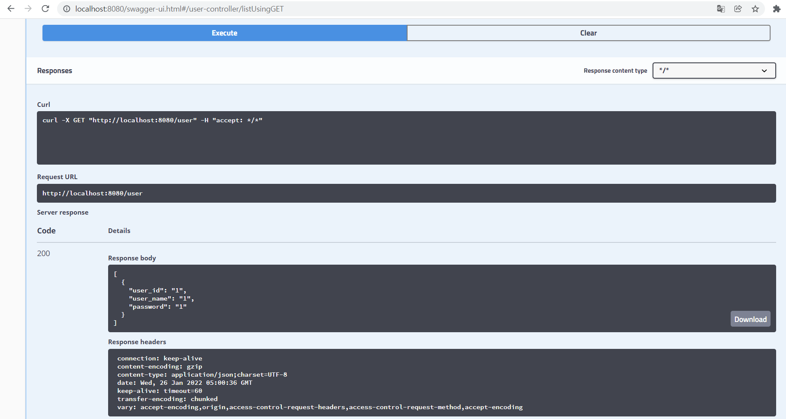
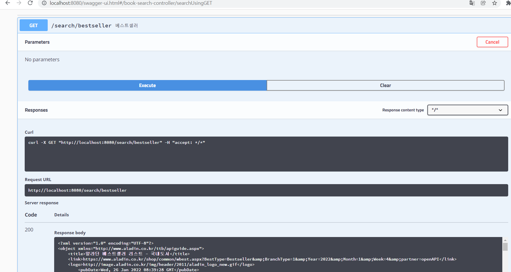
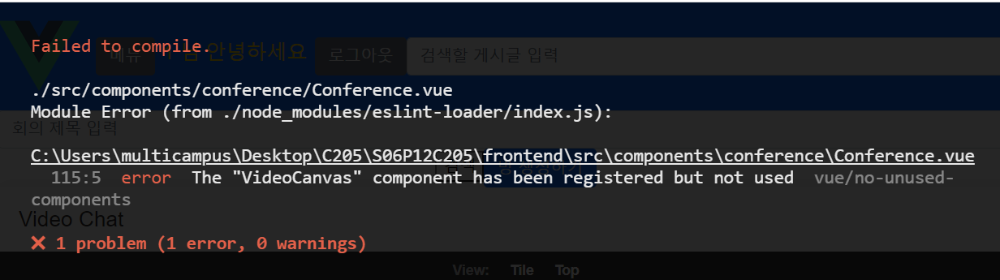

22.01.26

## Swagger 테스트 & Conference화상화면 시도

## 들어가며

계속 해서 안되던 프론트백 연결문제가 해결되긴 하였으나, 왜 된건지 정확한 원인파악은 하지 못했다.

### Swagger

chrome에서 Allow CORS 확장프로그램을 깔고 MySQL Shell에서 use mysql; 등 이것저것 해보고 로컬이 아닌 네트워크로 들어갔는데 갑자기 Swagger가 된다...







### 화상화면 구현 시도

Failed to load resource: net::ERR_CONNECTION_REFUSED가 떠서 구글링을 한 결과 `url 주소에 location 변수를 사용했는데 localhostname = 'xx.local' 이라 나온걸 확인할 수 있었고, localhost = 'xx.local:80' 포트번호가 누락이 되어서 에러가 뜬 것 같다`는 자답을 찾았는데 무슨 말인지 모르겠고 결국 다시 원상복구했다.

```null
// url: "http://"+location.hostname+"/user/joinWrite.do",
   url: "http://"+location.host+"/user/joinWrite.do",
```




### 마치며

이외에 제대로 구현 덜된 버튼이나 router-link 등을 수정했고, 아직 캐러셀마다 다르게 나와야 하는건 미해결이다.