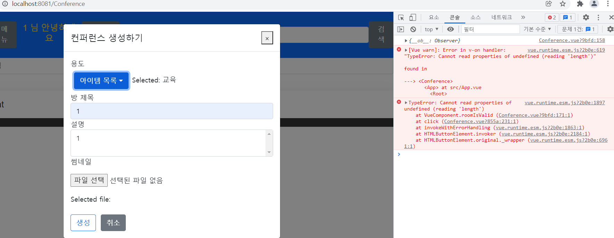

22.01.27

## 프론트 에러 수정

## 들어가며

에러가 있어도 우선 동작이 되니 넘어갔는데, 프론트도 에러를 남겨두는 게 아니라고 하셨고 버튼 등의 기능에서도 문제가 계속 발생했기 때문에 구글링을 통해 오류를 해결해나가고 있다.

### TypeError: Cannot read property of undefined (reading 'apply')

분명히 데이터가 있는데 undefined의 속성을 찾을 수 없다는 에러가 발생하였고, 아직 데이터가 없는 상태에서 HTML 코드에서 해당 데이터를 읽으려고 하기 때문에 에러가 난다. 좀더 정확하게는 undefined의 속성에 접근하려 할 때 에러가 발생한다고 한다.

### Property or method "file" is not defined on the instance but referenced during render

file이라는 속성이 선언되지 않았는데 화면에 렌더링되려고 했다는 것이고, 데이터 속성 안에 선언한 변수를 화면에서 잘못 입력한 경우라고 한다. `data`, `computed`, `methods` 속성과 HTML 태그의 {}안에 선언한 변수명이 같은지 확인해보아야 한다.

### Invalid prop: type check failed for prop "value". Expected Array, File, got String with value "".

value 값을 null로 바꾸었더니 에러가 사라졌다.

### cannot read properties of undefined (reading 'length')

역추적을 해보라는 글을 보긴 했으나, 변수명같은게 뒤섞인 듯하여 먼저 정리가 필요하다.

### 마치며

정확하게 이해를 하고 코드를 구현해야 하는데 여러 사람들의 코드 방식이 뒤섞이다 보니 점점 더 헷갈린다. 오랫동안 붙잡고는 있는데 정작 결과적으로 보면 한게 없어 걱정이다. 맘은 급하지만 찬찬히 되짚어봐야겠다.

### 참고

https://jess2.xyz/vue/data-undefined-error/

https://joshua1988.github.io/web-development/vuejs/common-error-cases/

https://forum.vuejs.org/t/vue-warn-invalid-prop-type-check-failed-for-prop-value-expected-string-with-value-null-got-null/88629