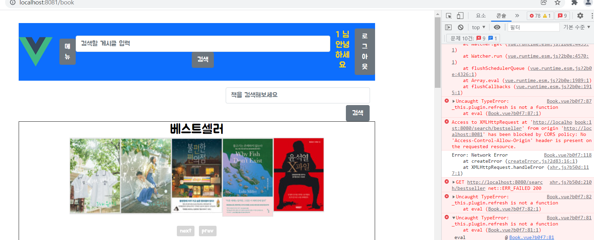
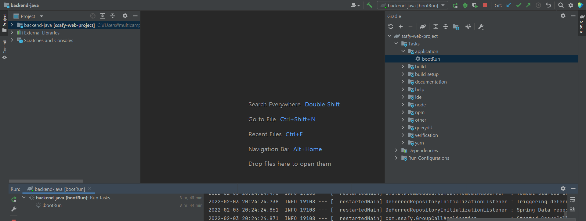
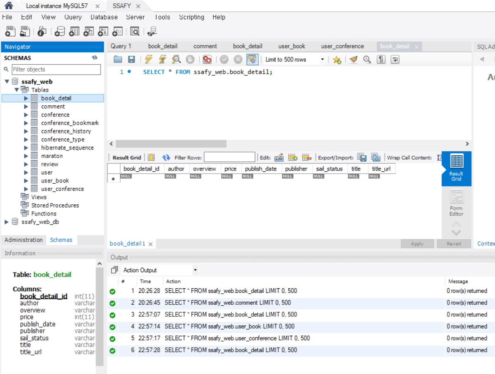
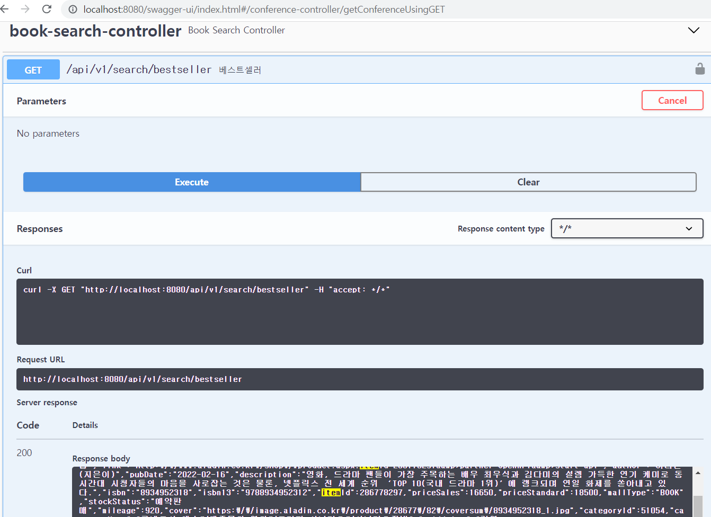
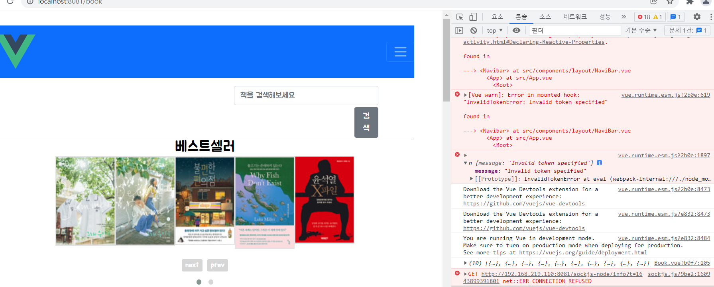

22.02.03

## book api 

기존의 book.vue의 cover 중복 해결이 안돼 코드 자체를 새로 짬

response.data.item을 했을 때 아무것도 찍히지 않음

openvidu를 쓰기로 바꿔서 backend팀에서도 swagger 서버를 변경

frontend에서 response가 받아짐

처음에 왜 안된건지 지금은 왜 또 되는지 원인은 모름

### 그외

#### 에러

Another git process seems to be running in this repository, e.g. an editor opened by 'git commit'. Please make sure all processes are terminated then try again. If it still fails, a git process may have crashed in this repository earlier: remove the file manually to continue.

#### 해결

rm -f ./.git/index.lock

https://goddaehee.tistory.com/220

https://joycestudios.tistory.com/98