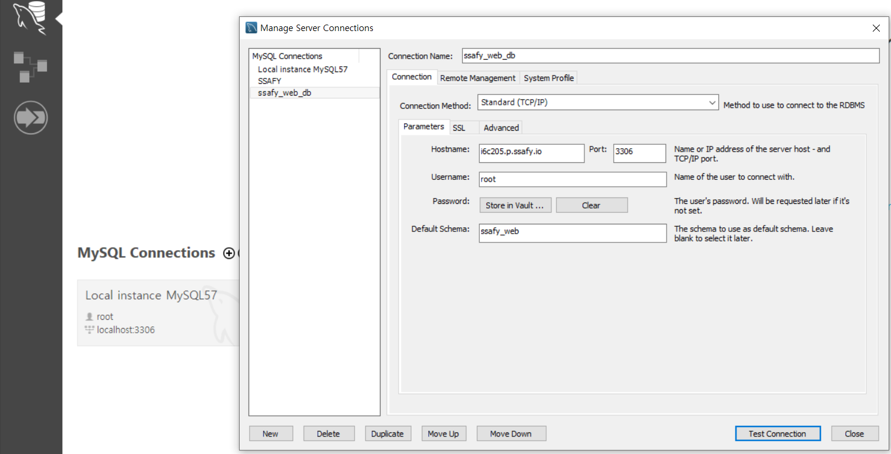
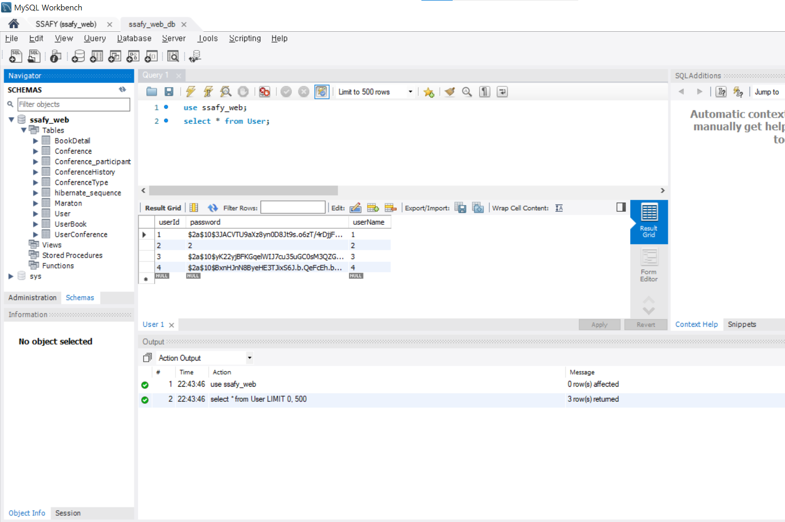
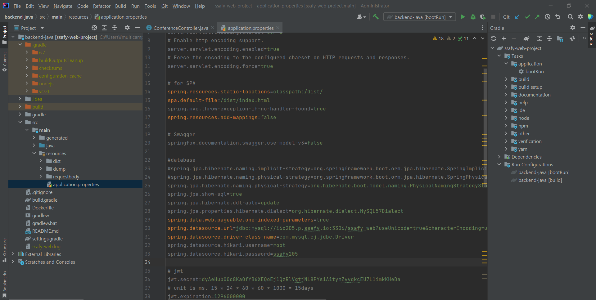
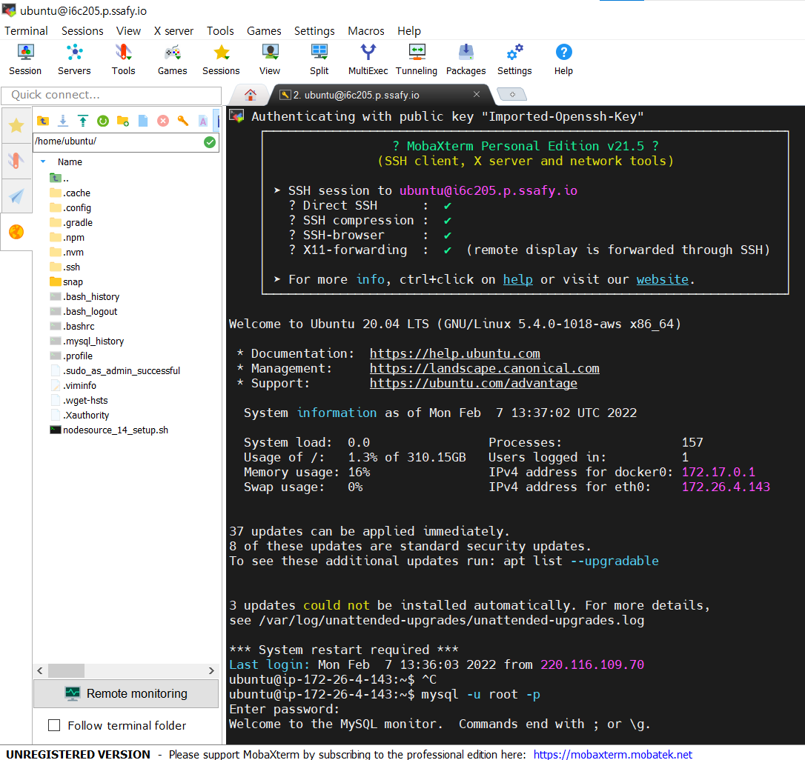
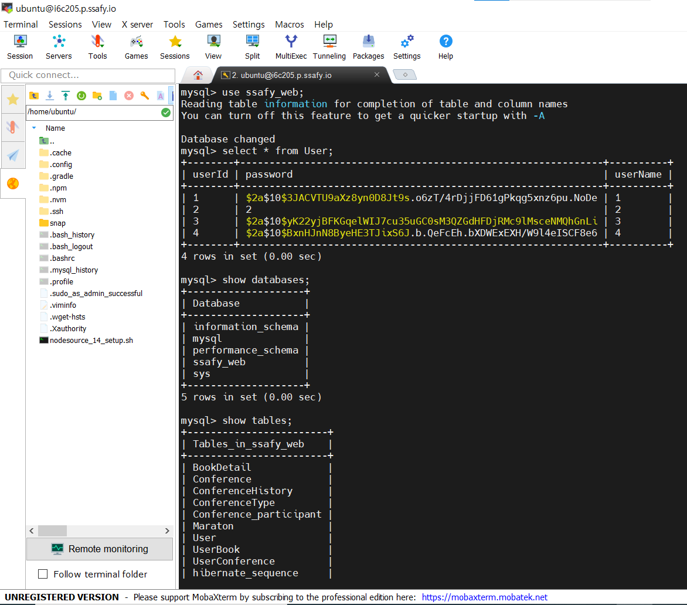

22.02.07

## id/pw 찾기

vuetify를 활용한 code를 찾아서 그걸 참고하여 아이디찾기와 비밀번호 찾기 기능을 시도해보았으나, 팀원들의 코드에 맞게 바꾸는게 잘 되지 않아 아직 구현은 하지 못했다.

https://ezcode.kr/board/vuessr


#### 그외

Found a swap file by the name 에러 발생

[O]pen Read-Only, (E)dit anyway, (R)ecover, (Q)uit, (A)bort:

```
a골라 vi/vim을 빠져나감
git merge --abort
git status
```


더미데이터

```
{
  "id": 1,
  "user": {
    "userId": "1",
    "userName": "1",
    "password": "1",
    "hibernateLazyInitializer": {}
  },
  "bookDetail": {
    "id": 1,
    "author": "1",
    "publisher": "1",
    "titleUrl": "1",
    "overview": "1",
    "price": 1,
    "title": "1",
    "publishDate": "1",
    "sailStatus": "1",
    "hibernateLazyInitializer": {}
  },
  "conferenceType": {
    "id": 1,
    "name": "업무",
    "hibernateLazyInitializer": {}
  },
  "callStartTime": "2022-02-07 11:19:51.575000",
  "callEndTime": null,
  "thumbnailUrl": "1",
  "title": "1",
  "isActive": 1,
  "participant": [
  ],
  "description": "1"
}
```


MobaXterm 연동db










