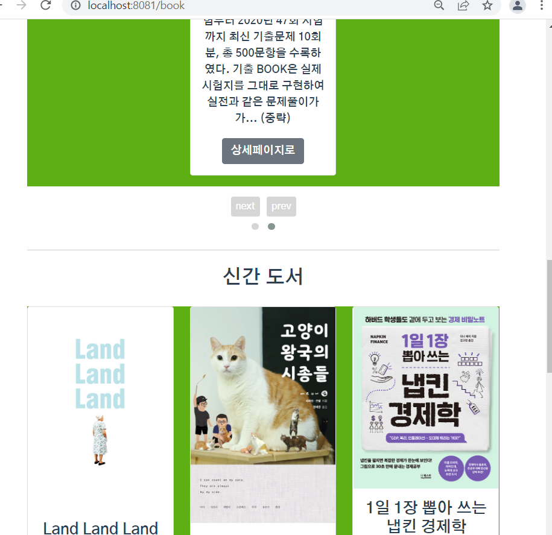
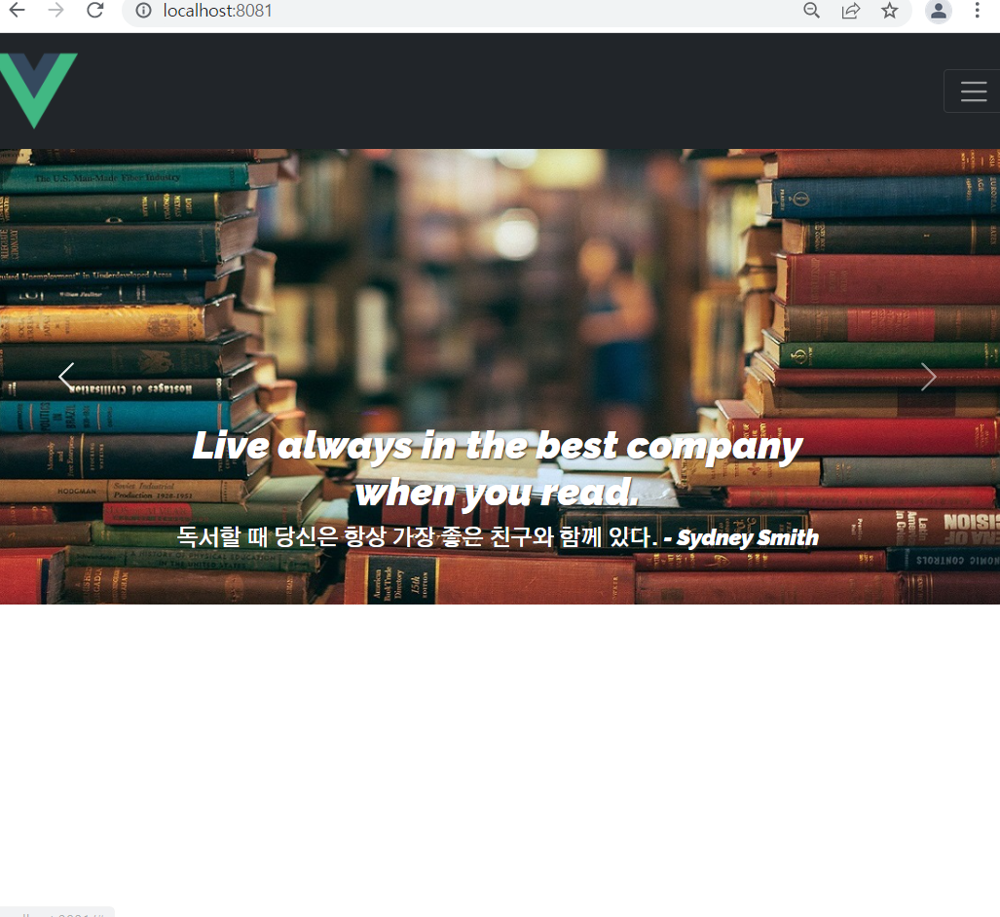

22.02.09

## 디자인

프로젝트 초반에 생각했던 Vuek(한글로 변환해 써보면 펴다)에서 더 나아가 발음상 뷰크 => 부크 => 부끄라는 점에 착안하여 책내용을 몰라서 부끄러울 때, 대면으로 하는 모임이 부끄러울 때 부끄를 쓰자라는 UCC를 구상함

유병재 채널의 책 안 읽고 온 사람들끼리 뻔뻔한 독서감상회를 하는 다독다독 컨셉을 패러디해도 좋을 것 같음

로고는 목업디자인할 때 ovenapp.io에 있는 아이콘으로 만들었던 건데 마음대로 쓸 수 있는 건지는 잘 모름

### 그외 문제

book에 다시 캐러셀을 적용해보았는데 연두색 부분을 아예 없애거나 하얀색으로 바꾸는걸 모르겠고, 화면크기를 조절시 wrap으로 인해 하나만 아래로 넘어가게 되는 경우가 있는데 배치가 이상하게 보여 어떻게 할지 고민

마찬가지로 화면 크기를 줄이는 경우 아래에 하얀 빈공간이 많이 생김

