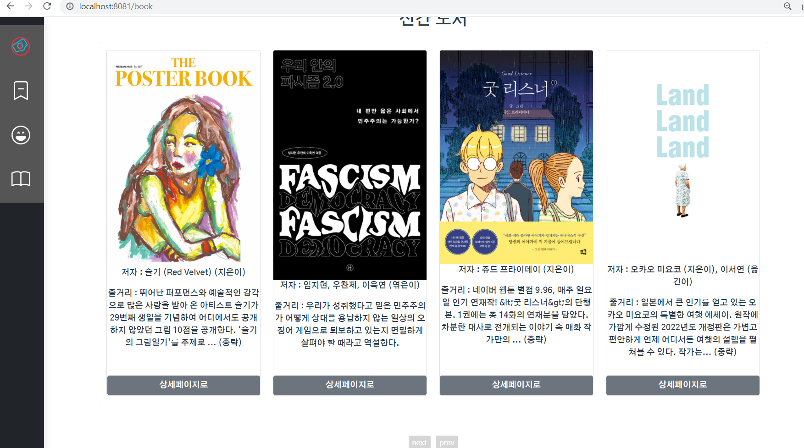

22.02.10

## 북캐러셀 정렬

어제 해결못한 것들이 갑자기 풀림 (배경 하얗게, 카드 정렬, 화면사이즈에 따른 배치)

```
<style scoped>
.row {
  padding: 15px;
  background-color: white;
  border-radius: 15px;
}
.card {
  height: 100%;
}
.card-text {
  height: 100%;
}
</style>
```

### sidebar 정리

variant를 footer로 바꿔 투명으로 하려 했는데 잘 안되어서 사이즈 줄이고 위치만 수정

```
<b-sidebar
  v-if="userInfo"
  id="sidebar-variant"
  title="메뉴"
  bg-variant="dark"
  text-variant="light"
  shadow
  width="90px"
  no-header
>
  <div class="px-0 py-3">
    <div class="icon-bar">
     <router-link to="/conference" id="tooltip-1"
     >...생략
```





### 참고

b-row background color

https://stackoverflow.com/questions/29727995/bootstrap-column-full-content-background-color

width height 비율 유지

https://code-study.tistory.com/13

https://coding-food-court.tistory.com/30

https://webdir.tistory.com/487

sidebar

https://bootstrap-vue.org/docs/components/sidebar#sidebar