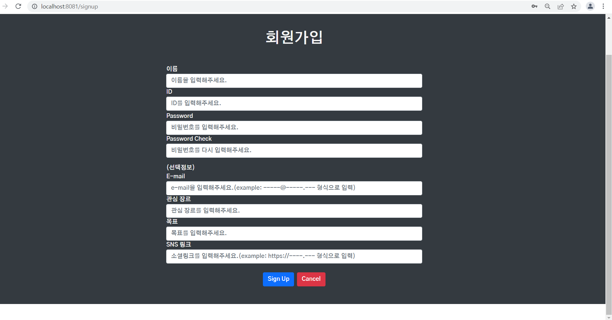
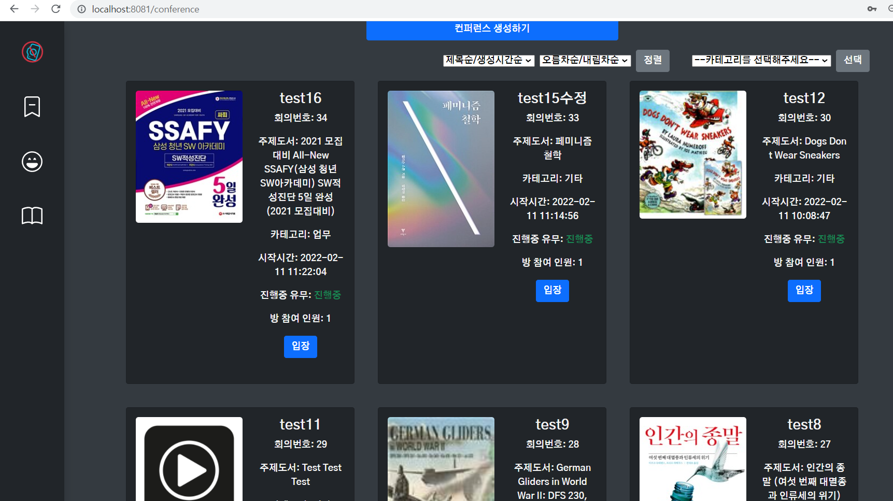

22.02.11

## 프론트코드통합

메인화면에서와 같은 문제로 회원가입도 아래 하얀 빈공간이 나옴

사이드바와 컨퍼런스룸 정렬했고, 아직 페이지네이션 적용 안됨

팀원이 새로 만든 로고는 적용했으나, 독서마라톤 게이지바가 안보임

브랜치 머지 중에 만난 에러

#### 참고

vue pagination 구현

https://pewww.tistory.com/5

https://daily-life-of-bsh.tistory.com/208

https://junhyunny.github.io/spring-boot/vue.js/spring-boot-vue-js-paging-table/

Parsing error: invalid-first-character-of-tag-name

https://stackoverflow.com/questions/69121124/how-to-fix-parsing-error-invalid-first-character-of-tag-name-eslint-vue-no-par